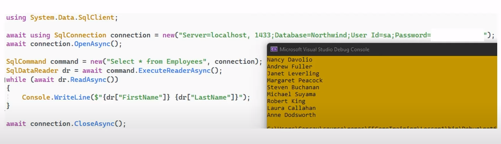
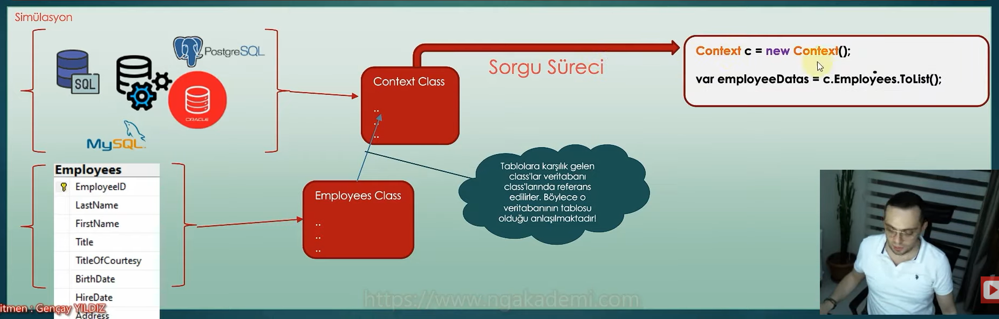
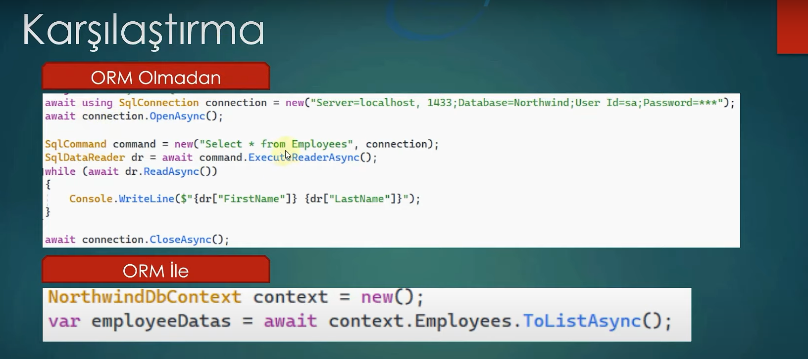

# Orm Nedir?

Yazılım uygulamalarında veriler, fiziksel olarak veri tabanlarında tutulmaktadır.

Haliyle yazılım ve veri tabanı arasında sürekli bir bağlantı üzerinden iletişim sağlanmaktadır ki yazılım dış dünyadan elde ettiği verileri veri tabanına işleyebilsin ya da veri tabanındaki verileri istediği zaman elde edebilsin.

İşte böyle bir durumda yazılım ile veri tabanı arasında biraz önce bahsedildiği üzere bir bağlantı kurularak tüm verisel grafik gerçekleştirilmektedir.

Yazılım bu bağlantı üzerinden veri tabanına anlayacağı dilden sorgular gönderir ve veri tabanı da bu sorgulara istinaden gerekli verisel işlemleri gerçekleştirir.

Bu sorgular genellikle sql dilindedir.

İşte bizleri Orm denen şeye götüren süreç tam da burada başlamaktadır. 

 

Dikkat ederseniz yukarıdaki kod içerisinde sql sorguları yazılmaktadır. Peki bu durum nelere sebep olmaktadır?

- Kodun içerisinde sql sorguları ve sql ile ilgili farklı cümleciklerin olması genel anlamda kodun kirlenmesine sebep olmaktadır.

Peki kodun kirlenmesinden kasıt nedir? Bir kod, metinsel ifadelere çok fazla boğuluyorsa ister istemez zaten kirlenmektedir. 

Bunun dışında yazdığımız metinsel ifadeler farklı bir dilin, yapının, servisin ya da veri tabanı gibi sunucuların anlayacağı bir semantikteyse, bu kod daha da kirlenmiş demektir.  

Çünkü yazdığımız kodda Employess ilerde bir gün Personeller olabilir. Bu yüzden bu kirli kod durmadan bir bağlayıcılığa sebep olacaktır. 

 

- Bunun dışında geliştiricinin sql hakkında olan bilgisinin endişe verici olmaması gerekmektedir. 

Çünkü bu yazılımda ilgili veri tabanıyla iletişim kurabilmem için kullanılan veri tabanının gramerine, cümlesine, semantiğine tam olarak hakim olmam gerekmektedir.

Çünkü bu veri tabanının anlayacağı semantiği manuel oluşturmam gerekiyor. 

 

- Ayrıca veri tabanına gönderilen sql neticesinde gelen datalar manuel parse edilmek zorunda bu da kodun sql'e olan bağımlılığını arttırdığı gibi yönetilebilirliğini de oldukça kısıtlamaktadır. Nasıl kısıtlamaktadır?

Örnek 1, yine yukarıdaki kodda yapılan sorgu neticesinde hangi kolonların geldiğini bilemeyebilirim. 

Örnek 2, gelen kolonların içerisinde FirstName ya da sadece Name gibi bir isimlendirme ile kolonun geldiğini bilemem. Yani kolonların isimlerini bilemem.

 
Örnek 3, biz employee'de herhangi bir kolonu değiştirdiğimizde ve eğer bu değişen kolon, kodun içerisinde kullanılıyorsa gidip kodun içerisinde de o kolonla ilgili değişikliği yapmak zorundayım. Aksi taktirde run time da hata alırız. 

 

Yani uzun lafın kısası kodun içerisinde sql cümleleri yazmanın ve veri tabanından gelen sonuçların manuel bir şekilde parse edilmesinin büyük projelerde büyük problemler doğurabileceği aşikardır.

 

## Kod içerisinde sql yazmanın dezavantajları 
* 
Kodun kirlenmesine sebep olacaktır.

* 
Geliştirme ve bakım maliyeti yüksek kod inşasına sebep olur.

* 
Veri tabanı bağımlılığı yaratır.

* 
Komplex sorguların manuel bir şekilde oluşturulması gerekir.

* 
Geliştirici açısından sql sorumluluğu beklenir. Sorgu sürecinde tablo, kolon vs. gibi bağımlılıklar olduğu gibi gelen datalarda da aynı bağımlılıklar söz konusu olacaktır.

* 
Veri tabanında olan değişikliklere uygun bir şekilde kodunda review edilmesi gerekmektedir.

Örneğin; bir kolon adı ya da bir kolonun herhangi bir kuralı (constraint, validation vs.) değiştiğinde bu durumdan kodun da haberdar olması gerekmektedir. Bilinçli bir şekilde review yapılmalıdır. 

* 
Kodu aşırı derecede veri tabanı seviyesine indirger. Bu durum tüm gelişmelerin veri tabanıyla uyumlu bir şekilde seyretmesi zorundalığını doğurur.

* 
Geliştirilen yazılım sürecinde tüm veri tabanı işlemleri, o an kullanılan programlama dili ve oop'nin nimetlerinden istifade etmeksizin icra edilir.

* 
Gün gelir veri tabanını değiştirmemiz gerekebilir. İşte böyle bir durumda tüm sql kodlarını yeni veri tabanına göre refactoring etmemiz gerekecektir.

 

## Peki bu dezavantajlı durumdan nasıl kurtulabiliriz?

Orm ile kurtulabiliriz. Peki Orm nedir?

Orm; yazılım ve veri tabanı arasındaki bağlantı üzerinden sorgular eşliğinde veri transferini oop nimetlerinden istifade ederek sağlayabileceği ve böylece kodun da, geliştiricinin de sql'e bağımlılığı olmaksızın hızlı ve kolayca operasyonları gerçekleştirebileceği bir yaklaşımdır.

Orm, Object Relational Mapping yani Nesne İlişkisel Eşleme şeklinde bir açılıma sahiptir.

Orm; geliştirilen yazılım içerisinde oop yapısına uygun olmayan katı ve kompleks veri tabanı sorguları yerine veri tabanı objelerinin bir oop nesnesi gibi düşünülerek yazılım tarafından kullanılabilmesine olanak sağlayan bir yaklaşımdır.

Bu yaklaşıma göre veri tabanı, yazılım tarafında birer nesneye karşılık gelmektedir. Böylece tüm veri tabanı süreçlerini kavramlarıyla rahatlıkla yönetebilir ve kodu sql'den arındırabiliriz.

 

## Orm Avantajları

* 
Veri tabanı bağımsızlığı sağlar.

Yani bundan sonra veri tabanında sorgulama yaparken veri tabanına uygun bir şekilde sql cümleciği yazmak zorunda değiliz. Çünkü orm, biz hangi veri tabanını kullanıyorsak o veri tabanına uygun bir şekilde sql cümleciğini, sorgusunu oluşturur.

* 
Kullanılan veri tabanına göre uygun sorgu oluşturulur. 

* 
Oop nimetlerinden faydalanarak sql mantığı işlememizi sağlıyor.

* 
Geliştiricinin kullanılan veri tabanına dair sql yeteneklerinin olması beklenmez.

* 
Sorgular otomatik generate edileceğinden dolayı kodu sql bağımlılığından soyutlar.
 
 

 

## Neden Orm Kullanmalıyız?

Koda gömülü sorgular, veri tabanı değiştiğinde inanılmaz derecede maliyet getirir.

Eğer ki orm kullanırsak veri tabanından bağımsız veri tabanı işlemleri yapabiliriz. Bundan dolayı orm kullanmalıyız.

Orm; ileriye dönük, dönüştürülebilir, veri tabanı değişikliğine açık, bu değişikliği karşılayabilecek bir proje oluşturmamızı sağlar.

Yani yazılımı mümkün mertebe kullandığımız veri tabanından bağımsız bir şekilde inşa etmemiz gerekecektir. Bunun içinde orm yaklaşımını benimsememiz gerekecektir.

