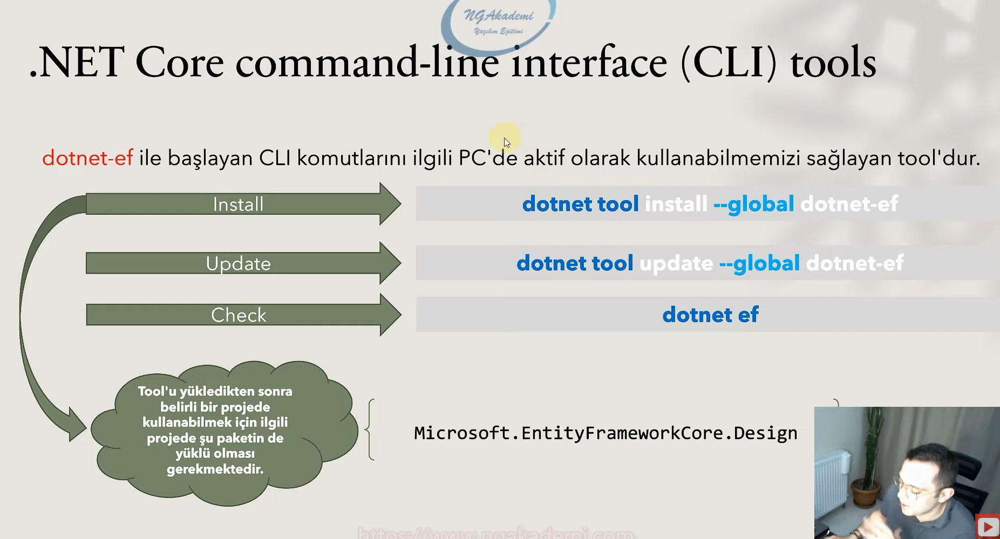
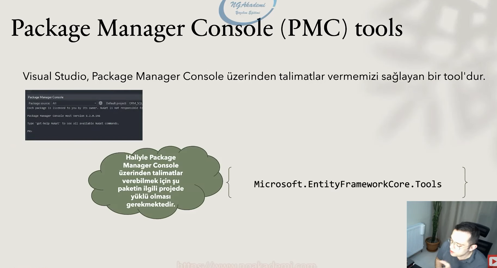

# Entity Framework Core Nedir?

* 
 Entity framework core, orm yaklaşımını benimsemiş bir araçtır.

Şimdi orm bir yaklaşımdır, kılavuzdur, yol göstericidir. Yani bir fikri savunur. İşte bu fikri, kılavuzu somutlaştıran bir araçtır. 

Dolayısıyla bu açıdan baktığımızda entity framework tek başına değildir. Yani orm araçlarından bir tanesidir. Mesela Nhibernate, dapper, entity framework vardır.

* 
Ve aslında bütün orm araçlarının amaçları; kod içerisinde oop nimetlerinden istifade ederek sql sorguları oluşturmamızı sağlamaktır.

* 
 Açık Kaynaktır. 

* 
 Esnektir, geliştirilebilir.

* 
 Kod içerisinde ihtiyaca binaen geliştirilmiş olan tekrarlı sql sorgularından bizleri kurtarmaktadır.

* 
Code First ve Database First yaklaşımları eşliğinde veri tabanı ile yazılım arasındaki koordinasyonu sağlamaktadır.

* 
Kod üzerinden; veri tabanı, tablo, constraint, sequence, ilişkili sorgular, view, stored procedure, function, temporal table gibi veri tabanı nesneleri oluşturmamızı ve kullanmamızı sağlamaktadır.

* 
Query için Linq sorgularını desteklemektedir.

 

## Orm olarak neden Ef Core seçilmelidir? 

- Ef Core, her ne kadar hızlı ve performanslı bir yapıya sahip olsa da piyasadaki en hızlı orm aracıdır diyemeyiz.

Misal olarak; minimal özelliklere sahip olan Dapper, Raw (ham) sorgular kullandığından dolayı kelimenin tam anlamıyla Ef Core'dan çok daha hızlıdır.

- Lakin her bir güncellemesinde performansının arttığı gözlemlenen Ef Core'un ise birçok özelliği mevcuttur.

- Oop nimetlerinden istifade etmemizi sağlayan Ef Core ile class oluşturma, nesne değişikliklerini izleme, (Change Tracker) mapping vs. gibi türlü işlemler gerçekleştirebiliriz. 

Ancak sırf yukarıdaki özellik için de ef core tercih edilmez. Çünkü bunu nhibernate'de yapabiliyor.

Bu yüzden yukarıdaki ilk iki özelliğe göre entity framework core'u seçebiliriz. Ya da ef core'u sevdiğimiz için de seçebiliriz. 

 

## Ef Core nasıl yüklenir? 

İleride Ef Core ile migration yapılanmalarına vs. değiniyor olacağız. İşte bu yapılanmaları sağlayabilmek ve işlevleri yürütebilmek için belirli araçları yüklememiz gerekmektedir.

Yüklenmesi gereken araçlar;

* 
.Net Core command-line interface (CLI) tools

* 
Package Manager Console (PMC) tools

olmak üzere iki farklı kümede değerlendirilebilir.

Aslında ikiside farklı yerlerde aynı işlemleri yapıyor.

 

## .Net Core command-line interface (CLI) tools

.Net cli üzerinden entity framework core ile ilgili bir çalışma yapacaksam eğer .net cli'yı kurmam gerekiyor. 

dotnet-ef ile başlayan cli komutlarını ilgili pc'de aktif olarak kullanabilmemizi sağlayan tool'dur.

Microsoft.EntityFrameworkCore.Design paketi ne işe yarıyor peki? Eğer ki biz cli dediğimiz tool'u kullanarak entity framework'ün bir yaklaşımına istinaden migration yapılanmalarıyla vesaire çalışmalar sergileyebilmek istiyorsak ilgili projede bu paketin yüklü olması gerekiyor.

 

## Package Manager Console (PMC) tools

Visual Studio, Package Manager Console üzerinden talimatlar vermemizi sağlayan bir tool'dur.

