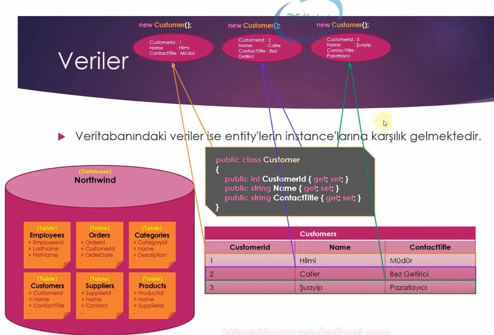

# Yapısal Olarak Ef Core Aktörleri Nelerdir?

Bir orm aracının veri tabanını oop nimetleriyle temsil edebilmesi için veri tabanının, o veri tabanı içerisindeki tabloların ve o tablolar içerisindeki kolon ve nesnelerin programatik olarak bir şekilde modellenmesi gerekmektedir.

Bu modelleme class'lar üzerinden gerçekleşecektir.

 

## Veri Tabanı Classı / Nesnesi - DbContext

Ef Core'da veri tabanını temsil edecek olan sınıf DbContext olarak nitelendirilmektedir.

Herhangi bir projede Ef Core kullanıyorsak eğer, database first ya da code first fark etmeksizin her ikisinde de veri tabanına karşılık gelen nesne / sınıf DbContext'tir.

Bir veri tabanının kod kısmındaki modellemesinin karşılığı DbContext'tir.

Bir class'ın adında DbContext geçmesi yeterli değildir. Bir class'ın veri tabanına karşılık gelen DbContext olabilmesi için Microsoft.EntityFrameworkCore namespace'indeki DbContext sınıfından türemesi gerekmektedir.

 

## DbContext Nesnesinin Sorumlu Olduğu Faaliyetler Nelerdir?

Bir DbContext sınıfı, veri tabanıyla ilgili temel bütün konfigürasyonlardan sorumludur.

- Veri tabanı bağlantısı, model yapılanmaları ve veri tabanı nesnesi ile tablo nesneleri arasındaki ilişkileri sağlar.

- Sorgulama operasyonlarını yürütür. Kod tarafında gerçekleştirilen sorgulama adımlarını sql sorgusuna dönüştürür ve veri tabanına gönderir.

- Change Trancking: Sorgulama neticesinde elde edilen veriler üzerindeki değişiklikleri takip eder.

- Verilerin kaydedilmesi, güncellenmesi ve silinmesi operasyonlarını gerçekleştirir.

- Gelen verileri birinci dereceden cache'lememizi sağlar. 

 

## Tablo Nesnesi - Entity

Ef Core'da tabloları temsil eden sınıflar Entity olarak nitelendirilmektedir.

Yeryüzündeki herhangi bir olguyu / nesneyi / objeyi modelleyen sınıfa Entity (varlık) denmektedir.

Ef Core açısından baktığımızda entity, bir veri tabanı tablosunu modelleyen sınıftır.

Dikkat! Veri tabanında tablo adı çoğul olur, lakin o tabloyu modelleyen entity sınıfının adı tekil olur.

 

## Tablo Kolonları

Ef Core'da kolonlar entity sınıfları içerisinde property olarak tanımlanmalıdırlar.

 

## Veriler

Veri tabanındaki veriler ise entity'lerin instance'larına karşılık gelmektedir. 

