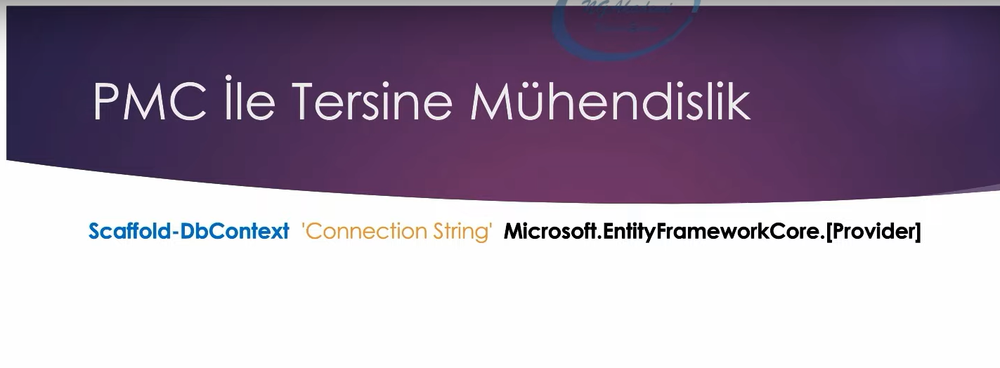

# Database First Yaklaşımı

Entity framework core aracında tersine mühendislik diye bir terim duyabiliriz. Bu terim database first yaklaşımında geçerlidir.

 

## Tersine Mühendislik (Reverse Engineering)

Tersine mühendislik, bir sunucudaki veri tabanının iskelesini / yapısını / modelini kod kısmında oluşturma sürecidir. 

Veri tabanı sunucusundan herhangi bir veriyi kod kısmında modellemeyi iki türlü gerçekleştiririz.

Bunlardan biri Package Manager Console (PMC) iken diğeri Dotnet Cli'dır. 

 

## 1- Package Manager Console (PMC) ile Tersine Mühendislik

 

Yukarıdaki resimdeki talimatı pmc'dan verdiğimizde, connection string'de belirtilen veri tabanındaki tüm tablo yapılanması kod kısmında modellenecektir.

Scaffold-DbContext talimatı, veri tabanının kod kısmında modellenmesini sağlar. Bunu hem pmc'da hem de dotnet cli'da bu komutu kullanabiliyoruz.

Connection string, hangi sunucudaki hangi veri tabanını çalıştıracaksak onu belirttiğimiz yer burasıdır.

Microsoft.EntityFrameworkCore.[Provider], connection string'de belirttiğimiz veri tabanı hangisiyse, bu veri tabanının kütüphanesi olacak.
Yani o provider yerine kullandığımız veri tabanının kütüphanesi gelecek.

Package manager console ile veri tabanını modelleyebilmek için aşağıdaki kütüphanelerin projeye yüklenmesi gerekmektedir: 

* 
Microsoft.EntityFrameworkCore.Tools

* 
Database Provider (Örneğin; Microsoft.EntityFrameworkCore.SqlServer)

 

## 2- Dotnet CLI ile Tersine Mühendislik

 

Baştaki dotnet komutunu, dotnet cli'yı kullandığımızı bildirmek için kullanıyoruz.   

Resimdeki talimatı PowerShell'den veya cmd'den verdiğimiz zaman da hedefteki veri tabanı direkt kod kısmında modellenmiş olacaktır.

Dotnet CLI ile veri tabanını modelleyebilmek için aşağıdaki kütüphanelerin projeye yüklenmesi gerekmektedir: 

* 
Microsoft.EntityFrameworkCore.Design

* 
Database Provider (Örneğin; Microsoft.EntityFrameworkCore.SqlServer)

  

## Tabloları Belirtme

Varsayılan olarak veri tabanındaki tüm tablolar modellenir. Eğer sadece istenilen tabloların modellenmesini istiyorsak aşağıdaki gibi talimatların verilmesi yeterlidir:

 

## DbContext Adını Belirleme

Scaffold ile modellenen veri tabanı için oluşturulacak context nesnesi adını veri tabanından alacaktır. Eğer ki context nesnesinin adını değiştirmek istiyorsanız aşağıdaki gibi çalışabilirsiniz.

 

## Path ve Namespace Belirtme

Entity'ler ve DbContext sınıfı, default olarak direkt projenin kök dizinine modellenir ve projenin varsayılan namespace'ini kullanırlar. Eğer ki bunlara müdahale etmek istiyorsanız aşağıdaki gibi talimat verebilirsiniz.

 

## Model Güncelleme

Veri tabanında olan değişiklikleri kod kısmına yansıtabilmek için Scaffold talimatını tekrar vermemiz gerekecektir lakin verilen talimat neticesinde ilgili sınıfların zaten var olduğuna dair hata mesajı sizleri yüksek ihtimalle karşılayacaktır.  

Böyle bir durumda veri tabanı modeline değişiklikleri manuel olarak yansıtabileceğimiz gibi (ki tavsiye edilmez!) zorla, yeniden, en güncel haliyle modellenmesii sağlayabiliriz.

Bunun için aşağıdaki gibi Force talimatının verilmesi yeterli olacaktır.

 

## Modellerin Özelleştirilmesi

Database first yaklaşımında veri tabanı nesneleri otomatik olarak modellenmekte ve generate edilmektedir. Bazen bu otomatize olan süreçte manuelde olsa entitylerde yahut context nesnesinde özelleştirmeler yapmak isteyebiliriz.

Ama biliyoruz ki veri tabanında yapılan değişiklikler neticesinde Force komutu eşliğinde tüm değişiklikler kod kısmına sıfırdan yansıtılabilir ve bu da yapılan değişikliklerin ezilme riskinin söz konusu olduğu anlamına gelir.

Bu tarz özelleştirme durumlarında bizzat model sınıflarını kullanmaktansa bunların partial class'ları üzerinde çalışmak en doğrusudur.

Burayı daha iyi anlayabilmek adına serideki 7. videonun 33:55 saniyesinden itibaren izleyebilirsin. 

 

