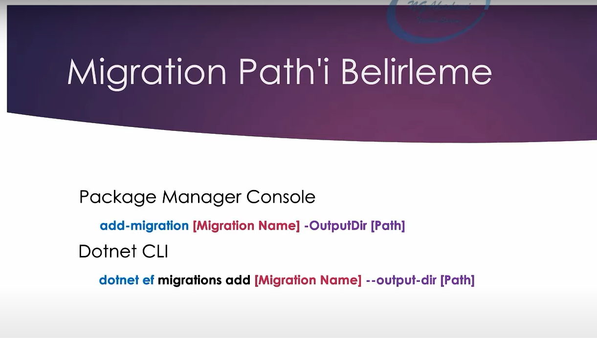

# Code First Yaklaşımı  

 

## Migration ve Migrate Kavramları Nelerdir?

Migration; kod kısmında modellediğimiz veri tabanını, veri tabanı sunucusunun anlayacağı hale getiren bir c# class'ıdır.

Migration'ı veri tabanına gönderip fiziksel olarak veri tabanını oluşturma eylemine migrate etme denir.

Yani "migration oluşturuluyor" denildiğinde şunu anlamamız lazım: Projede tasarlanan kod mantığının veri tabanı sunucusuna göç ettirilebilecek modeli oluşturuluyor.

"Migrate ediliyor" denildiğinde ise bu migration'ı artık veri tabanı sunucusuna gönderip orada fiziksel olarak veri tabanındaki gerekli değişiklikler yaptırılıyor anlamına gelir. Ya da eğer veri tabanı yoksa veri tabanı orada oluşturuluyor anlamına gelir.

 

## Migration Oluşturmak İçin Temel Gereksinimler Nelerdir?

Migration oluşturmak için temelde Ef Core aktörleri olan DbContext ve Entity class'larını oluşturmak gerekir.

Bunları oluşturduktan sonra migration; Package Manager Console ve Dotnet Cli olmak üzere iki türlü talimatla verilebilir.

 

Ancak her iki yöntemi de kullanabilmek için Microsoft.EntityFrameworkCore.Tools kütüphanesini uygulamaya yüklememiz gerekecektir.

 
 

## Migration Oluşturma

 

Şimdi biz pmc veya dotnet cli ile migration oluşturduğumuzda Migrations klasörünün altında migration'nın oluşturulduğunu görürüz. 

Ve bu migration class'ının içerisinde override edilmiş iki tane fonksiyon oluşturulur. Bunlardan biri Up fonksiyonu iken diğeri Down fonksiyonudur. 

 

Up fonksiyonu, migrate sürecinde veri tabanı sunucusuna gönderilecek olan bütün yapılanmaları, yenilikleri barındırır.

Down fonksiyonu ise veri tabanı sunucusunda yapılmış olanları, geri almamızı sağlayacak olan çalışmaları barındırır.

Mesela var olan bir tablo üzerinde bir değişiklik yapmak istediğimizde o değişikliği veri tabanı sunucusuna gönderebilmek için de bir migration oluşturmamız gerekecek ve bu süreçteki yenilikler, değişiklikler Up fonksiyonunun içerisinde olacak.

Ama tablodaki yenilikleri geri almamız gerekirse o zamanda Down fonksiyonunu kullanmamız gerekecek.

 

## Migration Path'ini Belirleme

Oluşturduğumuz migration'lar default olarak "Migrations" klasörü altında oluşturuluyor. Eğer biz oluşturulacak olan bu migration'ın başka bir klasör altında oluşturulmasını istiyorsak aşağıdaki komutu kullanabiliriz:

 

 
Bu komutu aşağıdaki gibi de kullanabiliriz:

 

Yani burada migs klasörünün altındaki ef klasörünün içinde bu migration'ı oluştur demiş oluyoruz. 

 

## Migration Silme

Oluşturulan migration'ı silmek için;

 

## Migration'ları Listeleme

Oluşturulan migration'ları listelemek için;

 

## Migration'ları Migrate Etme (Up Fonksiyonu)  

Şimdi veri tabanını modelleyip migration'a aktardıktan sonra geriye bir tek hedef veri tabanı sunucusuna bu çalışmayı göndermek yani migrate etmek kalıyor.

 

## Migration'ları Geri Alma (Down Fonksiyonu)

Migration'ları migrate ettiğimizde up fonksiyonu çalışırken geri aldığımızda down fonksiyonu çalışır.

 

Peki neden migration'ları geri alırken [Migration Name] kullanılıyor? Bunun sebebi de; bir sürü migration'larımızın olduğunu düşünelim ve hangi migration'a kadar geri almak istiyorsak o migration'ın adını belirtiyoruz. 

 

## Kod üzerinden Migrate Operasyonu

Migration'ları tool aracılığıyla migrate edebildiğimiz gibi kod üzerinden de uygulamanın ayakta olduğu süreçte (runtime'da) veri tabanını migrate edebiliriz.

 

Burada AppDbContext yerine kod kısmındaki DbContext sınıfımızın ismini yazıyoruz. Örneğin;

 
<h3>
Peki bu bizim ne işimize yarayabilir?  
</h3>

Örneğin biz bir yazılım oluşturduk ve bu oluşturduğumuz yazılım son kullanıcıya gitti. Şimdi son kullanıcı veri tabanını oluşturması gerektiği durumlarda oturup entity framework'le ilgili migration oluşturup ardından bunu migrate etmeyi mi bilecek? Yani update-database kodunu bilmesi mi gerekecek ya da dotnet cli nedir bunları bilmek zorunda mı kalacak?

İşte bunları bilemeyeceği için biz, kullanıcının uygulamayı ayağa kaldırdığı esnada veri tabanının hedef sunucuda modellenmesini isteriz. Bu işlemi de yukarıda bahsedilen kod sayesinde yapabiliriz.

 

## Son Uyarılar
* 
 Veri tabanı sınıfları üzerinde yapılan tüm değişiklikleri migration eşliğinde gönderiniz. Böylece her değişikliği migration ile kayıt altına almış oluruz. Bu da bize veri tabanı gelişim sürecini gösterir. Ve ihtiyaca binaen istediğimiz noktaya geri dönüş sağlayabiliriz.  

* 
Migration'lara mümkün mertebe dokunmamak lazım. Lakin ileride ihtiyaç doğrultusunda ham sql cümlecikleri ekleyeceğimiz ve hatta Stored Procedure gibi yapıları oluşturacağımız noktalar olacaktır.

