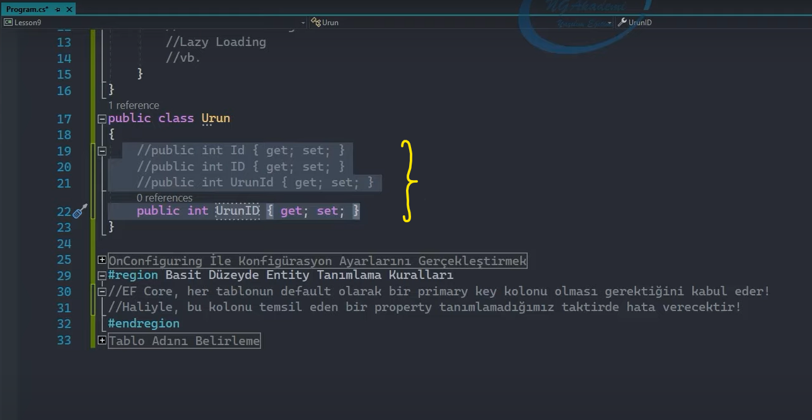

## OnConfiguring Fonksiyonu

Ef Core tool'unu yapılandırmak için kullandığımız bir metottur.

Context nesnesinde override edilerek kullanılmaktadır.

 

## Basit Düzeyde Entity Tanımlama Kuralları

Ef Core, her tablonun default olarak bir primary key kolonu olması gerektiğini kabul eder.

Haliyle bu kolonu temsil eden bir property tanımlamadığımız taktirde uygulama hata verecektir. 

Peki bizim bu primary key'e karşılık gelen property'leri nasıl tanımlamamız gerekiyor?

Aşağıda belirtilen property'ler gibi primary key kolonlarımızı oluşturabiliriz.

 

Ama tabi ilerki konularda farklı isimlendirmelerdeki property'leri primary key olarak seçebileceğiz.

