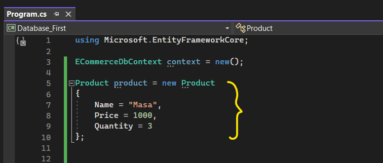
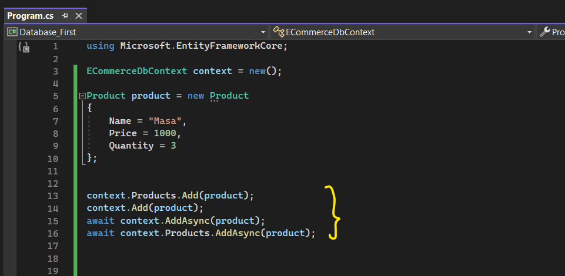
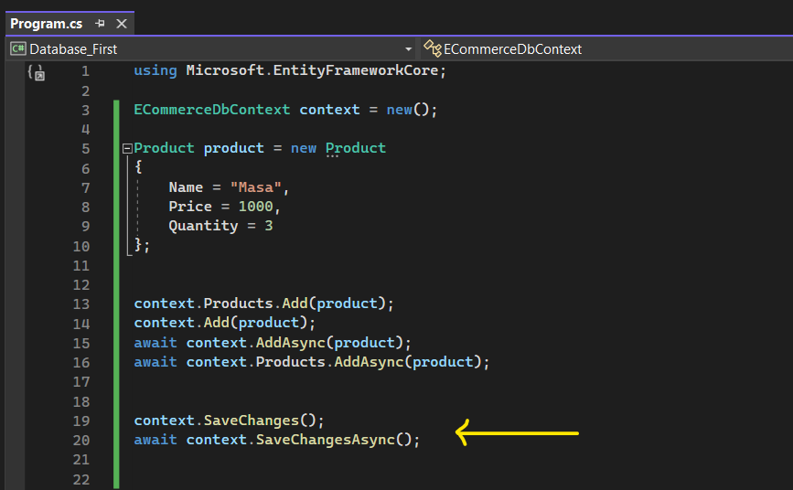
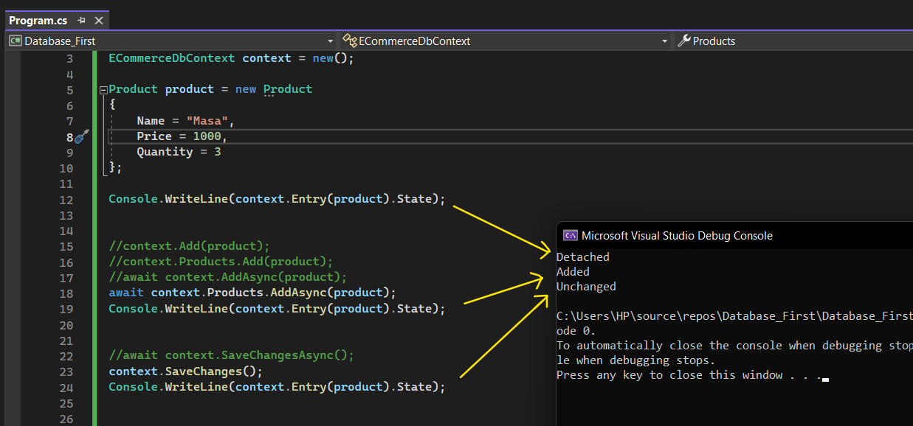
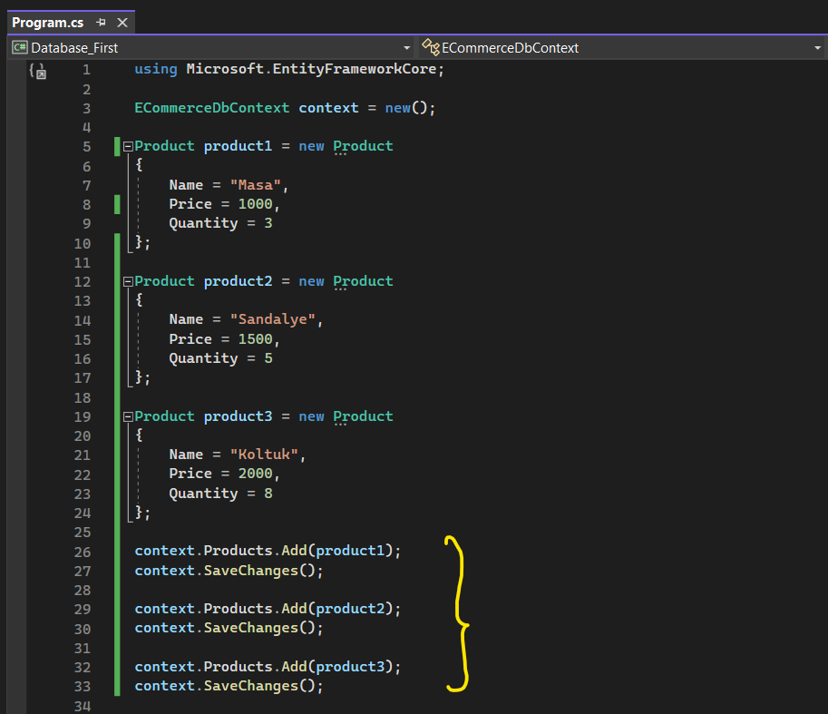
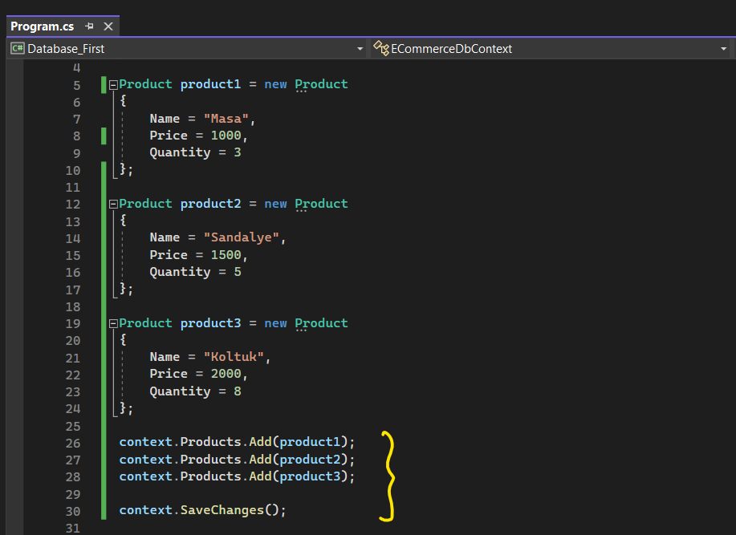
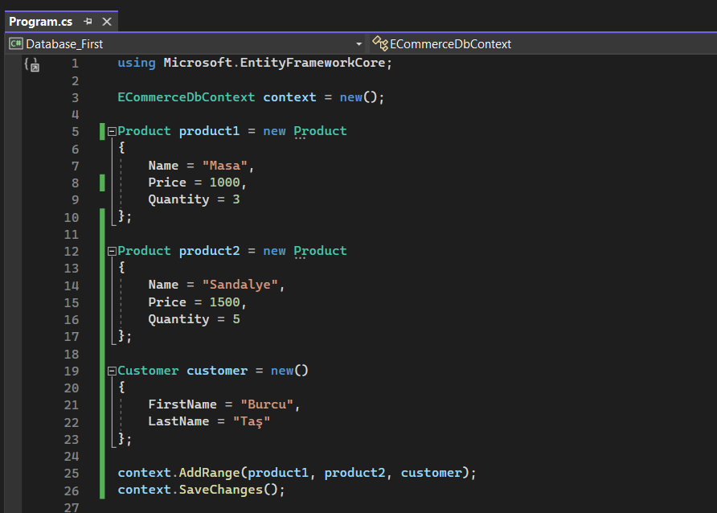

# Ef Core ile Veri Ekleme Detayları 
 

## Veri Nasıl Eklenir?

Ef Core'da veri ekleyebilmek, güncelleyebilmek, silebilmek, sorgulayabilmek yani verisel bütün işlemleri yapabilmek için öncelikle bir tane context nesnesinden instance'a ihtiyacımız var.

Dolayısıyla ilk işimiz context nesnesinden bir tane instance oluşturmaktır. Böylelikle ef core tool'larını kullanabiliriz.

 

Daha sonra eklenecek verinin bir tane entity instance'ını oluşturuyoruz.

 

Ardından bu context nesnesi üzerinden ilgili nesneyi Add veya AddAsync fonksiyonuyla ekliyoruz.

    
 

En sonunda da entity framework core'a, yapmış olduğumuz bu çalışmayı veri tabanına execute etmesi gerektiğini söyleyeceğiz. Bunun içinde SaveChanges fonksiyonunu kullanacağız.

 

## SaveChanges Metodu

SaveChanges Metodu; insert, delete ve update sorgularını oluşturup bir transaction eşliğinde veriyi veri tabanına gönderip execute eden fonksiyondur.

Eğer ki oluşturulan sorgulardan herhangi biri başarısız olursa tüm işlemleri geri alır. (rollback)

 

## Ef Core Açısından Bir Verinin Eklenmesi Gerektiği Nasıl Anlaşılıyor? 

Şimdi ef core, yukarıda yapmış olduğumuz işlemde SaveChanges'ı çağırdığımızda bir update ya da delete operasyonu değilde insert operasyonu yaptığımızı nasıl anlıyor?

Bunu anlayabilmemiz için bir özelliğimiz var o da State özelliğidir. Bu özellik, elimizdeki entity'e dair yapmış olduğumuz davranışın neticesinde onun durumunu bize söylüyor.

 

İlk state durumunda "Detached" diyor. Yani şu anda verinin üzerinde herhangi bir işlemin yapılmadığını, state'inin olmadığını söylüyor. 

İkinci state durumunda ise "Added" diyor. Yani eklenmeye hazır gibi düşünebiliriz.

Son olarak da state durumu "Unchanged" olarak görünüyor. Peki neden? Çünkü artık bu veri veri tabanına eklendiği ve üzerinde herhangi bir değişiklik yapılmadığı için unchanged olarak kabul edilmiş.

 

## Birden Fazla Veri Eklerken Nelere Dikkat Edilmelidir?

Biz projelerimizde birden fazla veri ekleyebiliriz ya da güncelleyebiliriz ya da silebiliriz. Peki her veri ekleme sürecinde aşağıdaki gibi bir davranış sergilersek bize nasıl bir maliyet çıkaracak gelin bunu inceleyelim.

 

Şimdi verilerimizi yukarıdaki gibi ekleyebiliriz. Ancak bu şekilde bir ekleme operasyonu yaptığımızda her ekleme işleminin devamında yaptığımız SaveChanges metodu birer transaction üreteceği için bu istemeyeceğimiz bir maliyettir. 

Dolayısıyla bunun yerine tek bir transaction oluşturup onun içerisinde bu ekleme, silme veya güncelleme işlemlerini yapmak daha az maliyetlidir. Yani kodumuzun son hali aşağıdaki gibi olmalıdır. 

 

Yukarıda anlatılanları tekrardan özetlememiz gerekirse eğer:

 - SaveChanges fonksiyonu her tetiklendiğinde bir transaction oluşturur. Ve bu da veri tabanı açısından ekstradan maliyete yol açar. Bu sebeple her işleme özel SaveChanges fonksiyonunu kullanmamalıyız.

- Mümkün mertebe tüm işlemlerimizi tek bir transaction eşliğinde veri tabanına göndermeliyiz. Böylelikle hem maliyetten tasarruf etmiş olacağız hem de yönetilebilirliği arttırmış olacağız.

 

## AddRange Fonksiyonu

AddRange fonksiyonu, veri tabanına birden fazla entity eklemek için kullanılan bir metottur.

Bu metot, birden fazla entity'i aynı anda veri tabanına eklemeyi kolaylaştırır ve daha verimli bir şekilde yapılmasını sağlar.

