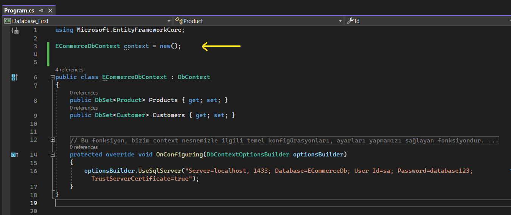
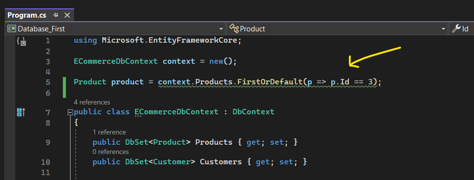
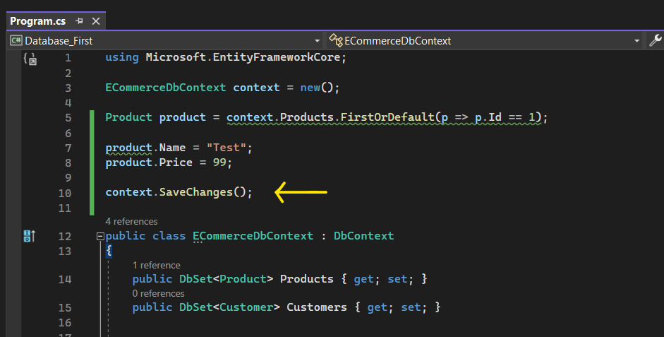
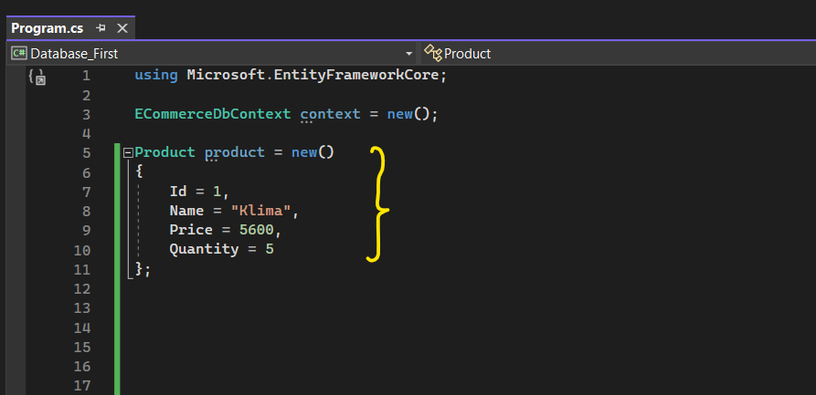
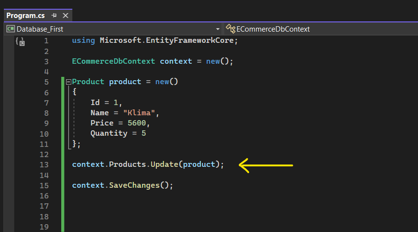
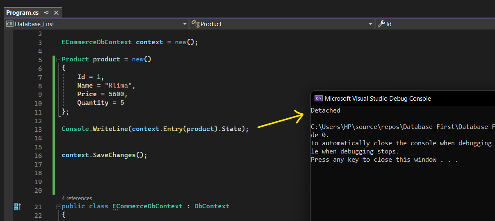
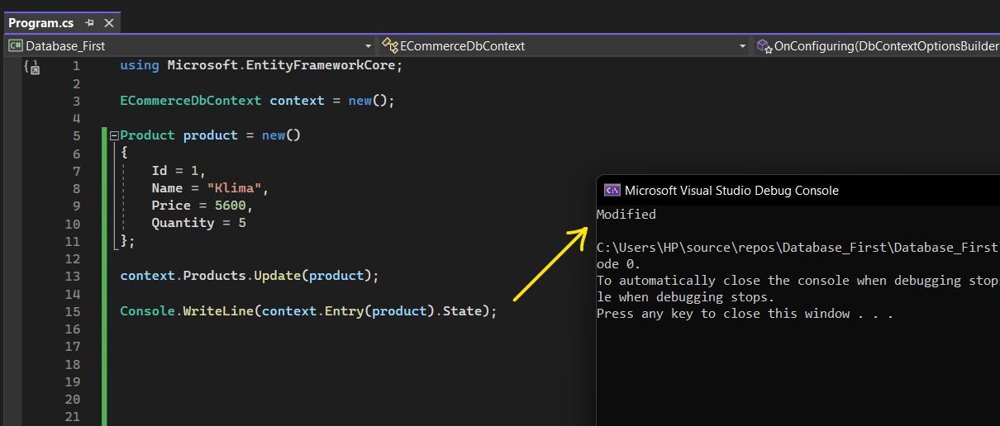
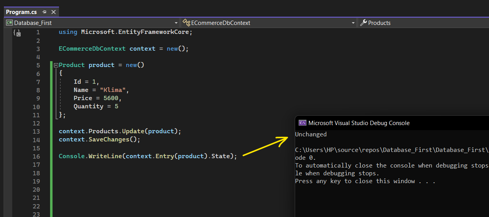

# Ef Core ile Veri Güncelleme Detayları

 

Yine öncelikle hangi veri tabanı üzerinde işlem yapıcaksak o veri tabanının bir context'ini oluşturuyoruz.

 

Veriyi güncelleyebilmek için o veriyi context üzerinden bir sorgulama neticesinde elde ediyoruz.

 

Daha sonrasında elde edilen bu veriyi istediğimiz gibi güncelleyerek veri tabanına SaveChanges fonksiyonuyla gönderiyoruz. 

 

SaveChanges fonksiyonu ChangeTracker sayesinde burada yapmış olduğumuz çalışmanın bir update işlemi olduğunu anlayacağı için bizim başka bir işlem yapmamıza gerek kalmıyor.

 

## ChangeTracker Nedir?

ChangeTracker, context üzerinden gelen verilerin takibinden sorumlu bir mekanizmadır. Bu takip mekanizması sayesinde nesnelerin delete yahut update sorgularının oluşturulup oluşturulmayacağı anlaşılır.

Böylelikle ef Core yapılanmasında; yapılan davranışa uygun sorgu, generate edilerek veri tabanına gönderilir. 

 

## Takip Edilmeyen Nesneler Nasıl Güncellenir?

Eğer ki güncelleyeceğimiz veri context'den gelmediyse yani veriyi herhangi bir sorgu neticesinde context'den elde etmediysek örneğin veriyi aşağıdaki gibi elde ettiysem;

 

o zaman bu veriyi nasıl güncelleyebiliriz? 

Ef core'da; bu şekilde oluşturduğumuz nesneler direkt veri tabanından elde edilmediği için veri tabanındaki nesne ile direkt eşleştirilmez.

Aynı zamanda bu oluşturmuş olduğumuz nesne context'den gelmediği için ChangeTracker tarafından da takip edilmez. Ve takip edilmediği için direkt SaveChanges fonksiyonunu da çağıramam.

Bu sebeple, takip edilmeyen nesneyi ef core üzerinden güncellemek istiyorsak eğer Update fonksiyonunu kullanabiliriz.

 

Ve en nihayetinde de sorguyu oluşturup veri tabanına gönderebilmek için SaveChanges fonksiyonunu çağırıyoruz.

Not: Update fonksiyonunu kullanabilmek için kesinlikle ilgili nesnenin id değeri verilmelidir.

 

## EntityState Nedir?

Bir entity instance'ının durumunu ifade eden, bize onunla ilgili bilgi veren referanstır.

Bir nesnenin üzerinde herhangi bir işlem yapılmadıysa, en sade halindeyse o zaman bu nesnenin durumu "Detached"dir.  

 

Eğer üzerinde bir değişiklik yaparsak eğer yaptığımız işleme göre bir değer yazdıracaktır. Örneğin bu nesneyi güncelleyeceksek eğer "Modified" durumunu ekrana yazdıracaktır. 

 

SaveChanges ile veri tabanına bu veriyi gönderirsekte nesnenin durumu "Unchanged" olarak değiştirilir. Yani veri, veri tabanına gönderildi ve artık üzerinde bir değişiklik yokmuş gibi kabul edilir. 

 

## Birden Fazla Veri Güncellenirken Nelere Dikkat Edilmelidir?

SaveChanges fonksiyonu her çağrıldığında bir transaction oluşturduğu için bu fonksiyonu, her güncelleme işleminin sonunda çağırmak yerine bütün güncelleme işlemleri bittikten sonra çağırmalıyız. Böylece daha az maliyetli bir iş çıkarmış oluruz.

