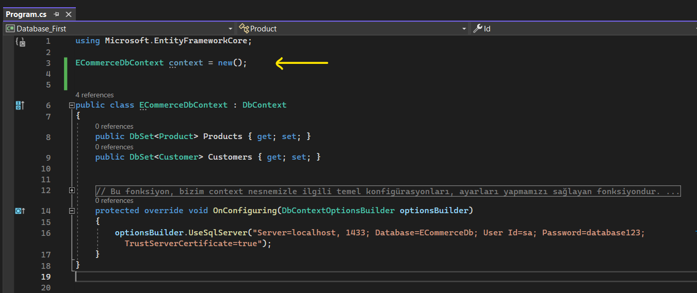
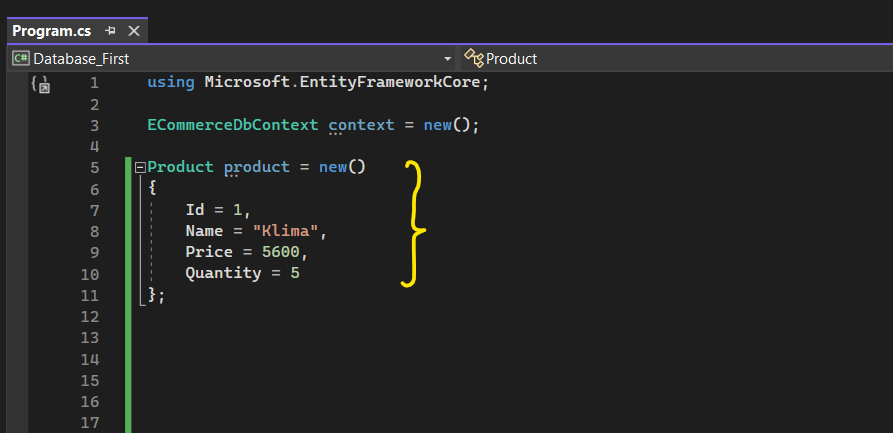

# Ef Core ile Veri Silme Detayları

 

Yine öncelikle hangi veri tabanı üzerinde işlem yapıcaksak o veri tabanının bir context'ini oluşturuyoruz.

 

Veriyi silmek için de o veriyi context üzerinden bir sorgulama neticesinde elde ediyoruz.

 

Daha sonrasında elde edilen bu veriyi Remove fonksiyonuyla silip, SaveChanges fonksiyonuyla da sorguyu oluşturup veri tabanına gönderiyoruz. 

 

## Takip Edilmeyen Nesneler Nasıl Silinir?

Eğer ki sileceğimiz veri context'den gelmediyse yani veriyi herhangi bir sorgu neticesinde context'den elde etmediysek örneğin aşağıdaki gibi elde ettiysem;

 

o zaman bu veriyi nasıl silebiliriz? 

Ef core'da; bu şekilde oluşturduğumuz nesneler direkt veri tabanından elde edilmediği için veri tabanındaki nesne ile direkt eşleştirilmez.

Aynı zamanda bu oluşturmuş olduğumuz nesne context'den gelmediği için ChangeTracker tarafından da takip edilmez. Ve takip edilmediği için direkt SaveChanges fonksiyonunu da çağıramam.

Bu sebeple, takip edilmeyen nesneyi ef core üzerinden silmek istiyorsak Remove fonksiyonunu kullanabiliriz.

 

## EntityState ile Silme İşlemi

Verinin durumunu değiştirerek de silme işlemini gerçekleştirebiliriz.

 

Hem context'ten aldığımız verinin hem de kendi oluşturduğumuz verinin state'ini değiştirerek veriyi database'den silebiliriz. 

 

## Birden Fazla Veri Silinirken Nelere Dikkat Edilmelidir?

Şimdi SaveChanges, her tetiklendiğinde yapılan işlemleri bir transaction eşliğinde veri tabanına gönderir ve orada execute eder. 

Yani ben SaveChanges'ı ne kadar çağırırsam o kadar transaction oluşturulmuş olacak. Ve ben birden fazla veri siliyorsam, her silmeden sonra da SaveChanges'ı çağırırsam bu çok maliyetli olur.

Bu yüzden her seferinde SaveChanges'ı çağırmaktansa bütün silme işlemlerim bittikten sonra SaveChanges'ı çağırmalıyım.

 

## RemoveRange Nedir?

Elimizde birden fazla veri varsa ve bunları tek tek silmek yerine ya da bunların state'lerini deleted olarak değiştirmek yerine bu verileri bir dizi olarak alıp silme işlemini yapan bir fonksiyondur.

 

İstersek yukarıdaki gibi RemoveRange fonksiyonuna bir dizi de verebiliriz ya da silinecek olan verileri virgüllerle ayırarak tek tek de verebiliriz. 

 

