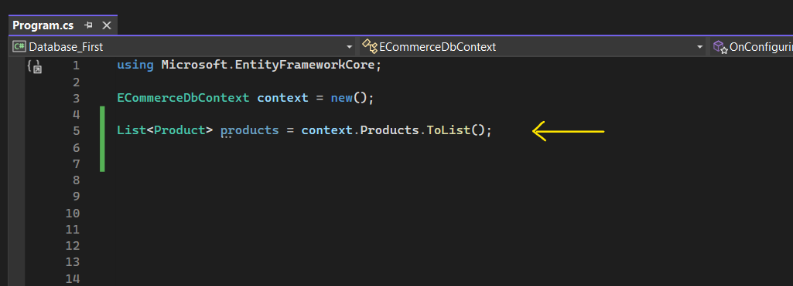
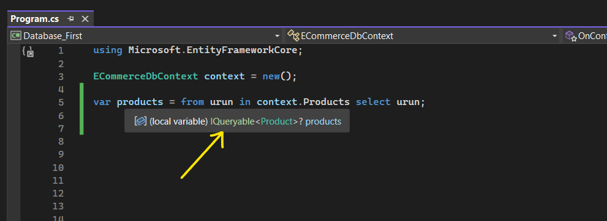
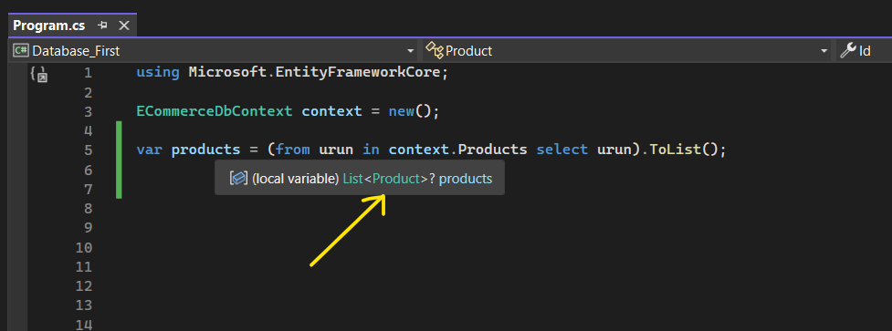
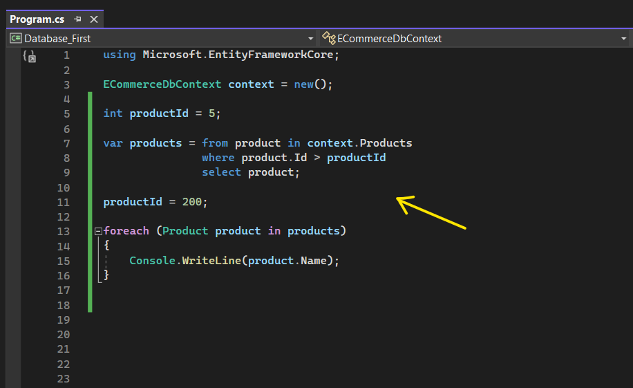

# Temel Düzeyde Sorgulama Yapılanmaları

Temelde, basit bir yapılanmada sorgulamayı ortaya koyabilmek için her şeyden önce bir tane context nesnesi üretmemiz gerekiyor. 

Ve sorgulama yaparken iki tane yöntem uygulayabiliriz. Bunlardan biri method syntax yöntemiyken diğeri query syntax yöntemidir.

 

## Method Syntax Yöntemi

Eğer sorgulama yaparken metotları kullanarak sorgulama yapıyorsak o zaman buna method syntax yöntemi denir.

Örneğin bir tablodaki bütün verileri getirebilmek için ToList fonksiyonunu kullanıyorsam eğer burada method syntax'ı kullanmış oluruz.

 

## Query Syntax Yöntemi

Eğer aşağıdaki gibi bir gramer ile sorgulama yapıyorsak o zaman da query syntax'ı kullanmış oluruz.

Bu LINQ sorgusundaki urun parametresi o an işlem yapılan ürünü temsil eder. Sorgunun her bir adımında, urun parametresi değişir ve sıradaki ürünü temsil eder.

 

## Sorguyu Execute Etmek İçin Ne Yapmamız Gerekmektedir?

Yani biz sorguyu oluşturduktan sonra execute edebilmek için ne yapmamız lazım? İlla ki ToList'i mi çağırmamız gerek?

Şimdi sorguyu execute edebilmek için ne yapmamız gerektiği sorusundan önce anlamamız gereken daha önemli bir nokta var. O nokta da şu ki; oluşturduğumuz sorgu, IQueryable mıdır yoksa IEnumerable mıdır?

İlk önce bu sorunun cevabını vericez ona göre de ToList'in çağırılıp çağırılmamasını ya da ToList'in dışında başka bir alternatifimiz var mı yok mu bunları cevaplandırıcaz. O yüzden öncelikle IQueryable ve IEnumerable nedir gelin bunlara bakalım.

 

## IQueryable ve IEnumerable Nedir?

IQueryable, sorguya karşılık gelir. Ef core üzerinden yapılmış olan sorgunun execute edilmemiş halini ifade eder. Yani elimizde bir veri yoktur.

IEnumerable, sorgunun çalıştırılıp / execute edilip verilerin in memory'e yüklenmiş halini ifade eder. 

IEnumerable; bellekteki verileri, koleksiyonel yapılanmaları temsil eder.

 

## Peki Bir Sorgunun IQueryable ya da IEnumerable Olduğunu Nerden Anlayabiliriz?    

Bunun için query syntax üzerinden bir örneği inceleyebiliriz:

 

Görüldüğü üzere yukarıdaki sorguda "products" değişkeninin tipi IQueryable'dır. Demek ki sorgulama aşamasındayız, elimizde herhangi bir veri yok. Eğer ki ben bu sorguyu çalıştırırsam; sorgu, veri tabanına gidecek ve ilgili verileri yazılım tarafına getirip in memory'de bu verilerin instance'larını tutacak. 

İşte o zaman nerde olmuş olucam IEnumerable'da olmuş olucam. IEnumerable'da da veriler artık bellektedir. Peki biz bu verileri IQueryable'dan IEnumerable'a nasıl çekicez?

Bunun için ilgili sorguyu alıp ToList ya da ToListAsync fonksiyonuyla sorguyu execute ediyoruz.

Yani ToList ya da ToListAsync fonksiyonu, sorguyu execute etmek için kullandığımız fonksiyondur.

 

Yukarıdaki örnekte "products" değişkeninin tipi her ne kadar List&lt;Product&gt; olsa da aslında List'ler özünde bir IEnumerable'dır. Bu sebepten ötürü biz IQueryable sorgularını execute edebilmek için ToList fonksiyonunu kullanırız. 

 
<h2>
Peki IQueryable sorgusunu IEnumerable yapabilmek için ToList ya da ToListAsync fonksiyonlarından başka bir alternatifimiz yok mu? 
</h2>

Var elbette. O da Deferred Execution yani Ertelenmiş Çalışma.

 

## Deferred Execution

 

Yukarıdaki çalışmada products değişkeni IQueryable durumunda yani çalıştırılmamış bir sorgu durumundadır. Ancak biz bu products'ı foreach içerisinde çalıştırdığımız zaman sorgu tetiklenecek ve IEnumerable olacak.  

Peki products'ın içerisindeki sorguda productId'nin değeri sizce ne olacak? Eğer 5 cevabını veriyorsanız cevap yanlış. productsId'nin değeri 200'dür. Ama neden?

products ile ilgili sorgu "oluşturulduğunda" productId'nin değeri 5'tir ancak products sorgusunun "çalıştırıldığı" anda ki değeri 200'dür.

Bu sebepten ötürü sorguyu da 200 değeri ile çalıştıracaktır.

IQueryable çalışmalarında ilgili sorgu yazıldığı noktada tetiklenmez / çalıştırılmaz / generate edilmez. Nerede eder peki?

Tetiklendiği noktada çalıştırılır. İşte bu duruma da Deferred Execution (ertelenmiş çalışma) denir.

