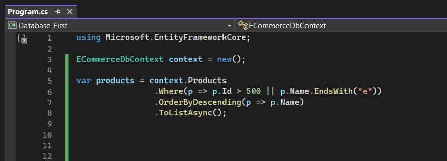
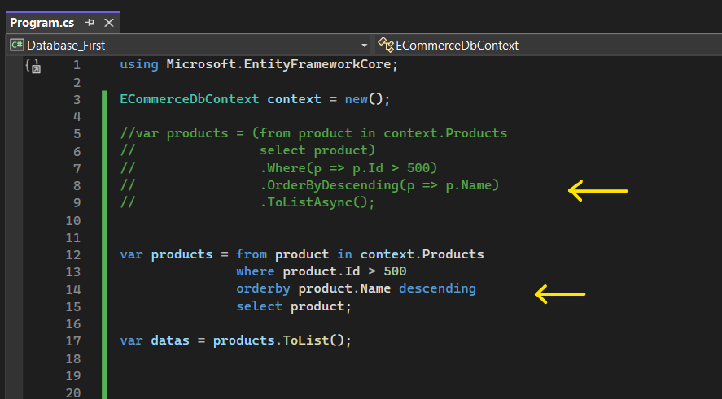

# Temel Düzeyde Sorgulama Yapılanmaları

 

## ToListAsync Fonksiyonu

üretilen sorguyu execute ettirmemizi sağlayan fonksiyondur. Yani IQueryable'dan IEnumerable'a geçiş yapmamızı sağlıyor. 

### Method Syntax

### Query Syntax

Bu sorguyu iki farklı şekilde oluşturabiliriz.

  

## Where Fonksiyonu

Oluşturulan sorguya where şartı eklememizi sağlayan fonksiyondur.

### Method Syntax

### Query Syntax

Yine her iki yöntemle de sorgumuzu oluşturabiliriz.

  

## OrderBy Fonksiyonu

İlgili sorguya sıralama operasyonu gerçekleştirmiş oluruz. Default olarak ascending davranışı gösterir. Yani küçükten büyüğe doğru bir sıralama yapar. Bu davranışın tam tersi olan descending'de ise büyükten küçüğe doğru bir sıralama yapar.

### Method Syntax - Ascending

### Query Syntax - Ascending

 

### Method Syntax - Descending

### Query Syntax - Descending

 
  

## ThenBy Fonksiyonu

Sıralama işlemlerinde kullanılan bir fonksiyondur. OrderBy fonksiyonu ile birinci sıralamayı yaptıktan sonra kullanılır. 

Birden fazla ThenBy fonksiyonu kullanarak da çoklu seviyeli sıralama yapabiliriz.

Bu fonksiyonu da OrderBy'daki gibi ascending ve descending davranışlarıyla kullanabiliriz.

### Method Syntax

### Query Syntax

 

Yukarıdaki çalışmada ikinci sorguda thenBy kullanılmıyor. Dolayısıyla sıralama işlemlerini virgüllerle ayırarak veyahut tekrar orderby keyword'ünü kullanarak yapabiliriz.

