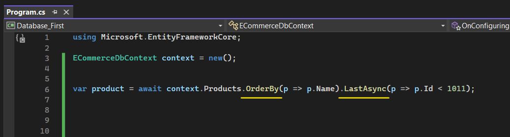

# Temel Düzeyde Sorgulama Yapılanmaları

 

## SingleAsync ve SingleOrDefaultAsync Fonksiyonları

Yapılan sorguda sadece tek bir verinin gelmesi amaçlanıyorsa SingleAsync ya da SingleOrDefaultAsync fonksiyonları kullanılabilir. Aynı zamanda bunların asenkron olmayan fonksiyonları da (Single veya SingleOrDefault) kullanılabilir.

### - SingleAsync

Eğer ki sorgu neticesinde birden fazla veri geliyorsa ya da hiç gelmiyorsa her iki durumda da exception fırlatılır. Yani tek bir verinin gelmediği her durumda exception fırlatılır.

### - SingleOrDefaultAsync

Eğer ki sorgu neticesinde birden fazla veri geliyorsa exception fırlatılır, hiç veri gelmiyorsa null döner.

  

## FirstAsync ve FirstOrDefaultAsync Fonksiyonları

Yapılan sorguda ilk / en üstteki verinin gelmesi amaçlanıyorsa First veya FirstOrDefault fonksiyonları kullanılabilir.

### - FirstAsync 

Hiç veri gelmezse hata fırlatır.

### - FirstOrDefaultAsync 

Hiç veri gelmezse null değerini döndürür.

  

## FirstAsync, FirstOrDefaultAsync, SingleAsync ve SingleOrDefaultAsync Karşılaştırması

  

## FindAsync Fonksiyonu

Find fonksiyonu, primary key kolonuna özel hızlı bir şekilde sorgulama yapmamızı sağlar.  

### - Composite Primary Key Durumu

Aşağıdaki gibi tabloların id'lerini tutarak oluşturduğumuz bir entity'de;

 

Find fonksiyonunu kullanabiliriz:

 

Yani ProductPieces tablosunda 42 ve 5 id'lerine sahip bir kayıt bulursa onu getirecek.

  

## Find ile Single, SingleOrDefault, First ve FirstOrDefault Fonksiyonlarının Karşılaştırması 

  

## LastAsync ve LastOrDefaultAsync Fonksiyonları

Yapılan sorguda son / en alttaki verinin gelmesi amaçlanıyorsa Last veya LastOrDefault fonksiyonları kullanılabilir.

! Bu fonksiyonu kullanırken OrderBy fonksiyonunu da kullanmak zorundayız. Aksi taktirde run time hatası alırız.

### - LastAsync

Hiç veri gelmezse hata fırlatır.

 

Önce productları name değerlerine göre sıralar. Daha sonrasında bu productların id'si 1011'den küçük olanlardan sonuncusunu getirir. 

### - LastOrDefaultAsync

Hiç veri gelmezse null döndürür.

