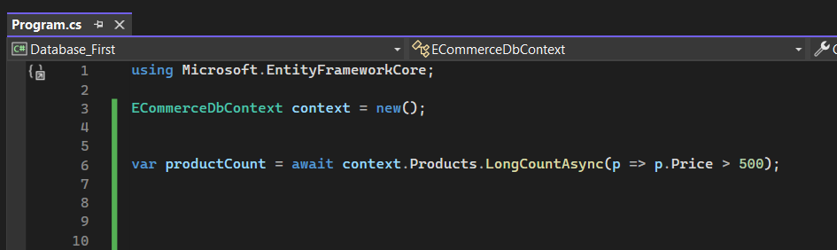

# Temel Düzeyde Sorgulama Yapılanmaları

 

## CountAsync Fonksiyonu

Oluşturulan sorgunun execute edilmesi neticesinde kaç adet kaydın elde edileceğini sayısal olarak (int) bizlere bildiren fonksiyondur.

Peki bu fonksiyonu nasıl kullanabiliriz? Eğer aşağıdaki gibi kullanırsak bu çok maliyetli olur. Çünkü bu yöntemde verilerin count'u bellekte hesaplanıyor. 

 

Ve nihayetinde bütün ürünleri belleğe çekip orada saymak yerine direkt veri tabanı kısmında bu hesaplamayı yapmak daha az maliyetlidir. Yani şöyle ki;

 

## LongCountAsync Fonksiyonu

Oluşturulan sorgunun execute edilmesi neticesinde kaç adet kaydın elde edileceğini sayısal olarak (long) bizlere bildiren fonksiyondur.

 

NOT : Ayrıca hem count hem de longCount fonksiyonunda şartlı bir sorgu oluşturabiliriz. Örneğin fiyatı 500'den büyük olan ürünlerin sayısını hesapla gibi bir sorgu oluşturabiliriz.

 

## AnyAsync Fonksiyonu

Sorgu neticesinde verinin gelip gelmediğini bool türüyle bize bildiren fonksiyondur.

Count fonksiyonunda olduğu gibi any fonksiyonunda da şarta göre bir sorgulama yapabiliriz.

 

## MaxAsync Fonksiyonu

Verilen kolondaki maximum değeri getirir.

 

## MinAsync Fonksiyonu

Verilen kolondaki minimum değeri getirir.

 

## Distinct Fonksiyonu

Sorguda mükerrer kayıtlar varsa bunları tekilleştiren fonksiyondur.

Distinct fonksiyonu, IQueryable döndüğü için ekstradan ToList fonksiyonunu da sorgunun sonuna ekliyoruz.

 

## AllAsync Fonksiyonu

Sorgu neticesinde gelen verilerin, verilen şarta uyup uymadığını kontrol eder. Eğer ki tüm veriler şarta uyuyorsa true, uymuyorsa false değerini döndürür.

 

## SumAsync Fonksiyonu

Verilen kolondaki sayısal değerileri toplar.

 

## Average Fonksiyonu

Verilen kolondaki sayısal değerlerin ortalamasını alır.

 

## Contains Fonksiyonu

Contains fonksiyonunu aşağıdaki gibi iki şekilde kullanabiliriz.

 

Eğer Contains metodunu 1. şekilde kullanırsak Products tablosunun içerisinde verilen product nesnesinin bulunup bulunmadığını kontrol eder. 

Bu kontrol, veri tabanında tam olarak aynı product nesnesinin olup olmadığını kontrol eder. Yani Name, Price ve Quantity özelliklerinin tümü aynı olmalıdır. 

Eğer böyle bir ürün veri tabanında bulunursa, product1 değeri true olur, aksi takdirde false olur.

2. şekilde kullanırsak da veri tabanındaki Products tablosundan, Name özelliği içerisinde "a" harfini içeren ürünler de kontrol yapar. Bu sorgu, adında "a" harfi bulunan tüm ürünleri döndürür. 

 

## StartsWith Fonksiyonu

Like (....%) sorgusu oluşturmamızı sağlar.

 

## EndsWith Fonksiyonu 

Like (%....) sorgusu oluşturmamızı sağlar.

