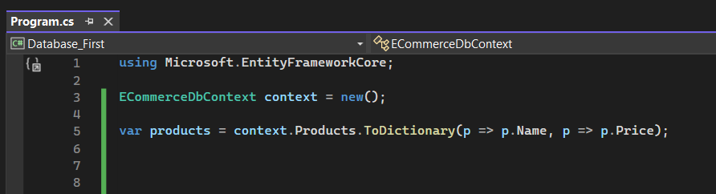
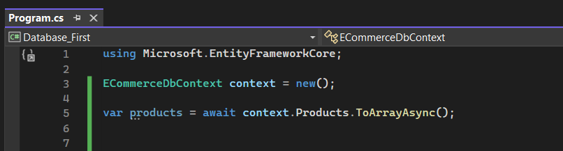
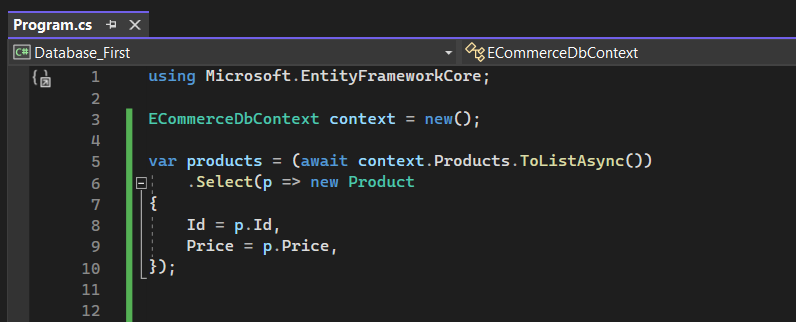
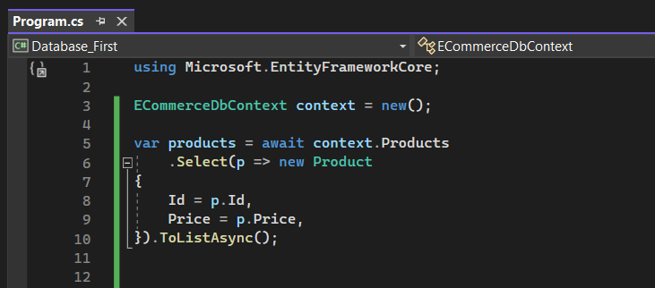
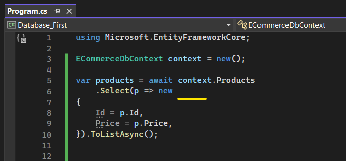
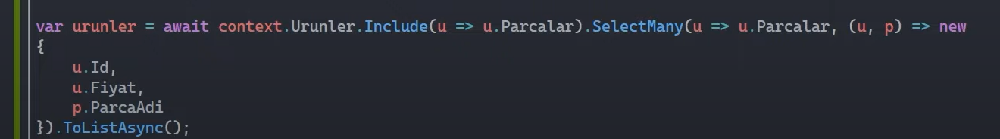

# Sorgu Sonucu Dönüşüm Fonksiyonları

Bu fonksiyonlar ile sorgu neticesinde elde edilen verileri isteğimiz doğrultusunda farklı türlerde projeksiyon edebiliyoruz. 

 

## ToDictionaryAsync Fonksiyonu

Sorgu neticesinde gelecek olan veriyi bir dictionary olarak elde etmek / tutmak / karşılamak istiyorsak eğer bu fonksiyon kullanılabilir.

 

ToList ile aynı amaca hizmet etmektedir. Yani ikiside oluşturulan sorguyu execute ederler. Aralarındaki fark ise;

- ToList, gelen sorgu neticesini entity türünde bir koleksiyona (List&lt;Entity&gt;) dönüştürmekteyken 

- ToDictionary, gelen sorgu neticesini Dictionary türünden bir koleksiyona dönüştürmektedir.

 

## ToArrayAsync Fonksiyonu

Oluşturulan sorguyu execute edip sonucu, entity dizisi olarak elde eder. 

 

## Select Fonksiyonu

Select fonksiyonunun işlevsel olarak birden fazla davranışı söz konusudur.

<strong>1.</strong> Select fonksiyonu, generate edilecek olan sorgunun çekilecek olan kolonlarını ayarlamamızı sağlamaktadır.

Yani eğer bir tablonun bütün kolonlarını değilde belirlediğimiz kolonlarını getirmek istiyorsak Select fonksiyonunu kullanabiliriz.

Eğer select fonksiyonunu aşağıdaki şekilde kullanırsak seçme işlemi bellekte yapılacağı için performanslı, düşük maliyetli bir sorgulama yapmış olmayız.

 

O yüzden bunun yerine, sorgu daha oluşturulma aşamasındayken yani IQueryable'dayken Select fonksiyonunu kullanmalıyız. Daha sonra sorguyu execute etmeliyiz. 

 

<strong>2.</strong> Select fonksiyonu gelen verileri farklı türlerle de (T, anonim) karşılamamızı sağlarlar.

 

Eğer new keyword'ünün yanında herhangi bir tür belirtmezsek bu anonim türüne karşılık gelir. Yani herhangi bir türü yok aslında.

Aynı şekilde bu gelen Products verilerini oluşturduğumuz başka bir tür ile de karşılayabiliriz. Örneğin Id ve Price property'lerinin olduğu ProductDetail diye bir class oluşturulur ve gelen veriler bu türle karşılanabilir.

 

## SelectMany Fonksiyonu

Select ile aynı amaca hizmet eder. Lakin ilişkisel tablolar neticesinde gelen koleksiyonel verileri de tekilleştirip projeksiyon etmemizi sağlar.

