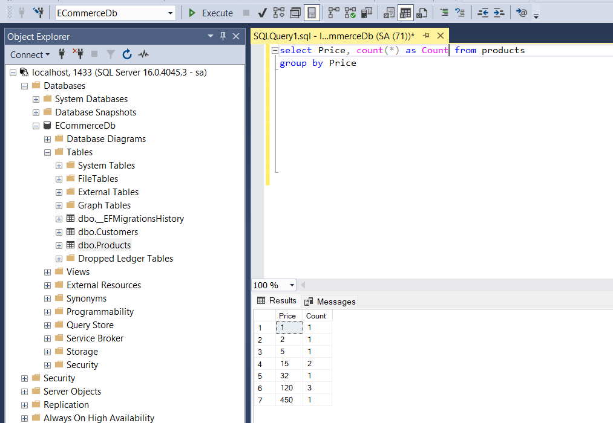
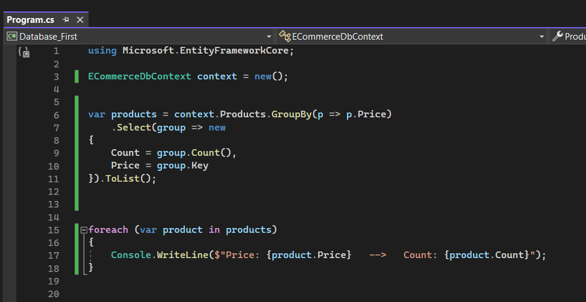
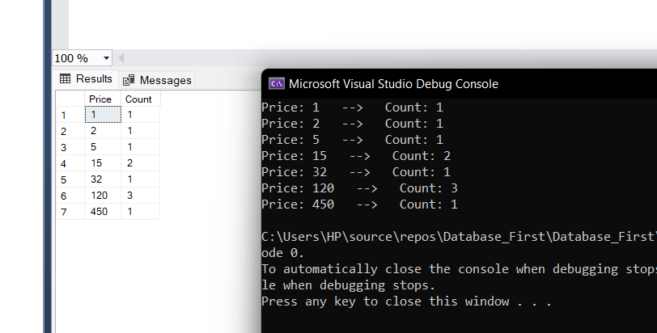
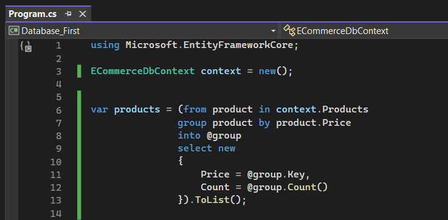
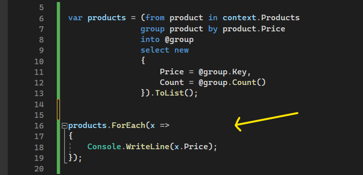

# GroupBy ve Foreach Fonksiyonları

 

## GroupBy Fonksiyonu

Gruplama yapmamızı sağlayan fonksiyondur.

Örneğin "Aynı fiyat bilgisine sahip kaç tane ürün var" bunu öğrenmek istiyorsam GroupBy fonksiyonunu kullanmalıyım.

Eğer bu sorguyu mssql'de oluşturmam gerekseydi, aşağıdaki sorguyu yazmamız gerekecekti.

 

Ancak yukarıdaki sorguyu ef core ile oluşturmamız gerekirse aşağıdaki çalışmayı yapmamız gerekecek.

 

Yukarıdaki çalışmada gruplanacak olan kolonu GroupBy fonksiyonuna parametre olarak veriyoruz. Ve GroupBy, bu verileri fiyat kolonuna göre gruplayıp buna karşılık kaç tane veri varsa onu getirecek.

Select'de bizim oluşturduğumuz group parametresi, gruplama işleminin yapıldığı her bir veri grubunu ve buna karşılık gelen toplam veri sayısını temsil ediyor. Ve bu her bir veri grubunun toplam sayısına ulaşabilmek için Count fonksiyonunu, bu gruplamanın yapıldığı tablo kolonuna ulaşabilmek için ise Key property'sini kullanıyoruz.

Böylece bu sorgu sonucunda üretilen çıktı ile mssql'de üretilen çıktı aynı olacaktır.

 

Peki bu method syntax'a karşılık gelen query syntax nasıl oluşturulmalı? Onu da aşağıdaki gibi yapabiliriz:

 

## Foreach Fonksiyonu

Bir sorgulama fonksiyonu değildir. Foreach döngüsünün metot halidir.

Sorgulama neticesinde elde edilen koleksiyonel veriler üzerinde iterasyonel olarak dönmemizi ve verileri teker teker elde edip işlemler yapabilmemizi sağlayan fonksiyondur. 

Örneğin yukarıdaki çalışmada elde ettiğimiz products listesini foreach fonksiyonu ile aşağıdaki gibi dönebiliriz. 

