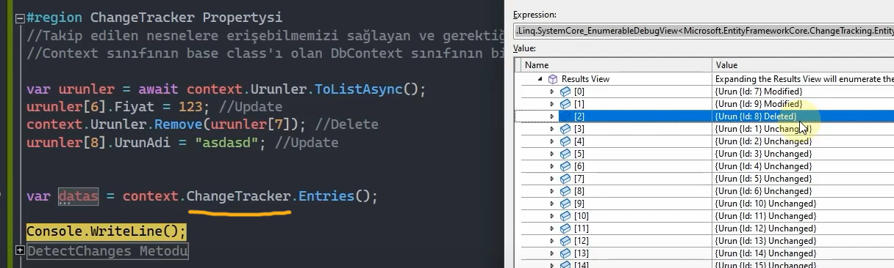
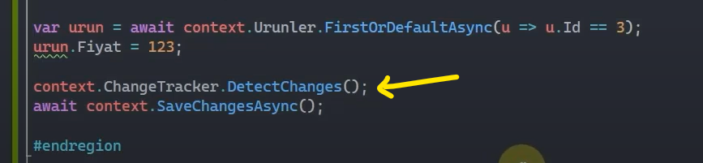
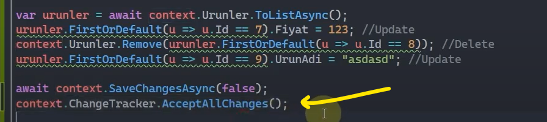
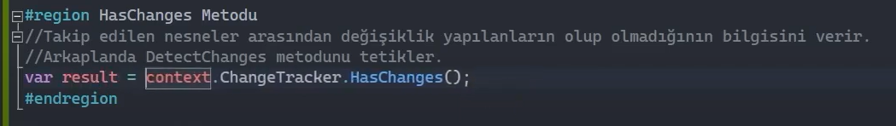
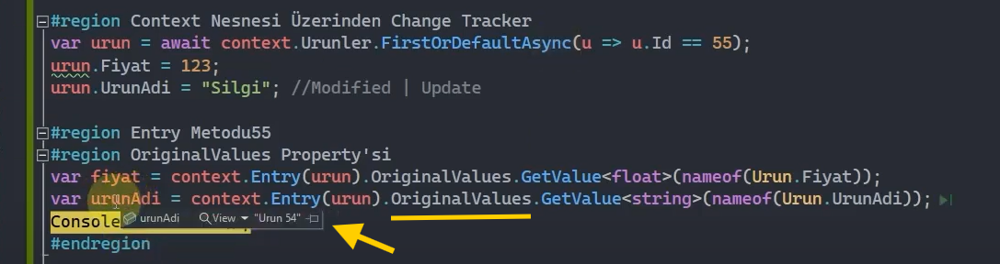

# Chance Tracker Fonksiyonu

 

## Change Tracking Neydi?

Context nesnesi üzerinden gelen tüm nesneler/veriler otomatik olarak bir takip mekanizması tarafından izlenir. İşte bu taki mekanizmasına Change Tracker denir. Change Tracker ile nesneler üzerindeki değişiklikler/işlemler takip edilerek bu işlemlerin fıtratına uygun sql sorgucukları generate edilir. İşte bu işleme de Change Tracking denir.

Yani bu mekanizmanın adı Change Tracker, bu mekanizmanın yapmış olduğu işleme de Change Tracking denir.

 

## ChangeTracker Property'si Nedir?

Takip edilen nesnelere erişebilmemizi sağlayan ve gerektirdiği taktirde işlemler gerçekleştirebilmemizi sağlayan bir property'dir.

Context sınıfının base class'ı olan DbContext sınıfının bir member'ıdır.

 

Görüldüğü üzere context nesnesi üzerinden ChangeTracker property'sine ulaşılmıştır.

 

## DetectChanges Metodu Nedir?

Ef Core, context nesnesi tarafından izlenen tüm nesnelerdeki değişiklikleri Change Tracker sayesinde takip edebilmekte ve nesnelerde olan verisel değişiklikler yakalanarak bunların anlık görüntülerini (snapshot) oluşturabilmektedir.

Ve yapılan değişikliklerin veri tabanına gönderilmeden önce algılandığından emin olmak gerekir.

SaveChanges fonksiyonu çağırıldığı anda nesneler, Ef Core tarafından otomatik kontrol edilir. Yani SaveChanges, sadece SaveChanges işlemini yapmıyor, ilk önce bir detect ediyor. Yani burada bir maliyet var aslında. SaveChanges önce Change Tracker ile ilgili gerekli kontrolleri yapıyor ondan sonra SaveChanges işlemini yapıyor.  

Ancak yapılan operasyonlarda güncel tracking verilerinden emin olabilmek için değişikliklerin algılanmasını opsiyonel olarak gerçekleştirmek isteyebiliriz.

Yani işi, ne Ef Core'a bırakmak isteyebiliriz ne de SaveChanges'a. Bunu kendi irademizle de kontrol etmek isteyebiliriz. İşte bunun için DetectChanges fonksiyonu kullanılabilir ve her ne kadar Ef Core değişiklikleri otomatik algılıyor olsa da biz yine de irademizle kontrole zorlayabilirsiniz.

Özetle DetectChanges ile sistemde yapılan değişiklikleri iradeli bir şekilde tekrardan kontrol etmiş ve Change Tracker mekanizmasındaki state'leri buna göre güncelle demiş oluyoruz. Bu birincisi.

İkincisi SaveChanges fonksiyonunu çağırdığımızda DetectChanges metodu da otomatik tetikleniyormuş.

 

## AutoDetectChangesEnabled Property'si Nedir?

Bu property, DetectChanges metodunu otomatik olarak tetiklenmesinin konfigürasyonunu sağlıyor. 

Normalde SaveChanges ve Entries fonksiyonları içerisinde DetectChanges otomatik olarak tetikleniyordu. İşte AutoDetectChangesEnabled property'sine gelip de biz false değerini verirsek artık SaveChanges fonksiyonlarının içerisinde DetectChanges fonksiyonu otomatik olarak tetiklenmeyecek.

Bu da neye yarayacak? Aşırı derecede Ef Core yapılanmasında bir optimizasyon yapacaksak ve özellikle de maliyet ve performans optimizasyonu yapacaksak bu property'i kullanabiliriz.  

 

## Entries Metodu Nedir?

Context'deki Entry metodunun koleksiyonel versiyonudur. Yani Entry ile tek bir entity nesnesi üzerindeki state'i bizlere verirken Entries fonksiyonu ise bunun çoğuludur, koleksiyonel hâlidir. Bütün takip edilen nesnelerle ilgili state bilgisini bizlere döndürür.

Change Tracker mekanizması tarafından izlenen her entity nesnesinin bilgisini EntityEntry türünden elde etmemizi sağlar ve belirli işlemler yapabilmemize olanak tanır. 

Entries metodu çalışmadan önce DetectChanges metodunu otomatik tetikler. Niye tetikler? Entries metodu Change Tracker üzerinde takip edilen ne kadar nesne varsa hepsini elde edecek ya, elde edebilmek için son kez bir DetectChanges'la durumu tetikliyor ve ondan sonra verilerin state'lerini elde ediyor. Bu durumda tıpkı SaveChanges'da olduğu gibi bir maliyettir. Buradaki maliyetten kaçınmak için AutoDetectChangesEnabled property'sine false değeri verilebilir.  

 

## AcceptAllChanges Metodu Nedir?

SaveChanges() veya SaveChanges(true) metodu tetiklendiğinde Ef Core her şeyin yolunda olduğunu varsayarak track ettiği verilerin takibini keser ve yeni değişikliklerin takip edilmesini bekler. Böyle bir durumda beklenmeyen bir durum / olası bir hata söz konusu olursa eğer Ef Core takip ettiği nesneleri bırakacağı için bir düzeltme söz konusu olmayacaktır.

Haliyle bu durumda devreye SaveChanges(false) ve AcceptAllChanges metotları devreye girecektir.

SaveChanges(false) metodu, Ef Core'a gerekli veri tabanı komutlarını yürütmesini söyler ancak gerektiğinde yeniden oynatılabilmesi için değişiklikleri beklemeye/nesneleri takip etmeye devam eder. Ta ki AcceptAllChanges metodunu irademizle çağırana kadar.

SaveChanges(false) ile işlemin başarılı olduğundan emin olursak AcceptAllChanges metodu ile nesnelerden takibi kesebiliriz.

 

## HasChanges Metodu Nedir?

Takip edilen nesneler arasında değişiklik yapılanların olup olmadığınının bilgisini verir.

Arkaplanda DetectChanges metodunu tetikler.

 

## OriginalValues Property'si ve GetDatabaseValues Metodu Nedir? 

Eğer nesne üzerindeki değişiklikler veri tabanına yansıtılmadan evvel veri üzerindeki güncel değerleri elde etmek istiyorsak OriginalValues property'sini veyahut GetDatabaseValues metodunu kullanabiliriz.

 

Görüldüğü üzere UrunAdi değerini "Silgi" olarak atamama rağmen, yapılan bu değişikliği veri tabanına yansıtmadığımız için orijinal değer olan "Urun 54" verisini alıyoruz.

