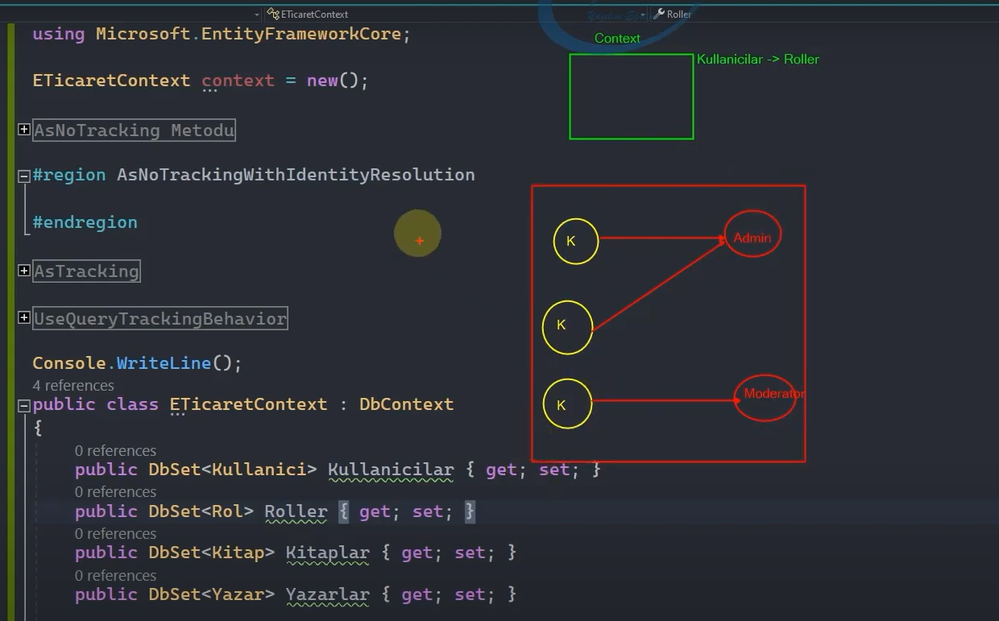
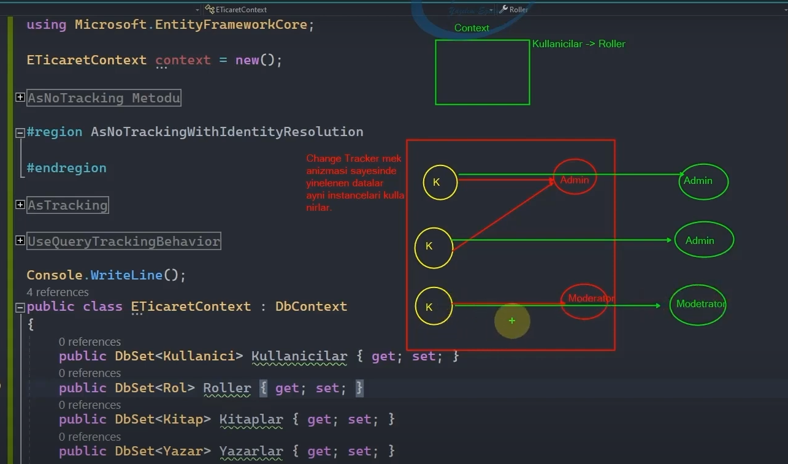
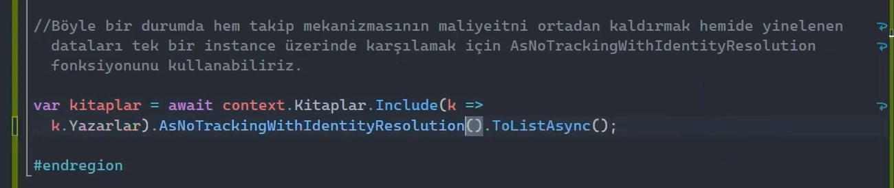
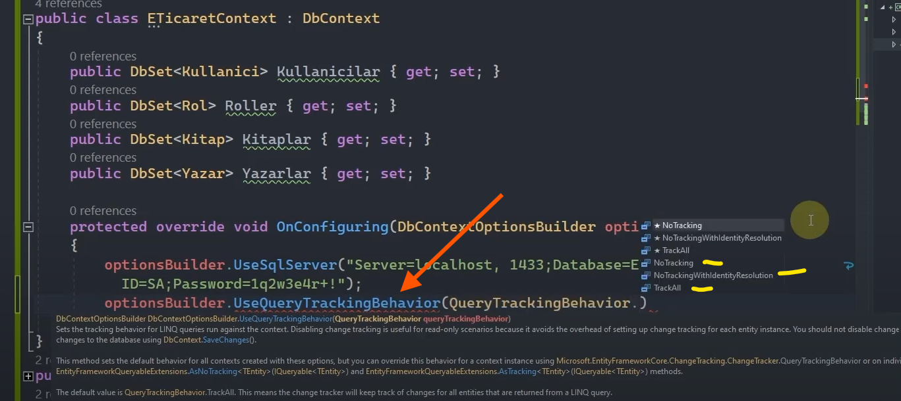

# AsNoTracking Fonksiyonu

 

Context üzerinden gelen tüm datalar Change Tracker mekanizması tarafından takip edilmektedir. Change Tracker takip ettiği nesnelerin sayısıyla doğru orantılı bir şekilde bir maliyete sahiptir.

Bu yüzden üzerinde işlem yapılmayacak verilerin takip edilmesi bizlere lüzumsuz yere bir maliyet ortaya çıkaracaktır.

AsNoTracking metodu; context üzerinden sorgu neticesinde gelen verilerin, Change Tracker tarafından takip edilmesini engeller.

Context üzerinden yapmış olduğumuz sorgulama neticesinde gelecek olan bütün dataların takip edilmesini istemiyorsak, bu datalar üzerinde herhangi bir değişiklik yapmayacaksak AsNoTracking ile buradaki takip mekanizmasını koparabiliriz. 

AsNoTracking metodu ile ChangeTracker'ın ihtiyaç olmayan verilerdeki maliyetini törpülemiş oluruz.

AsNoTracking fonksiyonu ile yapılan sorgulamalarda verileri elde edebilir, bu verileri istenilen noktalarda kullanabilir lakin veriler üzerinde herhangi bir değişiklik / update işlemi yapamayız.

 

## AsNoTrackingWithIdentityResolution Fonksiyonu 

Change Tracker mekanizması sayesinde yinelelen datalar aynı instance'ları kullanırlar.

 

Ancak AsNoTracking metodu ile yapılan sorgularda farklı instance'larla karşılanırlar.

 

Yani Change Tracker mekanizması yinelenen verileri tekil instance olarak getirir. Burada ekstradan bir performans kazancı söz konusudur. Bizler yaptığımız sorgularda AsNoTracking metodu ile takip mekanizmasının maliyetini kırmak isterken bazen daha büyük maliyetlere sebebiyet verebiliriz. (Özellikle ilişkisel tabloları sorgularken bu duruma dikkat etmemiz gerekiyor.)

AsNoTracking ile elde edilen veriler takip edilmeyeceği için yinelenen verilerin ayrı instance'larda olmasına sebebiyet veriyoruz. Çünkü Change Tracker mekanizması; takip ettiği nesneden bellekte varsa eğer aynı nesneden bir daha oluşturma gereği duymadan, ayrı noktalardaki ihtiyacı aynı instance üzerinden gidermektedir. 

Böyle bir durumda hem takip mekanizmasının maliyetini ortadan kaldırmak hem de yinelenen dataları tek bir instance üzerinde karşılamak için AsNoTrackingWithIdentityResolution fonksiyonunu kullanabiliriz.

 

AsNoTrackingWithIdentityResolution fonksiyonu AsNoTracking fonksiyonuna nazaran yavaştır / maliyetlidir ancak Change Tracker mekanizmasına göre de daha performanslı ve az maliyetlidir.

 

## AsTracking Fonksiyonu

Context üzerinden gelen dataların Change Tracker tarafından takip edilmesini iradeli bir şekilde ifade etmek için kullandığımız fonksiyondur.

Peki Change Tracker zaten sorgularda default olarak çağırılıyorsa biz bu fonksiyonu nerelerde, neden kullanıcaz?

Bir sonraki inceleyeceğimiz UseQueryTrackingBehavior metodunun davranışı gereği uygulama seviyesinde Change Tracker'ın default olarak devrede olup olmamasını ayarlıyor olacağız. Eğer ki default olarak pasif hâle getirilirse böyle bir durumda takip mekanizmasının ihtiyaç olduğu sorgularda AsTracking fonksiyonunu kullanabiliriz. Böylece takip mekanizmasını iradeli bir şekilde devreye sokmuş oluruz.       

 

## UseQueryTrackingBehavior Fonksiyonu

Ef Core / uygulama seviyesinde ilgili context'ten gelen verilerin üzerinde Change Tracker mekanizmasının davranışını temel seviyede belirlememizi sağlayan fonksiyondur. Yani konfigürasyon fonksiyonudur.

 

DbContext class'ı içerisindeki OnConfiguring metodunda bu davranışın konfigürasyonunu sağlamış oluyoruz. 

Eğer 'NoTracking' parametresini seçersek context üzerinden gelen hiçbir nesne takip edilmeyecektir.

'NoTrackingWithIdentityResolution' parametresini seçersek nesneler takip edilmeyecek ama yinelenen dataların ayrı instance'larda olmasını engelleyecektir.

'TrackAll' parametresini seçersek de nesnelerin takip edilmesini söyleyecektir. Ve bu default hâlidir.

