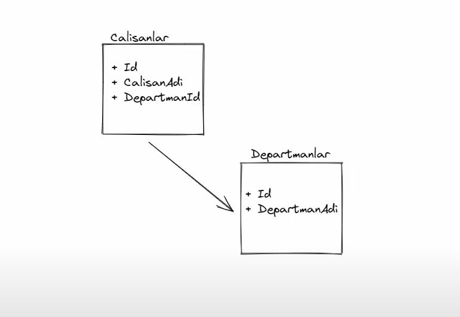
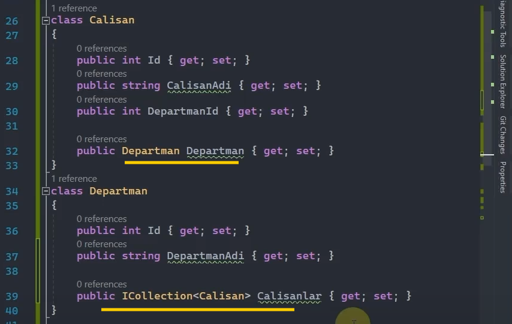

# Relationships (İlişkiler) Terimleri

 

## Principal Entity (Asıl Varlık) Nedir?

Kendi başına var olabilen tabloyu modelleyen entity'e denir.

 

Örneğin yukarıdaki ilişkide principal entity, Departmanlar tablosunu modelleyen 'Departman' entity'sidir.

Çünkü Departmanlar herhangi bir Çalışan olmasa da var olabiliyor mu? Olabiliyor. Ama Çalışanlar, Departman olmadan var olamıyor. 

 

## Dependent Entity (Bağımlı Varlık) Nedir?

Kendi başına var olamayan, bir başka tabloya ilişkisel olarak bağımlı olan tabloyu modelleyen entity'e denir.

Örneğin yukarıdaki ilişkide dependent entity, Calisanlar tablosunu modelleyen 'Calisan' entity'sidir.

 

## Foreign Key Nedir?

Principal Entity ile Dependent Entity arasındaki ilişkiyi sağlayan key'dir. 

Dependent Entity'de tanımlanır. Principal Entity'deki Principal Key'i tutar.

 

## Principal Key Nedir?

Principal Entity'deki id'nin ta kendisidir. Başka bir deyişle Principal Entity'nin kimliği olan kolonu ifade eden property'dir.

Yani Departman modelindeki 'Id' property'si, principal key'dir.

 

## Navigation Property Nedir?

İlişkisel tablolar arasındaki fiziksel erişimi entity class'ları üzerinden sağlayan property'lerdir.

 

* Bir property'nin navigation property olabilmesi için kesinlikle entity türünden olması gerekiyor.

* Navigation property'ler entity'lerdeki tanımlarına göre n'e n yahut 1'e n şeklinde ilişki türlerini ifade etmektedirler.  
 
 

## İlişki Türleri

### One to One İlişkisi

Çalışan ile adresi arasındaki ilişki, karı koca arasındaki ilişki one to one ilişkisine örnek olarak verilebilir.

### One to Many İlişkisi

Çalışan ile departman arasındaki ilişki, anne ve çocukları arasındaki ilişki one to many ilişkisine örnek olarak verilebilir.

### Many to Many İlişkisi

Çalışanlar ile projeler arasındaki ilişki, kardeşler arasındaki ilişki many to many ilişkisine örnek olarak verilebilir.

 

## Entity Framework Core'da İlişki Yapılandırma Yöntemleri

### Default Conventions

Varsayılan entity kurallarını kullanarak yapılan ilişki yapılandırma yöntemleridir.

Navigation property'lerini kullanarak ilişki şablonlarını çıkarmaktadır.

 

### Data Annotations Attributes

Entity'nin niteliklerine göre ince ayarlar yapmamızı sağlayan attribute'lardır. [Key], [Foreign Key] gibi...

 

### Fluent Api

Entity modellerindeki ilişkileri yapılandırırken daha detaylı çalışmamızı sağlayan yöntemdir.

* <b>HasOne:</b> İlgili entity'nin ilişkisel entity'e birebir ya da bire çok  olacak şekilde ilişkisini yapılandırmaya başlayan metottur.

* <b>HasMany:</b> İlgili entity'nin ilişkisel entity'e çoka bir ya da çoka çok olacak şekilde ilişkisini yapılandırmaya başlayan metottur.

* <b>WithOne:</b> HasOne ya da HasMany'den sonra birebir ya da çoka bir olacak şekilde ilişki yapılandırmasını tamamlayan metottur.

* <b>WithMany:</b> HasOne ya da HasMany'den sonra bire çok ya da çoka çok olacak şekilde ilişki yapılandırmasını tamamlayan metottur.
 

