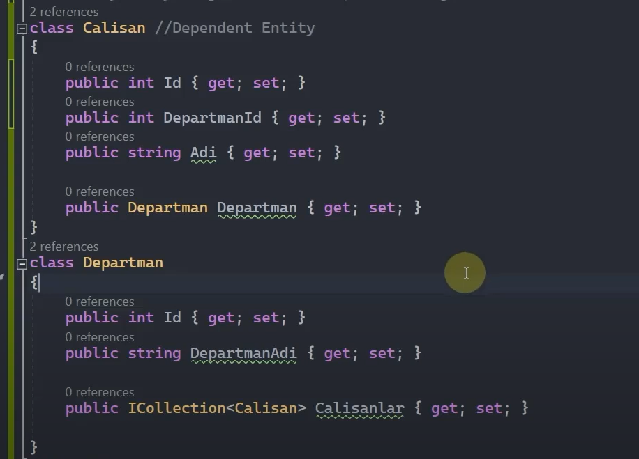
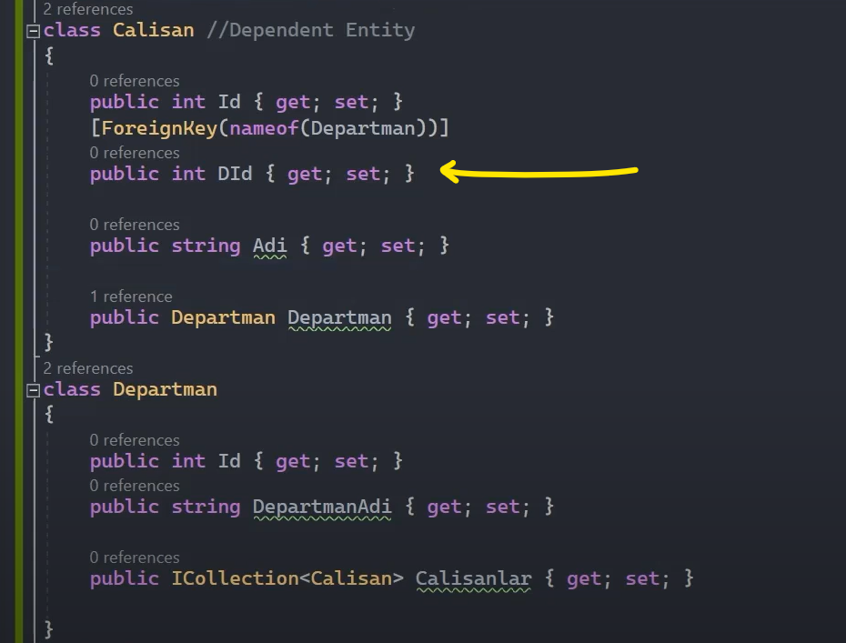
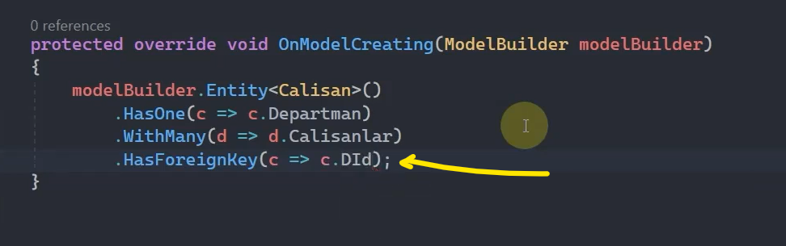

# One to Many Relationship

## Default Convention 

Bu yöntemde bire çok ilişkiyi kurarken foreign key kolonuna karşılık gelen bir property tanımlamak zorunda değiliz. Eğer tanımlamazsak Ef Core bunu kendisi tanımlayacaktır, yok eğer tanımlarsak tanımladığımız kolonu baz alacaktır.

 
 

## Data Annotations

Foreign key kolonuna karşılık gelen property'i; temel, geleneksel entity tanımlama kurallarına göre oluşturmuyorsak [ForeignKey] attribute'u ile bu property'e müdahalede bulunabiliriz. 

 

## Fluent Api

 

Eğer geleneksel entity tanımlama kurallarına göre bir foreign key tanımlaması yapılmışsa HasForeignKey() metodunu kullanmamıza gerek yoktur.

Hatta hem fluent api yönteminde hem de data annotations yönteminde default convension yönteminde olduğu gibi bilinçli olarak foreign key kolonu oluşturmamıza gerek yoktur. Çünkü bizim yerimize Ef Core default olarak oluşturacaktır. 

