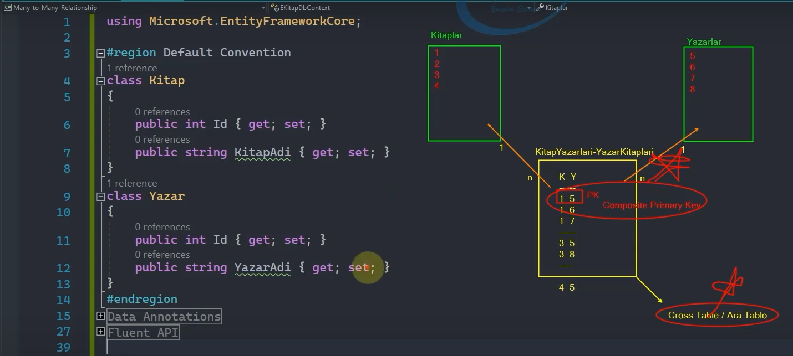
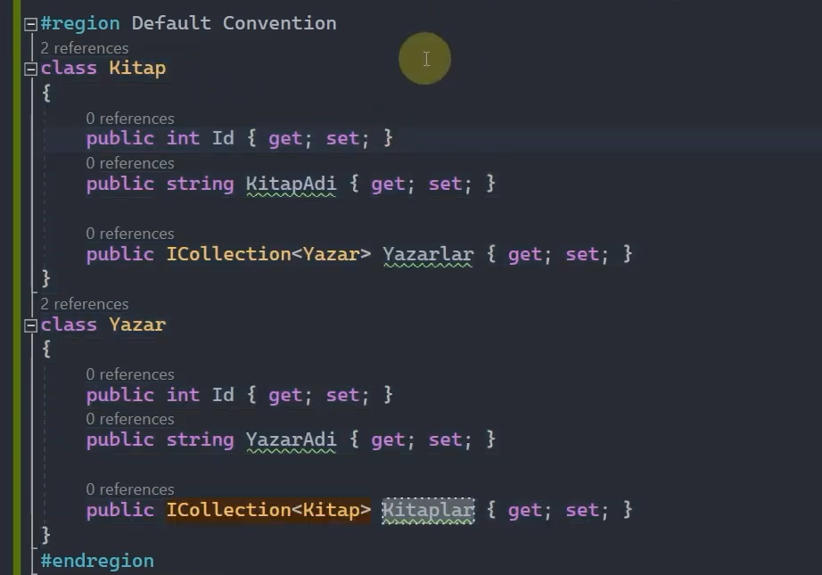
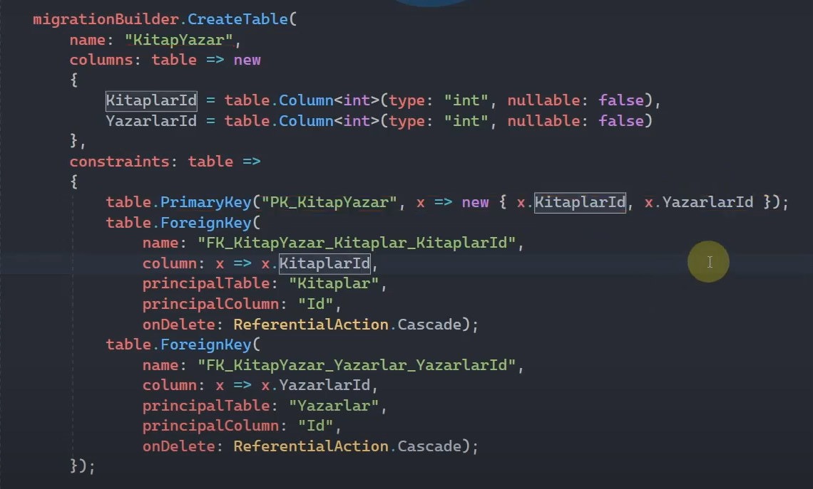
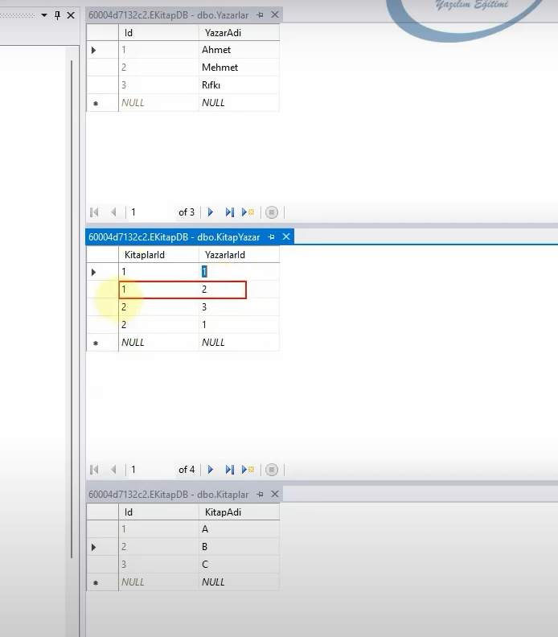
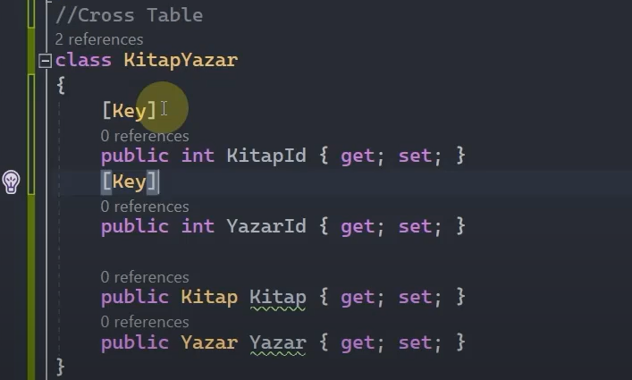
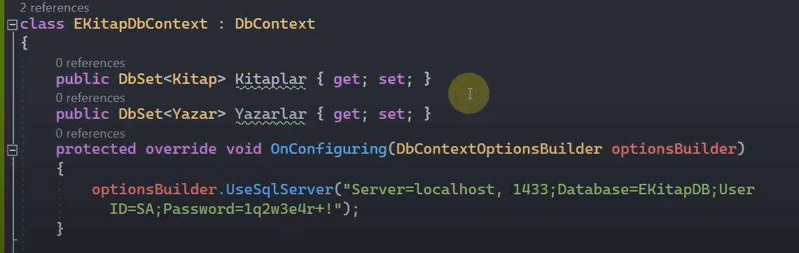
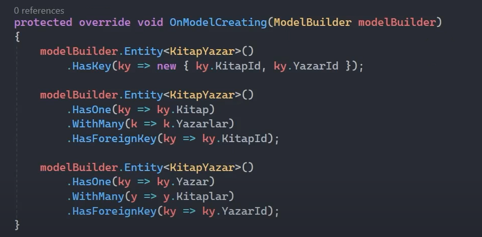

# Many to Many Relationship

 

## Composite Primary Key Nedir?  

Bir tabloya ait birincil anahtarın (primary key) birden fazla sütunla oluşmasıdır. Yani, tek bir sütun yerine birden fazla sütunun birleşimi, bir tablo içindeki her bir kaydı benzersiz şekilde tanımlar.

Bu durumda, iki veya daha fazla sütun birlikte birincil anahtar olarak tanımlanır.

 

## Default Convention

İki entity arasındaki ilişkiyi navigation property'ler üzerinden çoğul olarak kurmalıyız. Yani ICollection veya List kullanmalıyız.

 

Default Convention'da cross table'ı manuel olarak oluşturmak zorunda değiliz. Ef core, tasarıma uygun bir şekilde cross table'ı kendisi otomatik oluşturacaktır.

Ve oluşturulan cross table'ın içerisinde composite primary key'i de oluşturmuş olacaktır.

 

Yukarıda da görüldüğü üzere biz kendi irademizle 'KitapYazar' tablosunu oluşturmamamıza rağmen Ef Core bunu otomatik olarak generate etmiştir.

 

Aynı zamanda composite primary key'i de 'KitaplarId' ve 'YazarlarId' üzerinden kurmuştur. Böylelikle satırları benzersiz bir şekilde oluşturmuş oluyoruz. Yani 'KitaplarId'si 1 ve 'YazarlarId'si 2 olan bir kayıt bir daha oluşturamayız.   

 

## Data Annotations

Cross table manuel olarak oluşturulmak zorundadır. Ve entity'lerle, oluşturduğumuz cross table entity'si arasında bireçok ilişkiyi kurmalıyız. 

 

(Yukarıdaki Yazar entity'si içerisinde aslında 'public ICollection&lt;KitapYazar&gt; Kitaplar { get; set; }' property'si var ama ekran kaydına sığmamış.)

 

 

Şimdi biz cross table'da composite primary key'i data annotations yani attribute'lar ile manuel kuramıyoruz. Yani yukarıdaki resimdeki gibi iki property'e de [Key] attribute'unu ekleyemiyoruz. Bunun için Fluent Api'da çalışma yapmamız gerekiyor.

 

Yukarıda da görüldüğü üzere OnModelCreating() fonksiyonu içerisinde anonim bir tiple hem KitapId'yi hem de YazarId'yi composite primary key olarak ayarlamış oluyoruz.

 

* Cross table'a karşılık bir entity modeli oluşturuyorsak eğer bunu context sınıfında DbSet property'si olarak bildirmek mecburiyetinde değiliz!!!

 

 

Çünkü buradaki ilişkiler üzerinden Ef Core bunun bir cross table olduğunu anlayıp onun için bir tablo oluşturabiliyor.

 

## Fluent Api
* Cross table manuel oluşturulmalı.

* Cross table'ın DbSet olarak eklenmesine lüzum yok.

* Composite Primary Key, HasKey() metodu ile kurulmalı. 

 

 

Yine aynı şekilde KitapYazar tablosu üzerinden çoka çok ilişkiyi kuruyoruz. Ve OnModelCreating() metoduyla da bu çoka çok ilişkinin yapısını hazırlıyoruz. 

