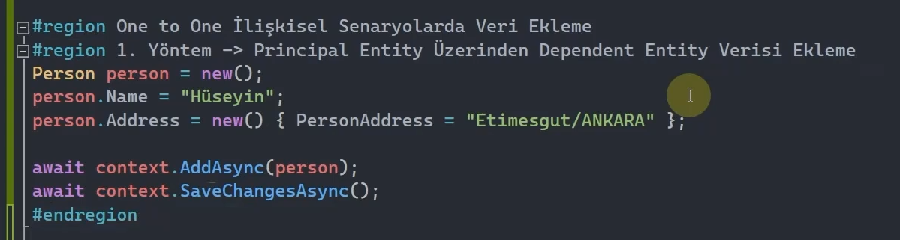
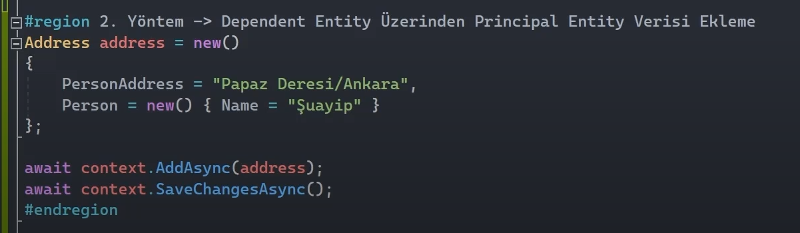

## One to One İlişkisinde Veri Ekleme

### 1. Yöntem: Principal Entity Üzerinden Dependent Entity Verisi Ekleme

 

Person nesnesini kaydettikten sonra person_id'yi alıp Address nesnesine bu person_id'yi vermek yerine ve her ikisini de ayrı ayrı AddAsync metotları ile kaydetmek yerine direkt person nesnesini oluştururken Address bilgilerini de vererek her iki kaydı oluşturabiliriz.

 

### 2. Yöntem: Dependent Entity Üzerinden Principal Entity Verisi Ekleme

 

Aynı şekilde Address nesnesini oluştururken Person nesnesini de ekleyebiliriz.

 

<b> 
Peki bu iki yöntem arasındaki temel fark ne? 
</b> 

 
Eğer ki principal entity üzerinden veri ekleme gerçekleştiriliyorsa dependent entity nesnesi verilmek zorunda değildir. Amma velakin, dependent entity üzerinden ekleme gerçekleştiriliyorsa burada principal entity'nin nesnesine ihtiyacımız vardır.

 

## One to Many İlişkisinde Veri Ekleme

### 1. Yöntem: Principal Entity Üzerinden Dependent Entity Verisi Ekleme

<b>
Nesne Referansı Üzerinden Ekleme
</b>

 

 

Şimdi yukarıda blog nesnesi üzerinden Posts referansına erişiyoruz fakat bu Posts referansı null'sa bu referans üzerinden herhangi bir member'a erişmeye çalışırsak NullReferenceException hatasına sebebiyet verir.

Haliyle Posts nesnesine erişirken kesinlikle Posts'un null olmadığından emin olmalıyız. İşte bundan emin olabilmek için Ef Core çalışmalarında bu koleksiyonel navigation property'leri, ilgili entity'nin constructor'ında new'liyoruz. Tıpkı aşağıda olduğu gibi...

 

<b>
Peki aklımıza şöyle bir soru gelebilir: Biz Posts'u new'lerken neden HashSet'i kullandık da List'i veya ArrayList'i kullanmadık?
</b>

Biz bunların üçünü de kullanabiliriz. Ancak burada HashSet kullanmayı tercih ediyoruz. Çünkü HashSet hem unique bir yapılanmaya sahiptir hem de List'e nazaran daha yüksek performansta çalışmaktadır.

 

<b>
Object Initializer Üzerinden Ekleme
</b>

 
 

 

Bu yöntemde ilgili entity'nin constructor'ında new'leme işlemini yapmamıza gerek yok çünkü verileri eklerken zaten new'leme işlemini yapıyoruz.

 

### 2. Yöntem: Dependent Entity Üzerinden Principal Entity Verisi Ekleme

Bu ikinci yöntemi hiçbir yerde kullanmayacağız. Ama yanlış yapabileceğimiz şeyleri de görmekte fayda olduğu için bunu da inceleyeceğiz.

Bire çok ilişki yapılanmasında dependent entity üzerinden principal entity verisini eklemek bire çok davranışına aykırıdır. O yüzden bu yöntemi kullanmamalıyız. 

 

Yukarıda da görüldüğü üzere bire çok ilişki yapılanmasında dependent entity'den (Post) başlayıp ardından principal entity'i (Blog) eklersek sadece bir tane dependent entity eklemiş oluruz. Yani sanki birebir bir ilişki kuruyormuşuz gibi bir durum ortaya çıkacaktır. Çünkü dependent entity (Post) verisinden birden fazla oluşturup bunların içerisine bir Blog verisini ekleyemeyiz. Bu nedenle de birinci yöntemi kullanmak bizim için daha sağlıklı olacaktır.

 

### 3. Yöntem: Foreign Key Kolonu Üzerinden Principal Entity Verisi Ekleme

Aşağıdaki gibi, kod kısmında bir foreign key property'miz varsa bu üçüncü yöntemi de kullanabiliriz.    

 

Post nesnemizi oluştururken foreign key olan BlogId property'sine 1 değerini vererek bu yöntemi uygulamış oluyoruz.

 

## Many to Many İlişkisinde Veri Ekleme

### 1. Yöntem:

Birinci yöntem; çoka çok ilişkinin default convention ile tasarlanması durumunda kullanılan bir yöntemdir. Yani cross table; manuel olarak kodlama kısmında oluşturulmamışsa, sadece principal entityler üzerinden çoka çok ilişki sağlanmışsa bu yöntemi kullanabiliriz.

 

 

Aşağıda da görüldüğü üzere navigation property üzerinden Authors nesnelerini ekleyebiliyoruz.

 

### 2. Yöntem:

İkinci yöntem; çoka çok ilişkinin fluent api ile tasarlanması durumunda kullanılan bir yöntemdir. Yani cross table'ın manuel olarak kod kısmında oluşturulması durumunda kullanılabilecek olan bir yöntemdir.

 

Bu yöntemde veri ekleme işlemini aşağıdaki gibi yapabiliriz. Author nesnesi içerisindeki Books property'si, 'BookAuthor' tipinde koleksiyonel bir yapılanma olduğu için Books verilerini bu şekilde ekledik.

