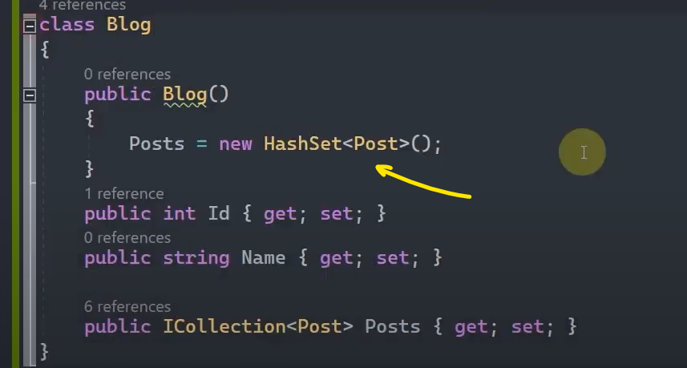

# One to One İlişkisinde Veri Güncelleme

### 1. Durum: Esas tablodaki veriye bağımlı veriyi güncelleme

 

FirstOrDefault() metodu ile ilgili person nesnesini elde ediyoruz. Ve bu Person nesnesinin Address verisini silebilmek için Include() metodu ile Address verisine ulaşıyoruz.

Ulaştığımız bu Address verisini direkt olarak Update() metoduyla güncelleyemiyoruz. Çünkü aşağıda da görüldüğü üzere 'Id' kolonu hem foreign key hem de primary key görevi görüyor. Primary key görevi gördüğü için bu alanı güncellememiz mümkün değil.

 

Bu yüzden öncelikle Remove() metoduyla person'ın Address'ini siliyoruz. Daha sonrasında change tracker mekanizmasıyla takip edilen person nesnesine yeni Address verisini ekleyip SaveChanges() ile yapılan değişiklikleri veri tabanına yansıtıyoruz.

 

### 2. Durum: Bağımlı verinin ilişkisel olduğu ana veriyi güncelleme

Yine yukarıdaki mantıkta olduğu gibi biz Address tablosundaki 'Id' kolonunu direkt olarak güncelleyemediğimiz için öncelikle bağımlı olan veriyi silip daha sonra istediğimiz veri ile ilişkilendirebiliyoruz.

 
 

# One to Many İlişkisinde Veri Güncelleme

### 1. Durum: Esas tablodaki veriye bağımlı veriyi güncelleme

Her şeyden önce hedef veriyi (Blog) ve buna bağlı olan Posts'ları elde ediyoruz. Daha sonrasında Remove() metoduyla istediğimiz verileri silip yine ekleme işlemini gerçekleştirerek güncelleme işlemini tamamlamış oluyoruz.  

 

Aşağıda da görüldüğü üzere güncelleme yapmak için direkt Update() metodunu kullanamadığımız için önce ilgili verileri silip daha sonrasında ekleme işlemi yaparak verileri güncellemiş oluyoruz.

 

Bu arada eğer Posts verilerini Include() etmemiş olsaydık, hata alırdık. Çünkü Posts, koleksiyonel bir yapılanma. Şimdi koleksiyonel yapılanmada bir veriyi Add fonksiyonuyla ekleyebilmek için bu koleksiyonel yapılanmanın null gelmemesi gerekiyor. İşte bunun null olarak gelmemesi için aşağıda da görüldüğü üzere Blog constructor'ında Posts'un new'lenmiş olması gerekiyor. 

 

Ama zaten biz bu işlemi yapsak dahi veri tabanındaki ilgili Posts'ları silebilmek için Include() etmemiz gerektiği için bu işlemi yapmamıza gerek yok.

 

### 2. Durum: Bağımlı verilerin ilişkisel olduğu ana veriyi güncelleme

Bağımlı veriyi (Post) elde ediyoruz. Akabinde bu Post'a yeni Blog verisini atıyoruz.  

Yeni bir Blog oluşturup da atayabiliriz;

 

Var olan bir Blog'u da atayabiliriz;

 

# Many to Many İlişkisinde Veri Güncelleme

Elimizde aşağıdaki gibi many to many ilişkisine sahip tablolarımız ve verileri olduğunu düşünelim.

 

### 1. Örnek:

İlk örneğimizde 1. Kitap'ı 3. Yazar'la ilişkilendirerek 1. Kitap'ın verilerini güncellemiş olalım.

 

### 2. Örnek:

İkinci örneğimizde ise 3. Yazar'ın sadece 1 id'sine sahip olan kitapla ilişkisi olsun diğerleriyle ilişkisini koparalım.

