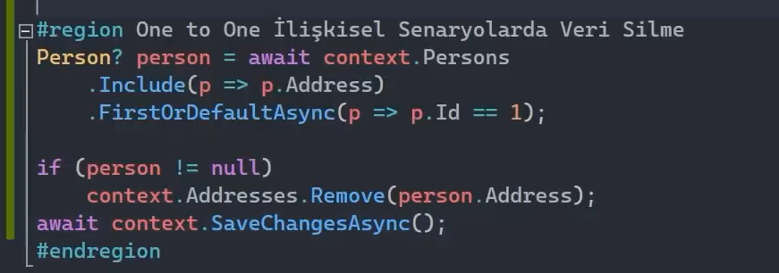
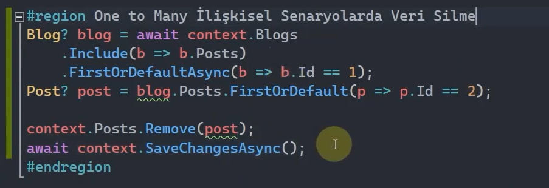
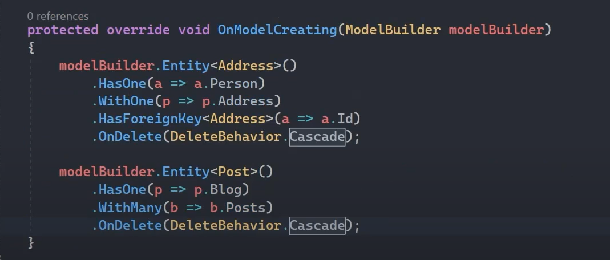
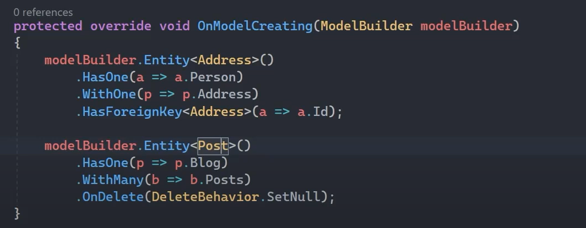
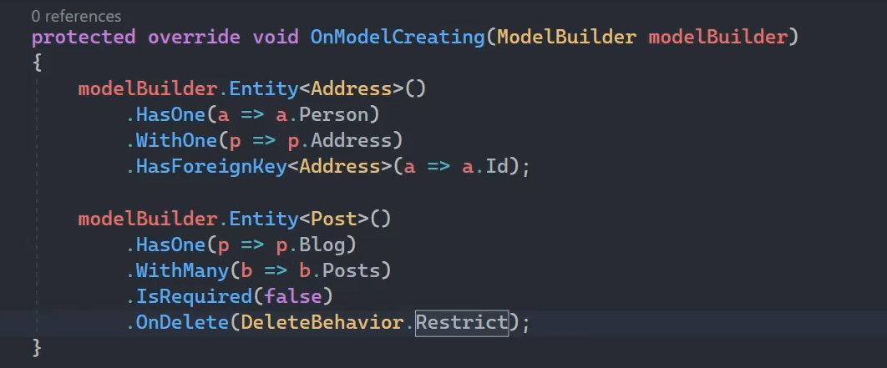

# One to One İlişkisinde Veri Silme

Bu örneğimizde Principal entity olan Person ile Dependent entity olan Address tabloları arasında birebir bir ilişki söz konusu. 

Id'si 1 olan Person'ın, Address verisini silmek için;

 
 

# One to Many İlişkisinde Veri Silme

Bu örneğimizde Principal entity olan Blog ile Dependent entity olan Posts tabloları arasında bire çok bir ilişki söz konusu. 

Id'si 1 olan Blog'un, 2 id'sine sahip Post verisini silmek için;

 
 

# Many to Many İlişkisinde Veri Silme

Bu örneğimizde Principal entity'ler olan Book ve Author ile cross table olan BookAuthor tabloları arasında çoka çok bir ilişki söz konusu. 

Id'si 1 olan Book'un, 2 id'sine sahip Author verisini silmek için;

Silme işlemini yaparken yorum satırında olan context.Authors.Remove(author); satırını kullanırsak seçtiğimiz author hem Authors tablosundan silinecek hem de cross table'da bu author verisi olan tüm satırlar silinecek.

O yüzden bu farkı bilerekten silme işlemini gerçekleştirmeliyiz.

 
 

Biz şuana kadar herhangi bir principal table'daki verinin, dependent table'daki ilişkisel verileri arasından birini silmeye çalışırken Ef core'un nasıl bir davranış sergileyeceğini gördük. 

Peki principal table'daki bir veriyi silmeye çalışırsak nolacak? Principal veri silinirse, buna bağlı dependent veriler silinecek mi? 

İşte böyle bir durumda artık davranış modeli karşımıza çıkacak. O da Cascade Delete modelidir.

 

# Cascade Delete Modeli

Bunu modellerken üç farklı davranış belirleyebiliriz. Bunlar cascade, setNull ve restrict davranışlarıdır.

Bu davranış modelleri Fluent API ile konfigure edilmektedir.  

## Cascade 

Esas (principal) tablodan silinen verinin, buna bağımlı olan tablodaki verilerini silmemizi sağlar. 

 

## SetNull 

Esas tablodan silinen verinin, buna bağımlı olan tablodaki verilerine null değerinin atanmasını sağlar. 

One to One senaryolarda eğer ki Foreign key ve Primary key kolonları aynı ise SetNull davranışını kullanamayız! Çünkü foreign key kolonu null değer alabilirken primary key kolonu null değer alamaz. Alamadığı için de tutarsızlık olur, hata alırız. 

 

## Restrict 

Esas tablodan herhangi bir veri silinmeye çalışıldığında o veriye karşılık dependent table'da ilişkisel bir veri ya da verileri varsa bu silme işlemi engellenecektir.

