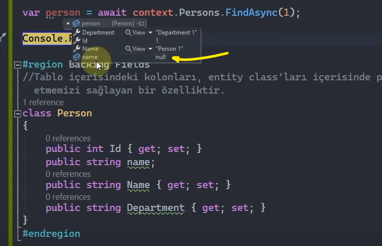
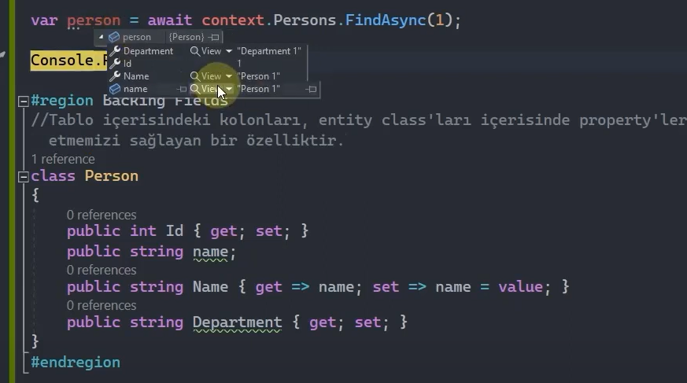
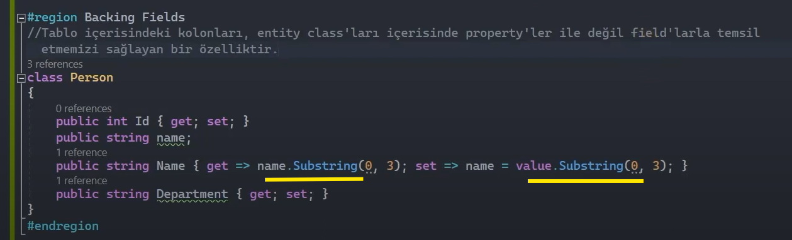
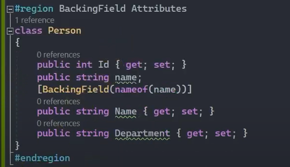
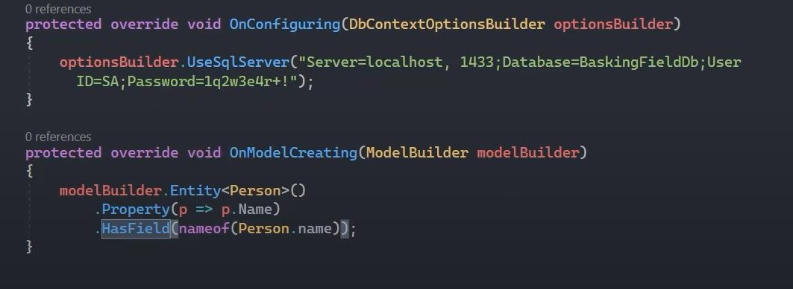
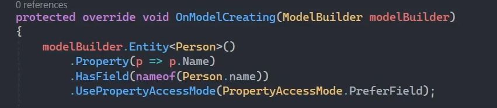
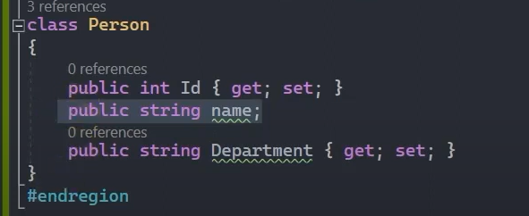
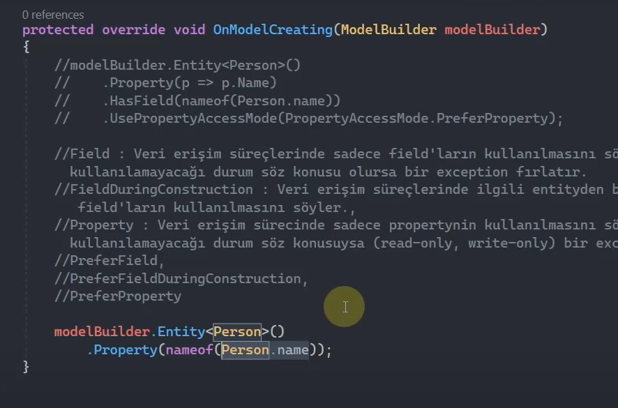

# Backing Fields Özelliği

Tablo içerisindeki kolonları entity class'ları içerisinde property'ler ile değil field'larla temsil etmemizi sağlayan bir özelliktir.

 

Yukarıda da görüldüğü üzere Person modeli içerisinde name field'ımız mevcut fakat 1 id'sine sahip Person verisini çağırdığımızda name field'ı null geliyor. Çünkü biz buradaki field'ın herhangi bir eşleştirmesini yapmış değiliz. 

Ayrıca name field'ı backing field'sa eğer ona göre bir çalışma yapmamız gerekiyor. Yani entity içerisindeki her field, bir backing field sayılmaz. Biz böyle bir field oluşturduysak eğer, bunun gelecek olan data'ya karşılık bir field olduğunu bildirmemiz gerekiyor. Peki bunu nasıl yapıcaz?

 

Şimdi diyelim ki 'Name' property'sine gelecek olan verileri buradaki 'name' field'ına bağlamak istiyorsak birinci yöntem olarak şöyle bir çalışma sergileyebiliriz:

- Veri tabanından sorgulama yaparken bu entity'nin içerisindeki Name data'larını name field'ında da döndür. (get;)

- Aynı şekilde dışardan herhangi bir data gelirse de name field'ını kullanarak bu data'yı set et. (set;)

 

Artık name field'ına, Name property'sindeki veri atanabilecek. 

 

<b>
Peki biz bu backing field özelliğini ne gibi durumlarda kullanabiliriz?
</b>

Veri tabanıyla olan iletişim sürecinde bir encapsulation gerçekleştirebiliriz. Yani şöyle; veri tabanından gelecek olan veriyi kapsülleyerek dış dünyaya açabilir, aynı şekilde veri tabanına göndereceğimiz veriler üzerinde de farklı bir kapsülleme yaparak veri tabanına gönderebiliriz. Bunun için şöyle bir örneklendirme yapabiliriz:

 

'name' değerini gönderirken Substring() metodunu kullanarak orijinal veri üzerinde kapsülleme yapabiliriz. 

 

## BackingField Attributes 

'Name' property'sindeki get; set; metotlarını kullanarak name field'ını backing field yapmak yerine [BackingField()] attribute'unu da kullanarak bu işlemi gerçekleştirebiliz.

 

## HasField() Metodu 

Fluent Api ile backing field tanımlamak için HasField() metodunu kullanabiliriz.

 

## Field And Property Access  

Ef Core'da hiç bir ayarlama yoksa varsayılan olarak property'ler üzerinden verileri getirir. Eğer ki backing field bildiriliyorsa field üzerinden getirir. Yok eğer backing field bildirildiği halde ayrı bir davranış belirtiliyorsa ilgili davranışla verileri getirir.

UsePropertyAccessMode() metodu ile bu davranışımızı belirleyebiliriz.

 

UsePropertyAccessMode() metodunun PropertyAccessMode enum'ı üzerinden alabileceği değerler aşağıdaki gibidir:

<b>Field: </b>Veri erişim süreçlerinde sadece field'ların kullanılmasını sağlar. Eğer field'ın kullanılamayacağı bir durum söz konusu olursa exception fırlatır.

<b>Property: </b>Veri erişim sürecinde sadece property'nin kullanılmasını sağlar. Eğer property'nin kullanılamayacağı bir durum söz konusu olursa (read-only, write-only) exception fırlatır.

<b>FieldDuringConstruction: </b>Veri erişim süreçlerinde ilgili entity'den bir nesne oluşturulurken field'ların kullanılmasını sağlar.

<b>PreferFieldDuringConstruction: </b>Sadece nesne oluşturulurken backing field kullanılır, sonrasında ise property üzerinden erişim sağlanır.

<b>PreferField: </b>Öncelikli olarak backing field kullanılır, tabi bir field tanımlanmışsa. Tanımlanmamışsa property kullanılır.

<b>PreferProperty: </b>Öncelikli olarak property kullanılır. Bir field tanımlanmış olsa dahi, property tercih edilir.

 

## Field-Only Properties  

Entity'lerde değerleri almak için property'ler yerine metotların kullanıldığı veya belirli alanların hiç gösterilmemesi gerektiği durumlarda (örneğin primary key kolonu) kullanılabilir.

 

Örneğin Person nesnesinden Name property'sini kaldırırsak ve name field'ını bu property'nin yerine kullanmak istersek aşağıdaki gibi OnModelCreating() metodu içerisinde böyle bir kullanım yapacağımızı bildirmeliyiz. Aksi taktirde name field'ına, Name kolonundaki veriler gelmeyecektir. 

 

