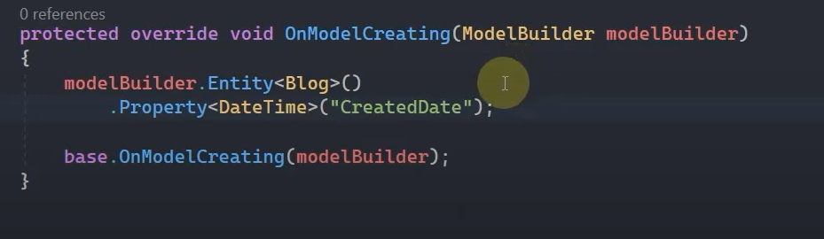
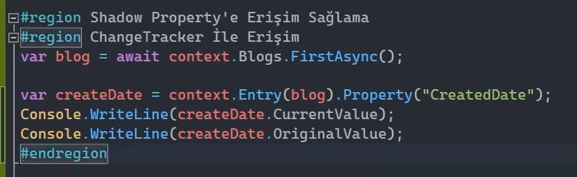
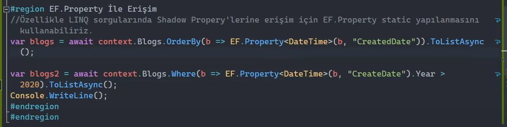

# Shadow Property 

Entity sınıflarında fiziksel olarak tanımlanmayan / modellenmeyen ancak EF Core tarafından ilgili entity için var olan ya da var olduğu kabul edilen property'lerdir.

 

Genellikle tabloda gösterilmesini istemediğimiz / lüzumlu görmediğimiz / entity instance'ı üzerinde işlem yapmayacağımız kolonlar için shadow property'ler kullanılabilir.

Shadow property'lerin değerleri ve state'leri Change Tracker tarafından kontrol edilir. Yani biz her ne kadar entity instance'ları üzerinde ilgili shadow property'i, bir property ile temsil etmiyor olsak dahi esasında bunun üzerinde yapılan değişiklikler, bunun state'i change tracker tarafından yine de takip ediliyor olacaktır. 

Peki biz bu shadow property'i nerelerde kullanıyoruz? Aslında şu ana kadar farkında olmasak da shadow property'i foreign key'lerde kullanıyoruz.

 

## Foreign Key - Shadow Properties

İlişkisel senaryolarda foreign key property'sini manuel olarak entity içerisinde tanımlamadığımız durumlarda EF Core tarafından bu property dependent entity'e eklenmektedir. İşte bu durumda foreign key property'si, shadow property özelliğini taşımış olacaktır. j 

 

## Shadow Property Oluşturma 

Bir entity üzerinde shadow property oluşturmak istiyorsak aşağıdaki gibi Fluent Api kullanmamız gerekmektedir.

 

Generic olan Property metoduna bu shadow property'sinin hangi tipte olacağını belirtmiş oluyoruz. Peki biz bu shadow property'e nasıl erişeceğiz?

 

## Shadow Property'e Erişim Sağlama

### ChangeTracker İle Erişim

Change Tracker sayesinde aşağıdaki gibi CreatedDate kolonunun değerine erişebiliriz.

 

### EF.Property İle Erişim

Özellikle LINQ sorgularında shadow property'lerine erişim için EF.Property static yapılanmasını aşağıdaki gibi kullanabiliriz.

