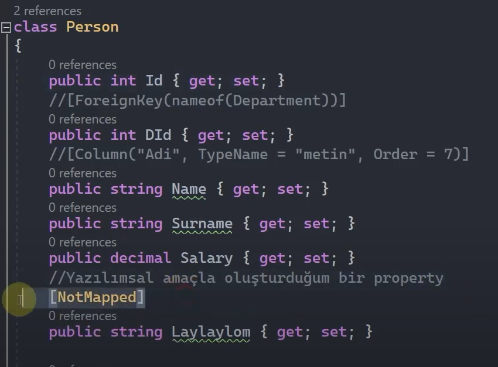
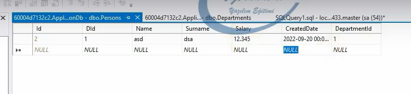

# Özelleştirici Entity Konfigürasyonları - 1

## EF Core'da Neden Yapılandırmalara İhtiyacımız Olur?

Yeri geldiğinde default davranışları geçersiz kılmak ve özelleştirmek isteyebiliriz. Bundan dolayı yapılandırmalara ihtiyacımız olacaktır.

 

## OnModelCreating() Metodu

EF Core'da yapılandırma deyince akla ilk gelen metot OnModelCreating() metodudur. Bu metot DbContext sınıfı içerisinde virtual olarak ayarlanmı bir metottur.

Bizler bu metodu kullanarak model'larımızla ilgili temel konfigürasyonel davranışları (Fluent Api) sergileyebiliriz.

Bir model'ın yaratılışıyla ilgili tüm konfigürasyonları burada gerçekleştirebilmekteyiz.

 

## GetEntityTypes() Metodu

Ef Core'da kullanılan entity'leri elde etmek, programatik olarak öğrenmek istiyorsak bu fonksiyonu kullanabiliriz.

 

## Configurations | Data Annotations & Fluent API

### Table - ToTable

Generate edilecek tablonun ismini belirlememizi sağlayan yapılandırmadır. Normalde yani default olarak bir entity'e karşılık gelen table'ı veri tabanına migrate ederken tablonun ismi DbContext sınıfındaki DbSet property'sinden alınır. Ama biz bu davranışı ezmek istiyorsak, başka bir isim verilmesini istiyorsak o zaman Table attribute'unu ya da ToTable() metodunu kullanabiliriz.

 

 

Peki biz hem attribute hem de fluent api kullanırsak ef core'da hangisi daha önceliklidir? Her daim fleunt api son karardır. Yani fluent api en baskınıdır. Biz bütün konfigürasyonları uygulayabiliriz ama fluent api varsa ef core en son onu baz alacaktır.

 

### Column - HasColumnName, HasColumnType, HasColumnOrder

Ef Core'da tabloların kolonları entity sınıfları içerisindeki property'lere karşılık gelmektedir. Ve default olarak property'lerin adı kolon adıyken, türleri / tipleri ise kolon türleridir.

Eğer ki bu durumu değiştirmek istiyorsak alt başlıkta da yazılan yapılandırmaları kullanabiliriz.

 

 

 

### ForeignKey - HasForeignKey

Foreign key, ilişkisel tablolarda dependent entity'nin principal entity'e karşı olan ilişkisel verisini tutan kolondur. Ve dependent entity'de tutuluyordu.

Ef Core'da foreign key kolonu genellikle entity tanımlama kuralları gereği default yapılanmalarla oluşturulur. Ama biz bu kuralların dışında farklı bir isimle foreign key tanımlamak istiyorsak o zaman bu yapılandırmalara ihtiyaç duyarız. 

Örneğin aşağıdaki çalışmada 'ahmet' kolonunu ForeignKey attribute'u ile foreign key olmasını sağladık.

 

Eğer ki foreign key tanımlamasını fluent api ile sağlayacaksak ilgili iki entity arasındaki ilişkiyide modellememiz gerekmektedir. Aksi taktirde HasForeignKey fonksiyonunu kullanamayız.

 

### NotMapped - Ignore

Ef Core, default olarak entity sınıfları içerisindeki tüm property'leri modellenen tabloya kolon şeklinde ekler. Ama bazen bizler entity sınıfları içerisinde tabloda bir kolona karşılık gelmeyen property'ler tanımlamak mecburiyetinde kalabiliriz.  

Bu property'lerin ef core tarafından kolon olarak tabloya eklenmesini istemediğimizi bildirebilmek için de NotMapped ya da Ignore fonksiyonlarını kullanabiliriz.

 

 

### Key - HasKey

Ef Core'da default convension olarak bir entity'nin içerisindeki Id, ID, EntityId, EntityID vs şeklinde tanımlanan tüm property'lere varsayılan olarak primary key constraint uygulanır.

Key yada HasKey yapılanmalarıyla istediğimiz herhangi bir property'e, default convension dışında primary key uygulayabiliriz.

Ef Core'da br entity içerisinde kesinlikle primary key'i temsil edecek bir property bulunmalıdır. Aksi taktirde Ef core migration oluştururken hata verecektir.

Eğer tablonun primary key kolonu olmayacaksa bunun belirtilmesi gerekir.

 

 

 

### Timestamp - IsRowVersion

Sonraki konularda Ef core'da veri tutarlığını görücez. Bu derste bir satırdaki verinin bütünsel olarak değişikliğini takip etmemizi sağlayacak olan versiyon mantığını konuşuyor olucaz.

İşte bir verinin versiyonunu bu konfigürasyonlarla oluşturuyoruz.

 

 

### Required - IsRequired

Bir kolonun nullable olup olmamasını bu konfigürasyonla belirleyebiliriz. Ef Core'da bir property default olarak not null şeklinde tanımlanır. Eğer ki property'i nullable yapmak istiyorsak tür üzerinde ?(nullable) operatörü ile bildirimde bulunmamız gerekmektedir.  

 

 

### MaxLength - StringLength - HasMaxLength

Bir kolonun maksimum karakter sayısını belirlememizi sağlar.

 

 

 

### Precision - HasPrecision

Küsüratlı sayılarda bir kesinlik belirtmemizi ve virgülün sağında kalan hane sayısını bildirmemizi sağlayan yapılandırmadır.

 

Şimdi yukarıdaki çalışmada Salary kolonuna girilecek olan ondalıklı sayının tamamının beş haneli ve virgülden sonraki kısmın ise üç haneli olmasını istediğimiz için aşağıdaki 12.345678 sayısını eklemeye çalıştığımızda otomatik olarak sayı, 12.345 şeklinde yazılacaktır. 

 

 

### Unicode - IsUnicode

Kolon içerisinde unicode karakterler kullanılacaksa bu yapılandırmadan istifade edilebilir.

 

 

### Comment - HasComment

Ef Core üzerinden oluşturulan veri tabanı nesneleri üzerinde bir açıklama / yorum yapmak istiyorsak bu yapılandırmaları kullanabiliriz.

 

 

### InverseProperty

İki entity arasında birden fazla ilişki varsa eğer bu ilişkilerin hangi navigation property'ler üzerinde olacağını ayarlamamızı sağlayan bir konfigürasyondur.

