# Özelleştirici Entity Konfigürasyonları - 2

### Composite Key

Tablolarda birden fazla kolonu kümülatif olarak primary key yapmak istiyorsak buna composite key denir.   

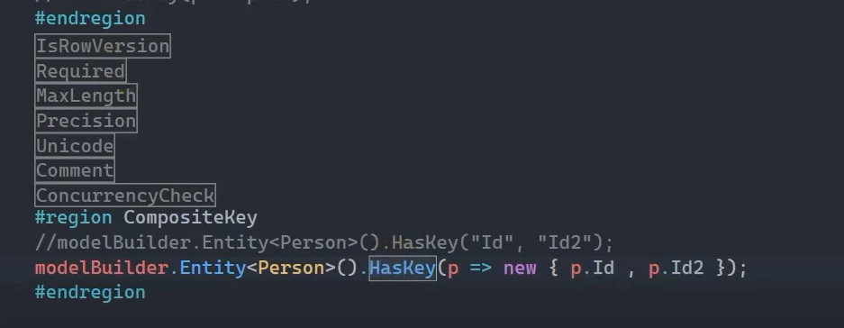

 

Yukarıda da görüldüğü üzere HasKey() metodu ile hem 'Id' kolonunu hem de 'Id2' kolonunu aynı anda primary key yapabiliyoruz.  

 

### HasDefaultSchema

Ef Core üzerinden inşa edilen herhangi bir veri tabanı nesnesi default olarak dbo şemasına sahiptir. Bunu özelleştirebilmek / ezebilmek için kullanılan bir yapılanmadır.

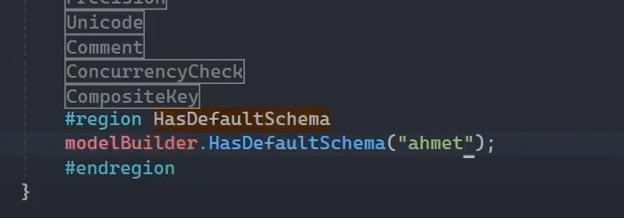

 

### Property

* <b>HasDefaultValue:</b> Tablodaki herhangi bir kolona değer gönderilmediği taktirde default olarak hangi değeri alacağını belirlediğimiz yapılanmadır. 

 

* <b>HasDefaultValueSql:</b> Tablodaki herhangi bir kolona değer gönderilmediği taktirde default olarak hangi sql cümleciğinden değeri alacağını belirlediğimiz yapılanmadır. 

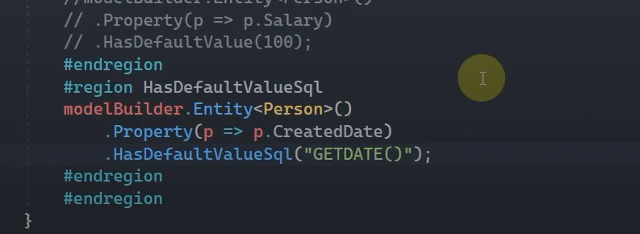

 

### HasComputedColumnSql

Tablolarda birden fazla kolondaki verileri işleyerek değerini oluşturan kolonlara Computed Column denmektedir. Ef core üzerinden 

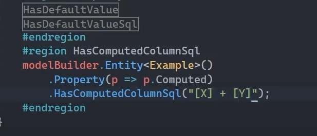

 

Örneğin yukarıdaki çalışmada HasComputedColumnSql() metodu kullanılarak X ve Y kolonlarıdaki int değerler toplanarak Computed isimli kolona yazdırılacaktır.

 

### HasConstraintName

Ef Core üzerinden oluşturulan constraint'lere default isim vermek yerine özelleştirilmiş bir isim vermek istiyorsak bu yapılandırmadan istifade edebiliriz.

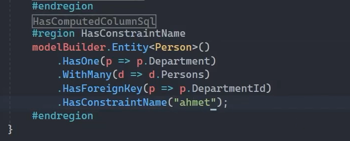

 

### HasData

Sonraki derslerde 'Seed Data' isimli bir konuyu inceleyeceğiz. Bu konuda, migrate sürecinde veri tabanını inşa ederken bir yandan da yazılım üzerinden hazır veriler oluşturmanın yöntemini inceliyor olacağız.

İşte HasData konfigürasyonu bu operasyonun yapılandırm ayağıdır.

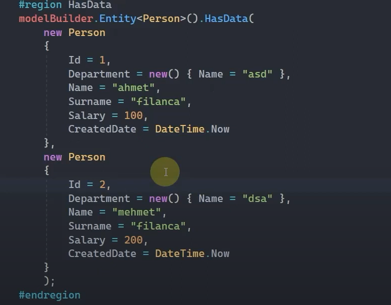

 

HasData() ile migrate sürecinde oluşturulacak olan verilerin primary key olan id kolonlarına, iradeli bir şekilde değerlerin girilmesi gerekir.

 

### HasDiscriminator

İleride entity'ler arasında kalıtımsal ilişkilerin olduğu 'Table Per Type' ve 'Table Per Hierarchy' isminde konuları inceliyor olucaz. İşte bu konularla ilgili yapılandırmalarımız HasDiscriminator() ve HasValue() fonksiyonları olucak. 

HasDiscriminator() fonksiyonu, default olarak oluşturulan 'Discriminator' kolonunu farklı bir isimle özelleştirmemize olanak tanır. Bu sayede ilgili kolonu, ihtiyaçlarımıza ve projedeki isimlendirme standartlarına uygun bir şekilde yeniden adlandırabiliriz."

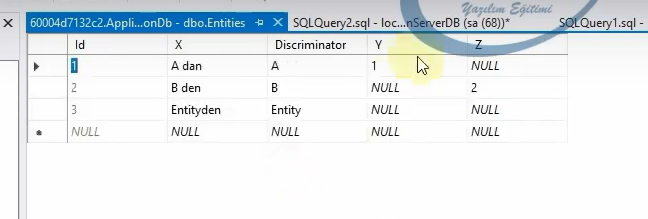

 

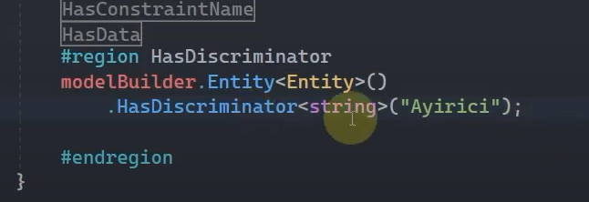

 

Yukarıdaki çalışmayla 'Discriminator' kolonunu 'Ayirici' ismiyle adlandırmış olduk.

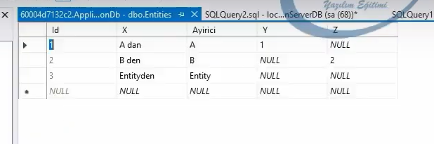

 

Eğer 'Discriminator' kolonunda, modelin sınıf isimleri yerine kendi belirlediğimiz integer değerleri kullanmak istiyorsak, aşağıdaki örnekte olduğu gibi HasValue() fonksiyonunu kullanarak her türe özel bir değer atayabiliriz. Bu yapılandırma sayesinde; A, B ve Entity gibi sınıflara ayrı ayrı ayırt edici değerler vererek, her bir sınıfın veri tabanındaki temsilini belirlemiş oluruz.

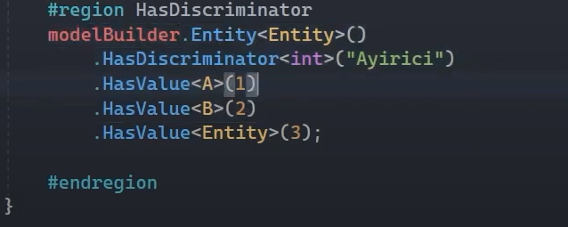

 

### HasField

Backing Field özelliğini kullanmamızı sağlayan bir yapılandırmadır.

 

HasField() metodu, bir entity’nin doğrudan erişilemeyen (private veya protected) alanlarını (public'de olabilir) (backing fields) yapılandırmak için kullanılır. Bu metot sayesinde, bir property'nin verisini tutan ancak doğrudan dışarıya açılmayan bir alan (backing field) ile çalışabiliriz.

Genelde encapsulation için kullanılan bu alanlar, yalnızca belirli bir mantık içerisinde erişilmesini istediğimiz property'lerin verisini tutar. HasField() metodu, Entity Framework'e bu alanın hangi field (alan) ile ilişkilendirildiğini belirtmemizi sağlar.

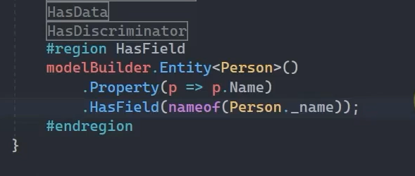

 

### HasNoKey

Normal şartlarda Ef Core'da tüm entity'lerin bir primary key kolonu olmak zorundadır. Eğer ki entity'de primary key kolonu olmayacaksa bunun bildirilmesi gerekir. İşte bu bildirim için kullanılan fonksiyondur.

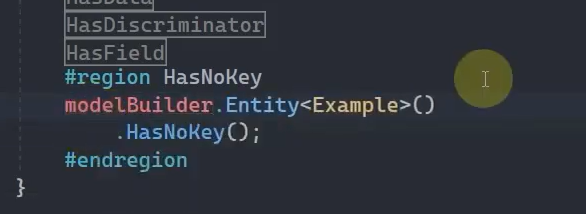

 

### HasIndex

Sonraki konularda Ef Core üzerinden Index yapılanmasını detaylıca inceliyor olucaz. Bu yapılanmaya dair konfigürasyonlarımız HasIndex ve Index attribute'u olacaktır.

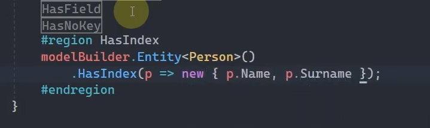

 

### HasQueryFilter

İlerde göreceğimiz 'Global Query Filter' başlıklı dersimizin yapılandırmasıdır. Temeldeki görevi bir entity'e karşılık uygulama bazında global olarak bir filtre koymaktır.  

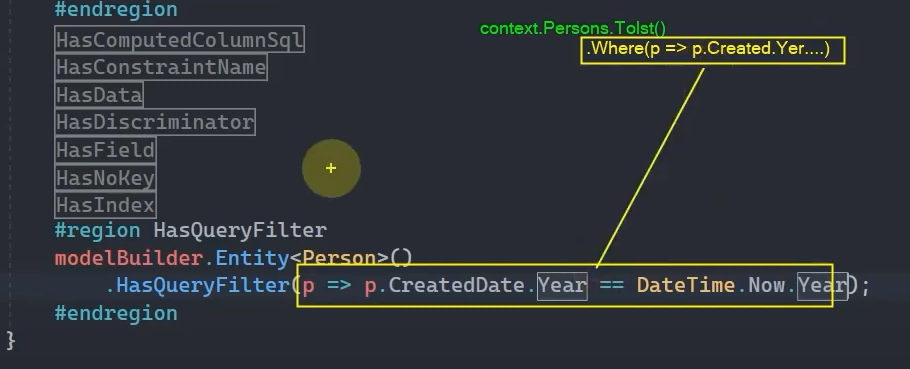

 

HasQueryFilter metodu sayesinde, Person entity'sine ait veriler sorgulanırken arka planda tanımlanan CreatedDate yılına göre bir filtre otomatik olarak eklenir. Bu da Person tablosundaki verileri; yalnızca oluşturulma yılı, güncel yılla (DateTime.Now.Year) aynı olan kayıtlarla sınırlandırır. Böylece her seferinde bu filtreyi manuel olarak eklememize gerek kalmadan, yıl bazlı bir filtreleme default olarak uygulanmış olur.

