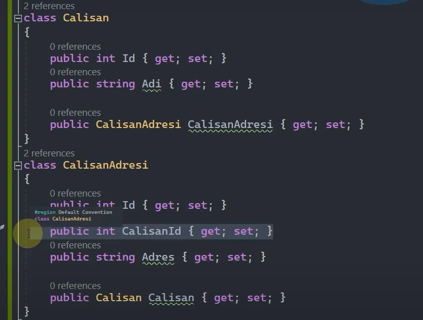
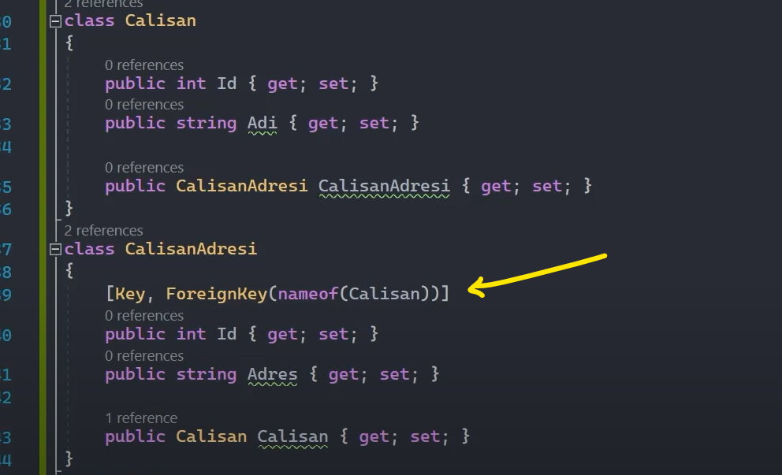
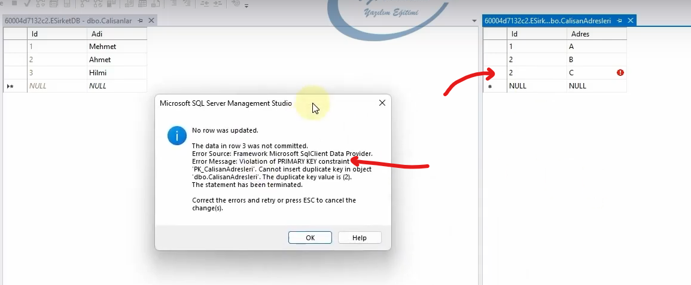
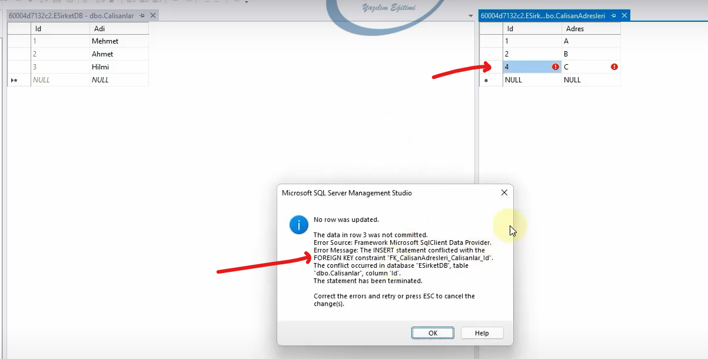
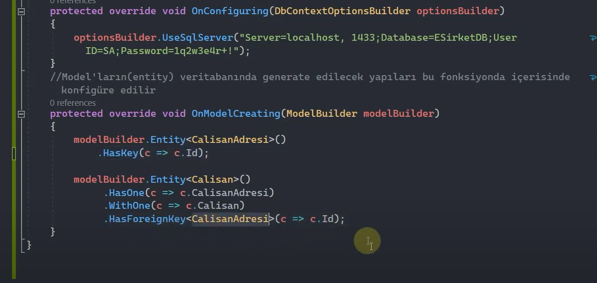

# One to One Relationship

## Default Convention 

Bu ilişkide default convention kullanılacaksa eğer, her iki entity'de Navigation Property ile birbirlerini tekil olarak referans ederek fiziksel bir ilişkinin olacağı ifade edilir.

 

## Data Annotations

Navigation property'ler tanımlanmalıdır.

Foreign key kolonunun ismi default convension dışında bir kolon olacaksa eğer [ForeingKey] attribute'u ile bunu bildirebiliriz.

Amma velakin bu Foreign Key kolonu oluşturulmak zorunda değildir. 

 

Birebir ilişkide ekstradan foreign key kolonuna ihtiyaç olmayacağından dolayı dependent entity'deki 'Id' kolonunu hem foreign key hem de primary key olarak kullanmayı tercih ediyoruz. 

 

Calisanlar tablosuyla CalisanAdresleri tablosu arasında birebir ilişkiyi 'Id' kolonu üzerinden kurduğumuz için buradaki hatayı primary key constraint veriyor. Çünkü primary key gereği 'Id' kolonu unique olmak zorunda. 2 Id'sine sahip bir tane daha veri oluşturamayız. Böylece birebir ilişkinin bir ayağının garantisini almış oluyoruz.

 

Burada da foreign key hata veriyor. Çünkü Id kolonuna verdiğimiz değerler kesinlikle Calisanlar'daki Id değerleri olmak zorunda. 4 değeri Calisanlar tablosunda olmadığı için foreign key'de hata alıyoruz.

Böylece ekstradan foreign key kolonuna karşılık verisel fazladan bir alan tahsis etmemiş oluyoruz hem de index, constraint gibi maliyetleri minimize etmiş oluyoruz.

 

## Fluent Api

Navigation property'ler tanımlanmalıdır.

Bu yöntemde entity'ler arasındaki ilişkiyi context sınıfı içerisinde OnModelCreating fonksiyonunu override ederek metotlar aracılığıyla tasarlarız. Yani tüm sorumluluk bu fonksiyon içerisindeki çalışmalardadır.

 

Model'ların (entity) veri tabanında generate edilecek yapıları, OnModelCreating fonksiyonu içerisinde konfigüre ederiz.

