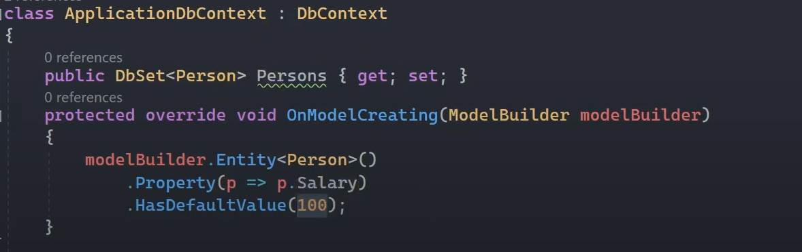
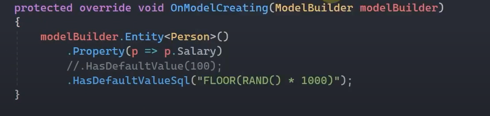
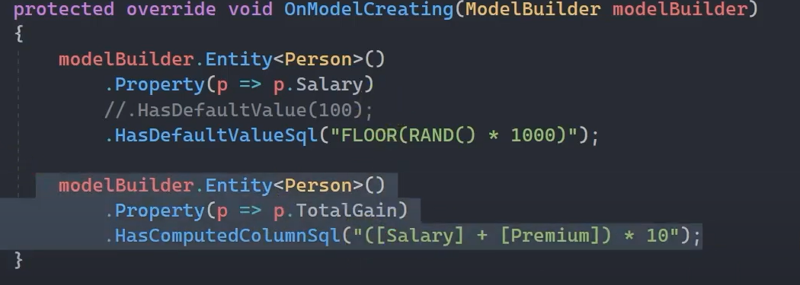
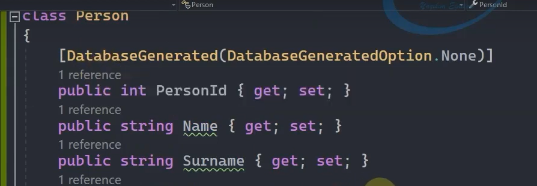
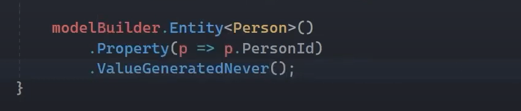
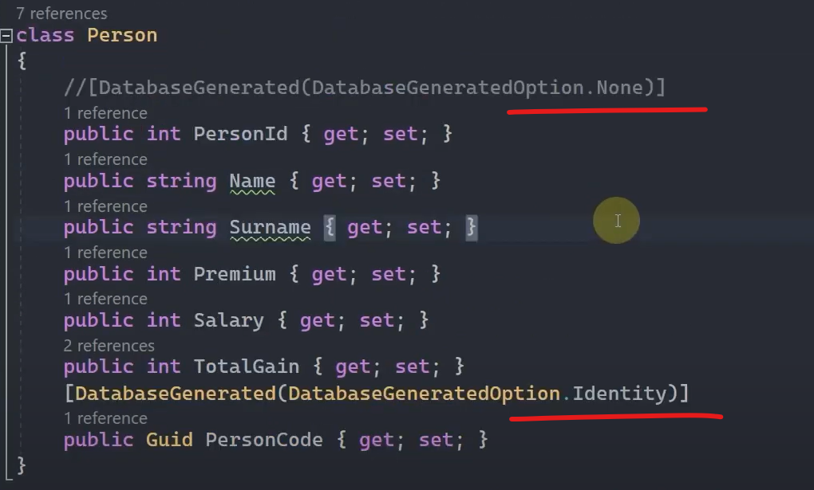
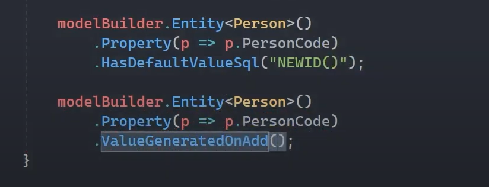
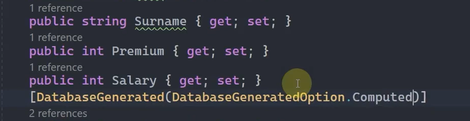

# Generate Values Yapılandırması 

 

## Generated Value Nedir? 

Ef Core'da üretilen değerlerle ilgili çeşitli modellerin ayrıntılarını yapılandırmamızı sağlayan bir özelliktir. 

 

## Default Values 

Ef Core herhangi bir tablonun, herhangi bir kolonuna yazılım tarafından bir değer gönderilmediği taktirde bu kolona hangi değerin (default value) üretilip yazdırılacağını belirleyen yapılanmadır.

 

## HasDefaultValue()

Static veri veriyor.

 

## HasDefaultValueSql()

Sql cümleciği veriyor.

 

## Computed Columns  

Tablo içerisindeki kolonlar üzerinde yapılan aritmetik işlemler neticesinde üretilen kolondur.

 

## Value Generation

### Primary Key

Herhangi bir tablodaki satırı kimlik vari bir şekilde tanımlayan, tekil (unique) olan sütun veya sütunlardır. 

  

 

### Identity

Identity, yanlızca otomatik artan bir sütundur. Bir sütun primary key olmadan da identity olarak tanımlanabilir.

 

    <b>
    !!! Primary key, kimlik vari bir özellik gösterip benzersiz bir sütun oluştururken; identity, ardışık özellik gösteren bir sütundur. Bu iki özellik genellikle birlikte kullanılır. Bu yüzden ef core primary key olan bir kolonu otomatik olarak identity olacak şekilde yapılandırmaktadır.
    </b>

 

    <b>
    Ancak böyle olması için bir zorunluluk yoktur. Yani biz bir kolonu sadece primary key olarak da ayarlayabiliriz, identity olarak da. Burda tek dikkat etmemiz gereken nokta şu: Identity bir tabloda sadece bir tane olabilir.
    </b>

 

    <b>
    Yani biz bir tabloda birden fazla sütunu primary key olarak tanımlayabiliyorken (Bu duruma composite primary key denir.) identity kolonunu sadece bir sütunda ayarlayabiliyoruz.
    </b>

 

## DatabaseGenerated

 

### DatabaseGeneratedOption.None - ValueGeneratedNever

Bir kolonda değer üretilmeyecekse eğer None ile işaretlenir. Ef Core'un default olarak primary key kolonlarına getirdiği identity özelliğini kaldırmak istiyorsak eğer None'ı kullanabiliriz. 

 

 

### DatabaseGeneratedOption.Identity - ValueGeneratedOnAdd

Herhangi bir kolona Identity özelliğini vermemizi sağlayan konfigürasyondur.

<b>Sayısal Türlerde :</b>

Eğer ki Identity özelliği bir tabloda sayısal olan bir kolonda kullanılacaksa, bu durumda ilgili tablodaki primary key kolonundan iradeli bir şekilde identity özelliğinin kaldırılması gerekmektedir.

 

<b>Sayısal Olmayan Türlerde :</b>

Eğer ki Identity özelliği bir tabloda sayısal olmayan bir kolonda kullanılacaksa, bu durumda ilgili tablodaki primary key kolonunun identity özelliğinin kaldırılmasına gerek yoktur. Bu kaldırma işlemini arkaplanda Ef Core kendisi yapacaktır.

 

 

### DatabaseGeneratedOption.Computed - ValueGeneratedOnAddOrUpdate

Ef Core üzerinde bir kolon Computed column ise ister Computed olarak belirleyebilirsiniz isterseniz de belirlemeden kullanmaya devam edebilirsiniz.

 

