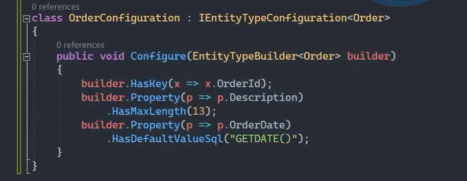
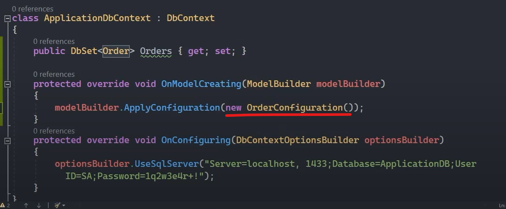
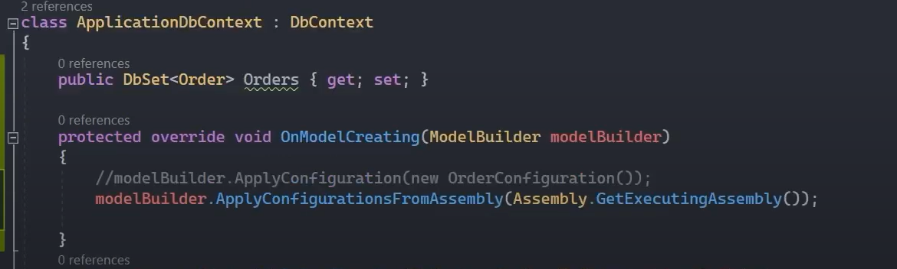

# IEntityTypeConfiguration İle Yapılandırmaları Harici Dosyalara Ayırmak

## OnModelCreating 

Entity'ler üzerinde konfigürasyonel çalışmalar yapmamızı sağlayan bir fonksiyondur. 

 

## IEntityTypeConfiguration&lt;T&gt; Arayüzü

Entity bazlı yapılacak olan konfigürasyonları, o entity'e özel harici bir dosya üzerinde yapmamızı sağlayan bir arayüzdür.

Harici bir dosyada konfigürasyonların yürütülmesi, merkezi bir yapılandırma noktası oluşturmamızı sağlamaktadır. Ekstra olarak; entity sayısının fazla olduğu senaryolarda yönetilebilirliği arttıracak ve yapılandırma ile ilgili geliştiricinin yükünü azaltacaktır.

 

## ApplyConfiguration() Metodu

Bu metot, harici konfigürasyonel sınıflarımızı Ef Core'a bildirebilmek için kullanılır. Örneğin yukarıdaki Order modeliyle ilgili olan OrderConfiguration sınıfındaki konfigürasyonları bu metot sayesinde Ef Core'a bildirmiş oluyoruz.

 

## ApplyConfigurationsFromAssembly() Metodu

Uygulama bazında oluşturulan harici konfigürasyonel sınıfların her birini OnModelCreating metodunda ApplyConfiguration ile tek tek bildirmek yerine, bu sınıfların bulunduğu Assembly'i bildirerek IEntityTypeConfiguration arayüzünden türeyen tüm sınıfları ilgili entity'e karşılık konfigürasyonel değer olarak baz almasını sağlayan bir metottur. 

