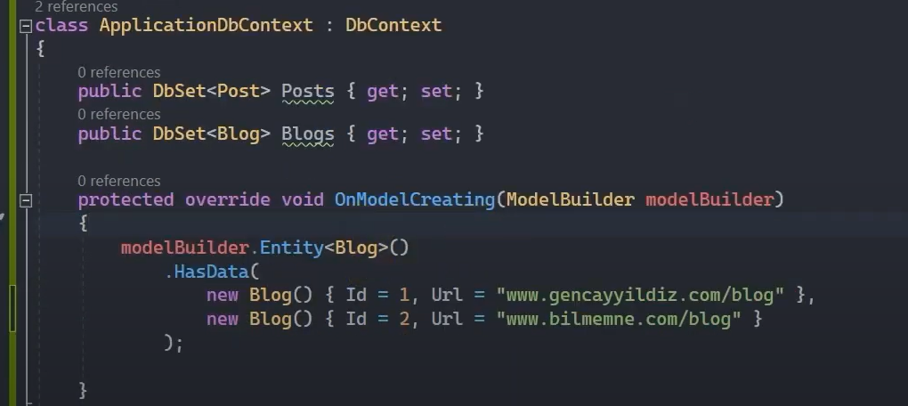
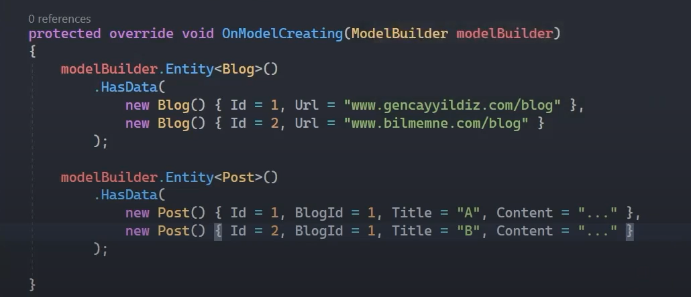
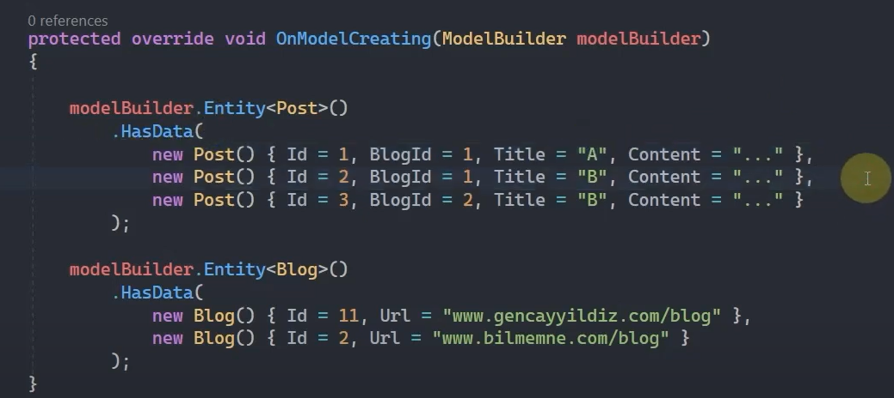

# Seed Data İle Hazır Verilerin Migrate Edilmesi

 

## Data Seeding (Seed Data) Nedir?

Ef Core ile inşa edilen veri tabanı içerisinde; veri tabanı nesneleri olabileceği gibi, verilerinde migrate sürecinde üretilmesini isteyebiliriz. İşte ihtiyaca istinaden Seed Data özelliği ile Ef Core üzerinden migration'larda veriler oluşturulabilir ve migrate ederken bu verileri hedef tablolara basabiliriz.

Seed Data'lar, migrate süreçlerinde hazır verileri tablolara basabilmek için bunları yazılım kısmında tutmamızı gerektirmektedir. Böylece bu veriler üzerinde istenilen manipülasyonlar da önül rahatlığıyla  gerçekleştirilebilir. 

 

## Data Seeding Özelliği Hangi Durumlarda Kullanılabilir?
* Test için hazır verilere ihtiyaç varsa,
* Asp .net core'daki Identity yapılanmasındaki roller gibi static değerler de tutulabilir 
* Yazılım için temel konfigürasyonel değerler.
 
 

## Seed Data Ekleme

OnModelCreating() metodu içerisinde, Entity fonksiyonundan sonra çağrılan HasData fonksiyonu; ilgili entity'e karşılık Seed Data'ları eklememizi sağlayan fonksiyondur.

 

Primary key değerlerinin manuel olarak bildirilmesi gerekmektedir. Bunun nedeni de, ilişkisel verileri seed data ile oluşturabilmektir. 

 

## İlişkisel Tablolar İçin Seed Data Ekleme 

İlişkisel senaryolarda dependent table'a veri eklerken foreign key kolonunun property'si varsa eğer, ona ilişkisel değerini vererek ekleme işlemini yapıyoruz. Ama örneğin Post modeli içerisindeki 'BlogId' property'si olmasaydı Post tablosuna seed data ekleyemezdik.

 

##  Seed Data'nın Primary Key'ini Değiştirme

Eğer ki migrate edilen herhangi bir seed datanın sonrasında primary key değiştirilirse ve bu data'yla ilişkisel başka veriler de varsa dependent tablodaki bu veriler Cascade davranışı uygulanıp silinecektir.

 

Örneğin yukarıdaki Post tablomuza Id değeri 1 ve 2 olan verileri BlogId değerleri 1 olacak şekilde önceden migrate etmişiz. Ama sonradan BlogId'si 1 olan Blog verisinin primary key değerini 11 olarak güncellersek öncelikle bu veri silinip daha sonrasında ekleneceği için bu gerçekleşen silme işleminden kaynaklı, ilişkisel olan Post verileri de silinecektir. Bu sebeple veri kayıpları ortaya çıkabilir. Böyle bir durumla da karşı karşıya kalmamak için primary key değerlerini güncellerken dikkatli olmalıyız.

