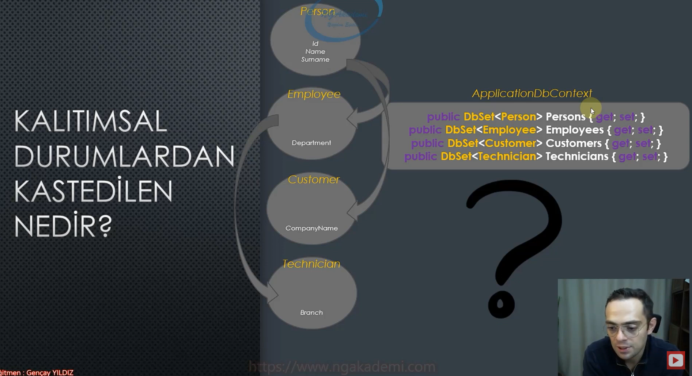
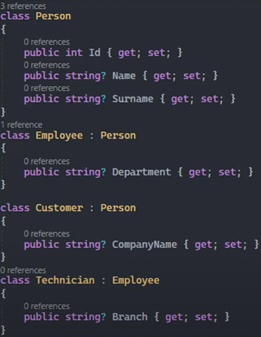
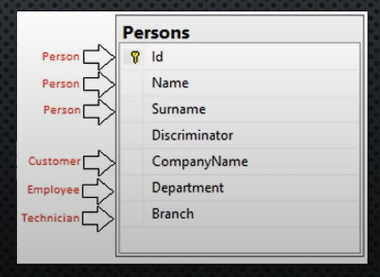
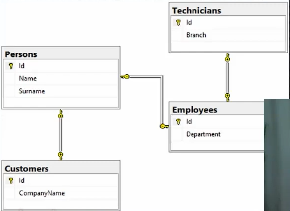
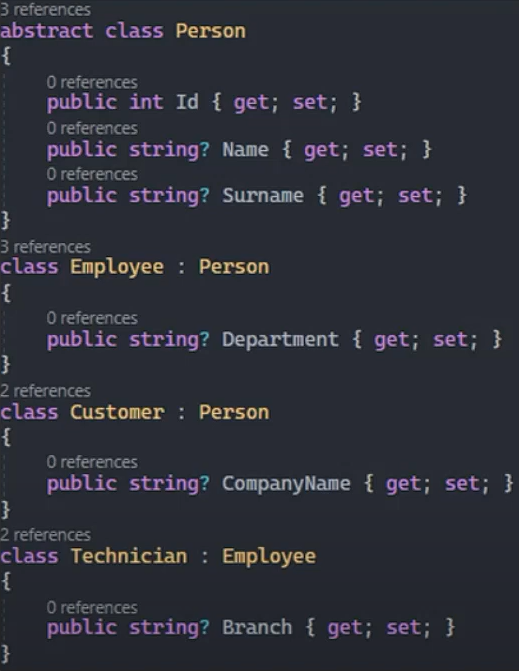
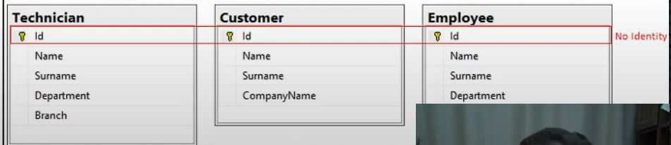

# Kalıtımsal Durumlarda Entity Framework Core Davranışları

 

## Kalıtımsal Durumlardan Kastedilen Nedir?

Örneğin aşağıdaki gibi bir durumda ef core nasıl bir davranış sergilicek, bunun üzerine konuşacağız.

 

## 1) Table Per Hierarchy (TPH)

Bu davranış modelinde, kalıtımsal hiyerarşideki tüm entity'ler için tek bir tablo oluşturulmakta ve drived olan tablolar arasındaki ayrım için bir discriminator kolonu kullanılmaktadır.

   
 

Yani yukarıdaki modelleri migrate ettiğimizde, elimizde aşağıdaki gibi bir tablo olacak.

 

## Table Per Type (TPT)

Bu davranış modelinde, kalıtımsal hiyerarşideki her sınıfa karşılık bir tablo oluşturulmakta ve oluşturulan bu tablolar ile bir üst sınıf arasında birebir ilişki sağlanmaktadır.

 

Yani yukarıdaki modelleri migrate ettiğimizde, elimizde aşağıdaki gibi bir tablo olacak.

 

## Table Per Concrete Type (TPC)

Bu davranış modelinde, kalıtımsal hiyerarşideki concrete (somut) sınıflara karşılık birer tablo oluşturulmakta ve abstract yapılanmaların member'ları bu tablolara eklemektedir.

 

 

Yani yukarıdaki modelleri migrate ettiğimizde, elimizde aşağıdaki gibi bir tablo olacak.

