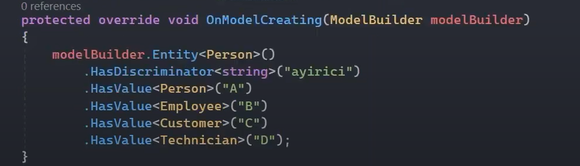

# Table Per Hierarchy (TPH) Davranışı

Kalıtımsal ilişkiye sahip entity'lerin olduğu durumlarda her bir hiyerarşiye karşılık bir tablo oluşturan davranıştır. 

## Table Per Hierarchy'e Neden İhtiyaç Duyarız?

İçerisinde benzer alanlara sahip olan entity'leri migrate ettiğimizde her entity'e karşılık bir tablo oluşturmaktansa bu entity'leri tek bir tabloda modellemek isteyebilir ve bu tablodaki kayıtları discriminator kolonu üzerinden birbirlerinden ayırabiliriz. İşte bu tarz bir tabloya göre ve bu tarz bir tabloya göre sorgulama, veri ekleme, silme vs. gibi operasyonların şekillendirilmesi için TPH davranışını kullanabiliriz. 

 

## Table Per Hierarchy Nasıl Uygulanır?

Ef Core'da entity'ler arasında kalıtımsal bir ilişki söz konusuysa eğer default olarak kabul edilen davranıştır. Bu yüzden herhangi bir konfigürasyon gerektirmez.  

 

Table Per Hierarchy davranışı için tek yapılması gereken; entity'ler kendi aralarında kalıtımsal bir ilişkiye sahip olmalı ve bu entity'lerin hepsi DbContext nesnesine DbSet olarak eklenmelidir.    

 

Table per hierarchy yaklaşımını sergilediğimiz bu çalışmayı migrate edersek eğer aşağıdaki gibi bir sonuçla karşılaşmış oluruz. 

 

 

## Discriminator Kolonu Nedir?

Table per hierarchy yaklaşımı neticesinde kümülatif olarak inşa edilmiş tablonun, hangi entity'e karşılık veri tuttuğunu ayırt edebilmemizi sağlayan bir kolondur. Ef core tarafından otomatik olarak tabloya yerleştirilir. Default olarak içerisinde entity isimlerini tutar. Discriminator kolonunu tamamen özelleştirebiliriz.

 

## Discriminator Kolon Adı Nasıl Değiştirilir?

Hiyerarşinin başında hangi sınıf varsa, fluent api'da onun konfigürasyonuna gidilmeli. Ardından HasDiscriminator fonksiyonu ile özelleştirilmeli.

 

## Discriminator Değerleri Nasıl Değiştirilir?

Yine hiyerarşinin başındaki entity konfigürasyonuna gelip, HasDiscriminator fonksiyonu ile özelleştirmede bulunarak HasValue fonksiyonu ile hangi entity'e karşılık, hangi değerin girileceğini belirtilen türde ifade edebiliriz.

 

## Table Per Hierarchy - Veri Ekleme

Davranışların hiçbirinde veri eklerken, silerken, güncellerken vs. normal operasyonların dışında bir işlem yapılmaz! Hangi davranışı kullanıyorsak ef core ona göre arkaplanda modellemeyi gerçekleştirecektir.

 

## Table Per Hierarchy - Veri Silme

Table per hierarchy davranışında veri silme operasyonu, yine entity üzerinden gerçekleştirilir. 

 

## Table Per Hierarchy - Veri Güncelleme

Table per hierarchy davranışında veri güncelleme operasyonu, yine entity üzerinden gerçekleştirilir. 

 

## Table Per Hierarchy - Veri Sorgulama 

Veri sorgulama operasyonu, bilinen DbSet property'si üzerinden yapılan sorgulamadır. Ancak burada dikkat edilmesi gereken bir husus vardır. O da şu;

 

Kalıtımsal ilişkiye göre yapılan sorgulamada üst sınıf, alt sınıftaki verileri de kapsamaktadır. Bu yüzden sorgulamaları yapıldığında, alt sınıfların verileri de gelicektir. Buna dikkat edilmelidir.

