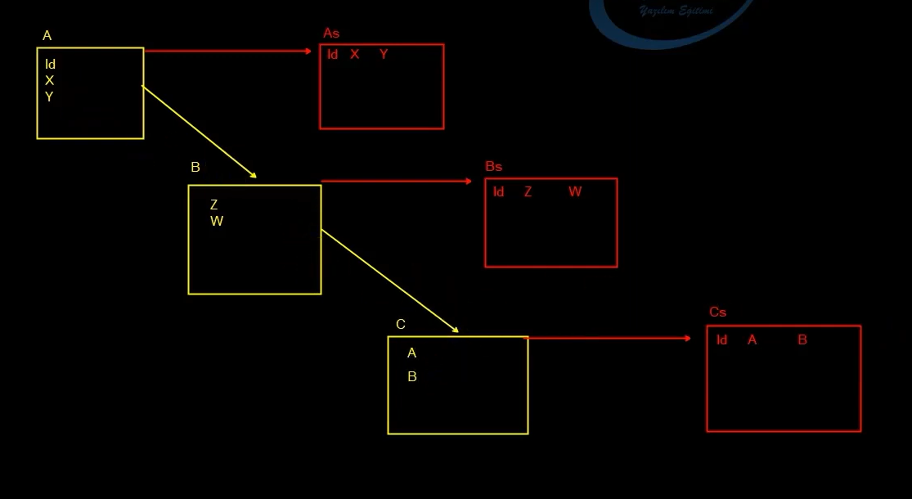
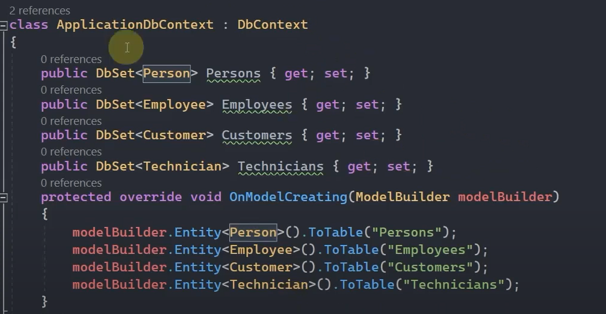
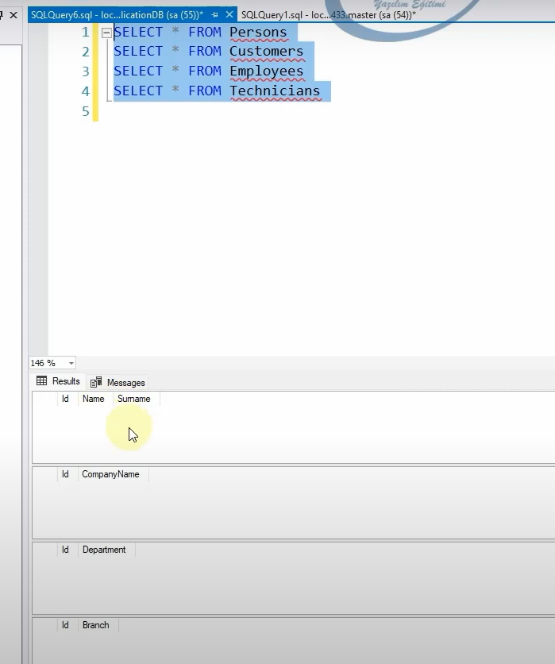
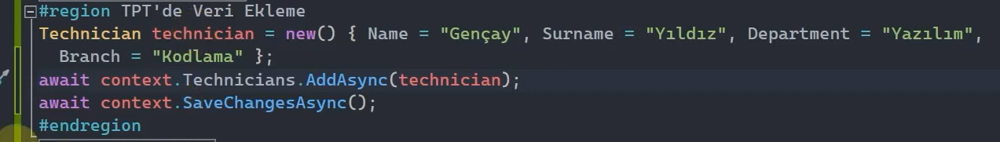
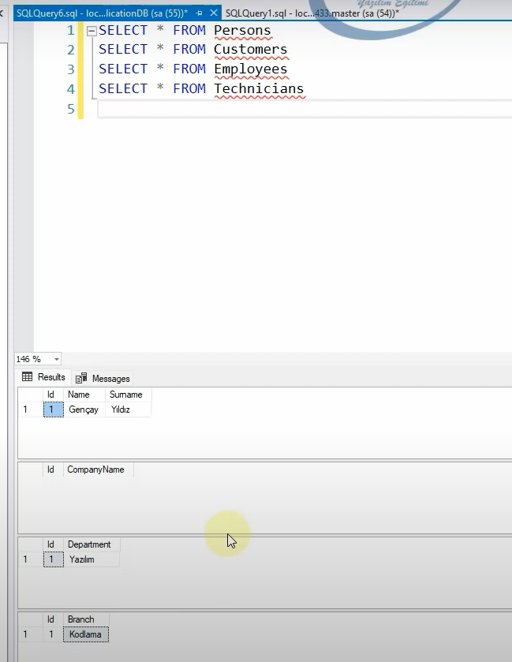
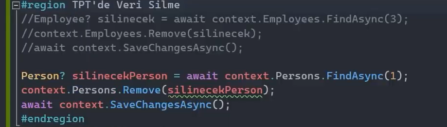
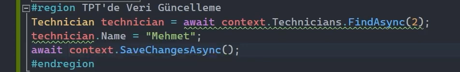

# Table Per Type (TPT) Nedir?

Entity'lerin aralarında kalıtımsal bir ilişkiye sahip olduğu durumlarda her bir türe / entity'e karşılık bir tablo generate eden davranıştır. 

Ama normalde ef core her bir entity'e karşılık zaten bir tablo generate ediyor. Bu table per type'ın farkı, özelliği ne derseniz? Her generate edilen tablolar hiyerarşik düzlemde kendi aralarında birebir ilişkiye sahiptir. 

 

Örneğin yukarıdaki çalışmada, ana sınıf olan A'nın bir tablosu oluşturulmuş (As tablosu) ve bu tablonun sütunları A sınıfına ait özellikleri içermektedir. B ve C sınıfları ise A sınıfından türetilmiş alt sınıflardır ve bu alt sınıflar için de ayrı tablolar oluşturulmuştur (Bs ve Cs tablosu).
Her tablo, hiyerarşik ilişkileri koruyarak birbirine bağlanmıştır. 

Örneğin:

As tablosunda Id, X, ve Y sütunları bulunur ve bunlar A sınıfının özelliklerini yansıtır.
Bs tablosu ise sadece B sınıfına özgü olan Z ve W sütunlarını içerir. Ancak bu tablo, Id sütunu üzerinden As tablosuyla birebir bir ilişkiye sahiptir.
Benzer şekilde, Cs tablosu, yalnızca C sınıfına özgü olan A ve B sütunlarını içerir ve yine Id sütunu üzerinden As tablosuyla ilişkilendirilmiştir.

 

## Table Per Type Nasıl Uygulanır?

Table per type davranışını uygulayabilmek için öncelikle entity'leri kendi aralarında olması gereken mantıkta inşa etmemiz gerekmektedir. Daha sonrasında ilgili entity'ler DbSet olarak bildirilmelidir. Ve son olarak hiyerarşik olarak aralarında kalıtımsal ilişki olan tüm entity'leri, OnModelCreating() fonksiyonunda ToTable() metoduyla konfigüre etmeliyiz. Böylece ef core, kalıtımsal ilişki olan bu tablolar arasında table per type davranışının olduğunu anlayacaktır.

 

 

## Table Per Type - Veri Ekleme

Aşağıdaki görselde, bir Technician nesnesi oluşturulmuş ve bu nesneye Name, Surname, Department, ve Branch değerleri atanmış. Bu davranış modeliyle, hiyerarşik bir yapıda Technician nesnesinin, tablolara uygun şekilde parçalanarak ilgili tablolara eklenmesini sağlıyoruz.

 

 

## Table Per Type - Veri Silme

 

## Table Per Type - Veri Güncelleme

