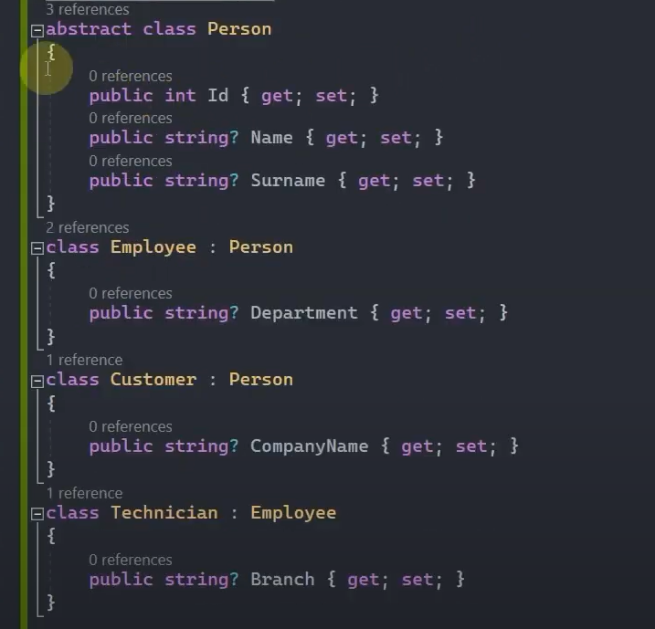
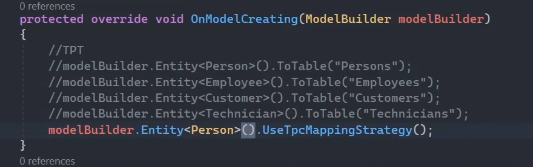
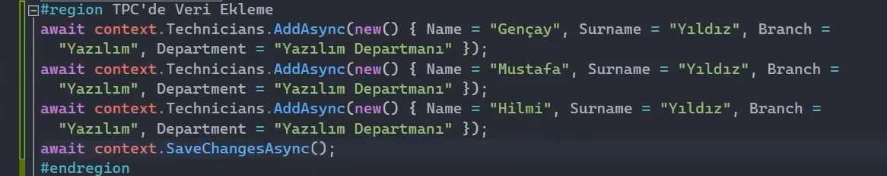
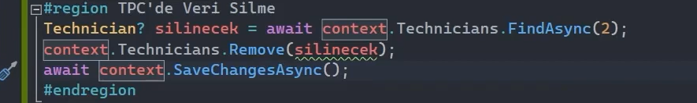
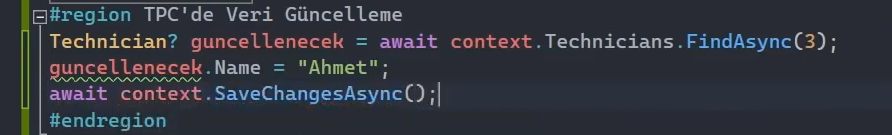

# Table Per Concrete Type Davranışı 

Table per concrete type davranışı; kalıtımsal ilişkiye sahip entity'lerin olduğu çalışmalarda, sadece concrete (somut) olan entity'lere karşılık bir tablo oluşturan davranış modelidir. 

Table per concrete type davranışı, table per type davranışının daha performanslı hâlidir diyebiliriz.

 

## Table Per Concrete Type Davranışı Nasıl Uygulanır?

Hiyerarşik düzlemde abstract olan yapılar üzerinden Entity fonksiyonuyla ilgili konfigürasyona girip UseTpcMappingStrategy fonksiyonu eşliğinde davranışın TPC olacağını belirleyebiliz.

 

 

## Table Per Concrete Type - Veri Ekleme

 

## Table Per Concrete Type - Veri Silme

 

## Table Per Concrete Type - Veri Güncelleme

