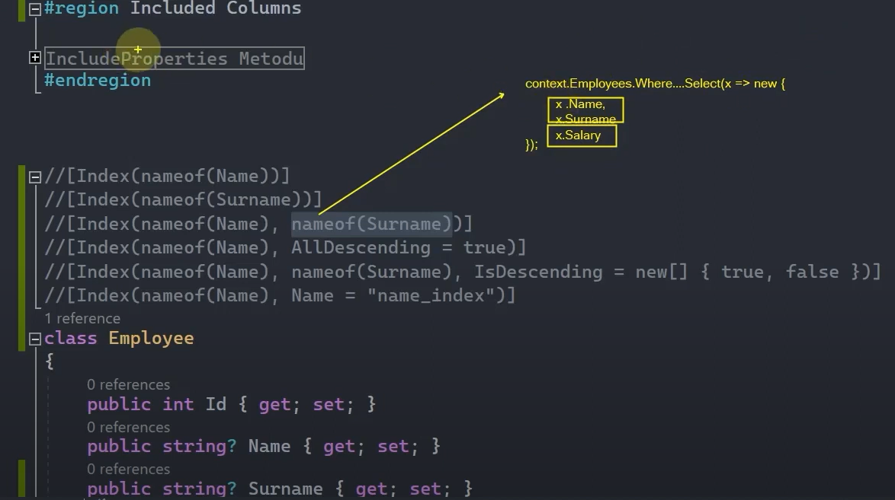

# Indexes

Index, bir sütuna dayalı sorgulamaları daha verimli ve performanslı hâle getirmek için kullanılan yapıdır.

 

## Index'leme Nasıl Yapılır?

Primary key, foreign key ve alternate key kolonları; otomatik olarak indexlenir. Bunların dışında farklı kolonlara index'ler atamak istiyorsak attribute ya da fluent api olmak üzere iki farklı özellikten istifade edebiliriz. Bunlardan biri [Index] attribute'u, diğeri ise HasIndex() metodudur.

 

## Index Attribute'u

 

## HasIndex() Metodu

 

Yukarıdaki örneklerde artık "Name" kolonumuz index'lenmiş oldu. İndex'lendiği için de aşağıdaki gibi "Name" üzerinden yapılan tüm sorgulamalarımız; daha az maliyetli, daha yüksek performanslı ve verimli bir şekilde gerçekleştirilecektir. 

 

## Composite Index

 

Composite index, bir veritabanında birden fazla sütun üzerinde yapılan indeksleme yöntemidir. Özellikle sorguda birden fazla sütunun sıklıkla filtreleme ya da sıralama işlemlerinde kullanıldığı durumlarda avantajlıdır.

 

 

 

## Birden Fazla Index Tanımlama

Tablolarımızda aşağıdaki görseldeki gibi birden fazla kolonu index'leyebiliriz.

 

Ama aklımıza şöyle bir şey gelebilir: "Veri tabanı çalışmalarımızda ne kadar kolon varsa hepsine gidip index'i ekleyelim, lazım olunca da zaten performanslı bir çalışma sergilemiş oluruz." diye düşünebiliriz. Amma velakin şunu bilmekte fayda var, her bir index veri tabanı açısından ekstra bir maliyet olacağından dolayı bir tabloda yoğun olarak sorgulama yapılan kolonlar üzerinde index'lerin oluşturulmasını tavsiye ediyoruz.  

 

## Index Uniqueness 

Index'leri unique hâle getirebilmekteyiz. Index'ler default hâlleriyle unique değillerdir. Eğer index'lemiş olduğumuz kolonu unique hâle getirmek istiyorsak attribute ya da fluent api'dan faydalanabiliriz.

 

 

## Index Sort Order - Sıralama Düzeni (EF Core 7.0) 

EF Core'da Index Sort Order, dizinlerin sıralama düzenini belirleyerek sorgu performansını artırmayı sağlar.

<h3> 
    <li>AllDescending - Attribute</li>
</h3>

Tüm index'lemelerde descending davranışının bütünsel olarak konfigürasyonunu sağlar.

 

<h3> 
    <li>IsDescending - Attribute</li>
</h3>

Index oluşturma sürecindeki her bir kolona göre sıralama davranışını hususi olarak ayarlamak istiyorsak IsDescending parametresi, attribute içerisinde kullanılır.

 

Örneğin yukarıdaki çalışmada IsDescending parametresi sayesinde 'Name' kolonu için indexleme descending olarak yapılırken 'Surname' kolonu için ascending olarak yapılır.

 

<h3> 
    <li>IsDescending() Metodu</li>
</h3>

Fluent api'da bu sıralama düzenini belirlemek için IsDescending metodunu kullanırız.

 

## Index Name

Index dediğimiz bu yapılanma özünde bir veri tabanı nesnesi, objesidir. Hâliyle her objenin bir ismi olduğu gibi index'lerimizin de bir ismi olacaktır. Dolayısıyla arkaplanda default bir şekilde verilen bu ismi aşağıdaki alternatiflerle özelleştirebiliriz.

 

 

## Index Filter

Index Filter özelliği, bir index üzerinde filtreleme yaparak sadece belirli bir koşulu karşılayan kayıtları getirmeyi sağlar. Yani tüm kayıtları index'e eklemek yerine yalnızca koşulu sağlayan kayıtlar index'e dahil edilir.

 

## Included Columns

Şimdi yukarıdaki Employee entity'sinden devam edecek olursak eğer biz index kolonlarımızı 'Name' ve 'Surname' olarak belirlersek ve yapacağımız sorguda Where şartından sonra Select fonksiyonunda 'Name' ve 'Surname' dışında başka kolonları da Select'e dahil edersek sorgunun performansını düşürmüş, maliyeti arttırmış oluruz.

 

Böyle bir durumda IncludeProperties() metoduyla, Select sürecinde eklenebilecek property'leri yani kolonları da index tablosuna ekleyebiliriz. Yani bizim yapmış olduğumuz index'in dışında ekstradan başka bir kolonu Select ile sorguda elde etmek istiyorsak ve sorgunun da performanslı olmasını istiyorsak bu kolonları IncludeProperties() metodu ile bildirebilir ve index tablosuna dahil edebiliriz.

