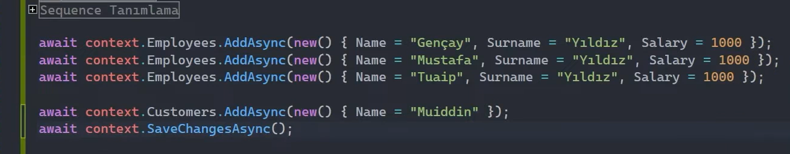
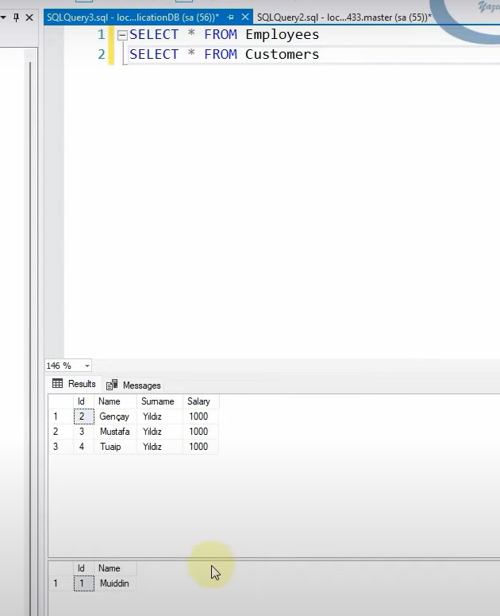

# Sequences

Veri tabanında benzersiz ve ardışık sayısal değerler üreten veri tabanı nesnesidir.

Sequence, herhangi bir tablonun özelliği değildir. Veri tabanı nesnesidir. Birden fazla tablo tarafından kullanılabilir. Yani bunu identity ile karıştırmamalıyız.

## Sequence Tanımlama

 

Yukarıdaki örnekte, sequence oluşturmayı ve bu sequence'i birden fazla entity'de (örneğin Employee ve Customer) primary key (başka bir property'de olabilir) olarak nasıl kullanabileceğimizi göstermiş olduk.

Sequence'ler üzerinden değer oluştururken veri tabanına özgü çalışma yapılması zaruridir. Yani örneğin MsSql veri tabanı sunucusuyla çalışıyorsak bu dilin syntax'ına özel bir tanım yapılmalıdır.

 

 

Yukarıdaki çalışmada Employees ve Customers tablolarında aynı sequence kullanıldığı için, her iki tablonun id değerine benzersiz bir değer atanır. Yani, örneğin Employees tablosuna yeni bir kayıt eklediğinizde sequence bir sonraki değere geçer, bu Customers tablosunu da etkiler. Tıpkı aşağıda olduğu gibi...  

 

Sonuç olarak, sequence değerleri iki tablo arasında paylaşılır ve her iki tabloda da benzersiz, sıralı bir değer sağlanır.

 

## Sequence Yapılandırması

 

Yukarıdaki yapılandırmayla sequence nesnesinin 100'den başlamasını ve bu değerlerin 5'er 5'er artmasını sağlamış oluyoruz. 

 

## Sequence ile Identity Arasındaki Fark

Şimdi sequence fıtrat olarak bir veri tabanı nesnesidir. Identity ise herhangi bir tablonun içerisindeki özelliktir. Yani sequence veri tabanına özel bir nesneyken identity bir tablodaki özelliktir. Peki bu ne demek? 

Sequence veri tabanında bir nesne olduğu için herhangi bir tabloya bağımlı olmuyor. Hâliyle istediğimiz kadar tabloda bir tane sequence'i kullanabiliriz. 

Identity yapılanmasından farkı da şudur ki; identity bir sonraki değeri disk'ten alırken sequence RAM'den alır. Bu yüzden önemli ölçüde identity'e nazaran daha hızlı, performanslı ve az maliyetlidir.  

<b>Peki id kolonundaki değerin otomatik olarak oluşturulmasının maliyetini düşürebilmek için, her seferinde sequence kullanmalı mıyız?</b> Evet, kullanabiliriz. Veri tabanı çalışmasında tasarımı daha ideal noktaya getirebilmek için birden fazla, haddinden fazla tablonun söz konusu olduğu mimarilerde mikro düzeyde optimizasyonlar yaparken sequence'lerden faydalanabiliriz.

