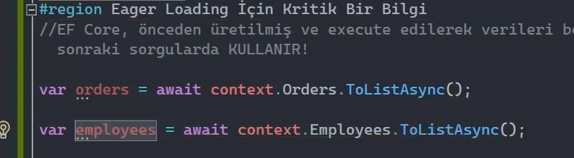

# Loading Related Data

 

## Eager Loading

Generate edilen bir sorguya ilişkisel verilerin parça parça eklenmesini ve bunu iradeli br şekilde yapmamızı sağlayan bir yöntemdir. Peki biz eager loading'i nasıl kullanabiliriz? Bunu kullanabilmek için Include() metodundan istifade ediyoruz. 

 

## Include()

Eager loading operasyonunu yapmamızı sağlayan bir fonksiyondur. Yani üretilen sorguya diğer ilişkisel tabloların dahil edilmesini sağlar. 

*** Aşağıdaki her iki satırda da Employees tablosuyla ilişkili olan 'Orders' tablosu sorguya dahil edilmiş oldu.

 

*** Eager loading, arkaplanda üretilen sorguya hedef tablonun / uygun Join işlemini uygular.

 

*** Include fonksiyonunu kullanarak istediğimiz kadar tabloyu o anki sorguya dahil edebiliriz. 

 

*** Aşağıdaki sorguda Order adedi 2'den büyük olan verileri getirmiş oluyoruz. Ama istersek bu Where koşulunu Include() fonksiyonundan önce de ekleyebiliriz.

 

Ve aşağıdaki gibi bir çalışmada şöyle düşünmemeliyiz: biz burada Orders tablosuyla ilgili bir Where şartı yazıyoruz ama Where şartından sonra Orders tablosunu Include ediyoruz. Acaba sorgudaki Orders tablosunda patlamaz mıyız? Hayır, patlamayız. Çünkü Ef Core Include'ları önceden görüyor ve buna göre sorguyu ve koşulu oluşturuyor. Yani netice itibariyle yukarıdaki çalışmada da aşağıdaki çalışmada da aynı sorguyu elde etmiş olacağız.  

 

## ThenInclude()

Üretilen sorguda Include edilen tabloların ilişkili olduğu diğer tablolarıda sorguya ekleyebilmek için kullanılan bir fonksiyondur. 

Eğer ki üretilen sorguya Include edilen navigation property koleksiyonel bir yapıda olmasaydı, tekil bir nesne olsaydı o zaman yorum satırına alınan çalışmada da olduğu gibi ".Include(o => o.Employee.Region)" şeklinde ilişkili tabloları da sorguya ekleyebilirdik.

Ama Include edilen navigation property koleksiyonel bir yapıda ise bu tabloya yukarıdaki gibi bir erişim gösterilememektedir. Şöyle ki; ".Include(e => Employees.Orders)" gibi bir çalışma yapamayız.

Bunun yerine aşağıdaki gibi ThenInclude() metodunu kullanarak bu koleksiyonel property'nin türüne erişip o tür ile ilişkili diğer tabloları da sorguya ekleyebiliriz.

 

## Filtered Include()

Sorgulama süreçlerinde Include yaparken sonuçlar üzerinde filtreleme ve sıralama gerçekleştirebilmemizi sağlayan bir özelliktir.   

 

Where(), OrderBy(), OrderByDescending(), ThenBy(), ThenByDescending(), Skip() ve Take() fonksiyonlarını Include fonksiyonu içerisindeki tabloyu sorgularken kullanabiliriz.

 

### Önemli Not:

Change Tracker'ın aktif olduğu durumlarda; Include edilmiş sorgular üzerindeki filtreleme sonuçları, beklenildiği gibi olmayabilir.

 

Örneğin 1. sorguda biz tüm verileri çekmiş olalım ve bunun sonrasında da Filtered Include ile 2. sorguyu generate edelim. Çalıştırmış olduğumuz bu 2. sorguda change tracker mekanizmasını kullanıyorsak eğer istemediğimiz verileri de elde edebiliriz. 

Yani biz change tracker'la bu filtreli sorguyu çalıştırmadan önce belirli verileri elde etmişiz ve bunları takip ediyoruzdur. Artık Filtered Include operasyonunu gerçekleştirip hedef verileri elde etmek istiyoruzdur ama bu filtrenin dışında kalan verileri change tracker'dan dolayı sorgu sonucunda tekrardan elde edebiliriz. 

İşte bu durumu sağlıklı bir şekilde yönetebilmek için Filtered Include operasyonlarında change tracker'ın kullanılmadığı sorguları tercih etmemiz gerekiyor.

 

## Eager Loading İçin Kritik Bir Bilgi

Ef Core, önceden üretilmiş ve execute edilerek verileri belleğe alınmış olan sorguların verilerini, sonraki sorgularda KULLANIR!

Örneğin; aşağıdaki çalışmada öncelikle Orders tablosu, daha sonrasında da Employees tablosu sorgulanıp execute edilmiş. 

 

Şimdi biz Employees tablosundan gelen verileri gözlemleyecek olursak eğer, içerisinde ilişkili olduğu Orders verilerinin de geldiğini görmüş oluruz. Çünkü Orders verileri execute edilip belleğe alındığı için sonraki sorgularda da eğer bir ilişkisi varsa gönderilir.

 

Yani sonuç olarak; eğer ki gerçek operasyonlarımızda yapmış olduğumuz çalışmada önceden bir veriyi sorgulayıp belleğe aldığımızdan eminsek daha sonraki operasyonlarımızda bir daha o tabloyu Include etmemize gerek yok. Include da edebiliriz ama gereksiz bir maliyet ortaya çıkarmış oluruz.

 

## AutoInclude() - Ef Core 6

Uygulama seviyesinde her bir entity'e karşılık yapılan tüm sorgulamalarda "kesinlikle" bir tabloya Include işlemi gerçekleştirilecekse eğer, bunu her bir sorgu için tek tek yapmaktansa merkezi bir hâle getirmemizi sağlayan bir özelliktir.

 

Yukarıdaki çalışmayla Employees tablosunu her sorguladığımızda ilişkili olan Region verileri de otomatik bir şekilde getirilmiş olacak. 

 

## IgnoreAutoIncludes()

Peki bu AutoInclude metodunu nasıl olacak da istediğimiz sorgularda pasif hâle getirebilicez? Yani yukarıdaki örnekten devam edecek olursak, biz her Employees verilerini sorguladığımızda AutoInclude() metoduyla gelen Region verilerinin getirilmesini istemiyorsak nasıl yapıcaz?

Örneğin kimi sorguda sadece maaş verilerini getirmek istiyorum ama Region verilerini getirmek istemiyorum. Bu durumda n'apıcaz? Bu durumda IgnoreAutoIncludes() fonksiyonunu kullanabiliriz. 

 

## Birbirlerinden Türetilmiş Entity'ler Arasında Include

 

Yukarıdaki örnekte Person nesnesinin Employees nesnesine kalıtım verdiğini düşünelim. Bu durumda eğer Persons tablosu üzerinden Employees tablosuna, ordan da Orders tablosuna gidecek olursak belirtilen operatörleri kullanmadan istediğimiz işlemi gerçekleştiremeyiz. 

Employees nesnesi Person nesnesinden kalıtım aldığı için Employee, bir yandan Person nesnedir. Bu sebeple cast veya as operatörünü veyahut 2. Overload Include ile Employees tablosundan Orders tablosuna erişebiirim. 

