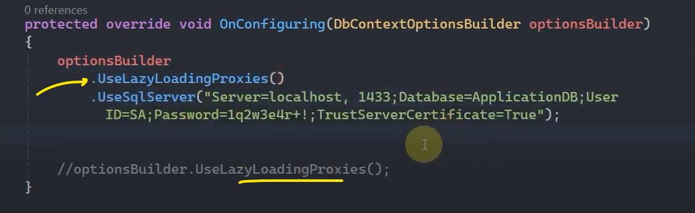
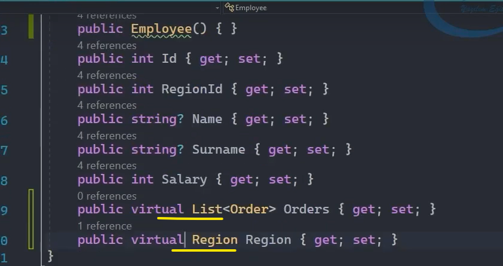
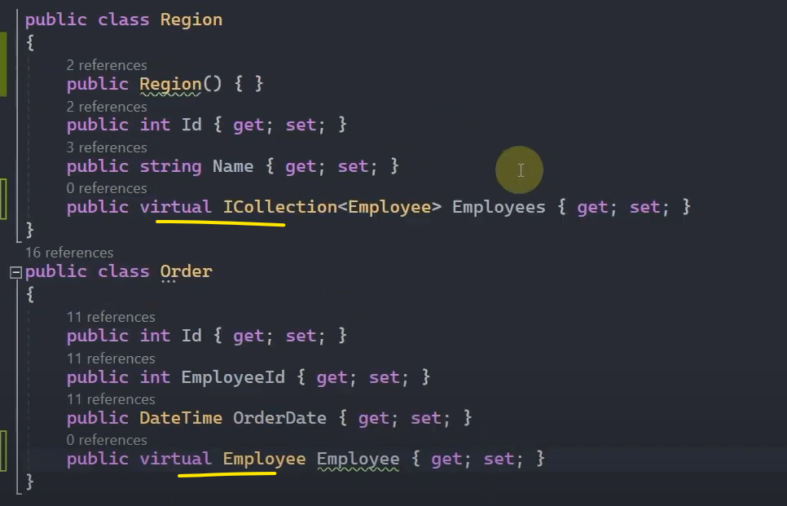
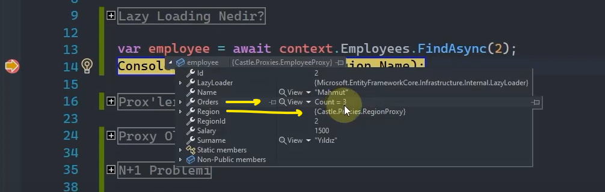
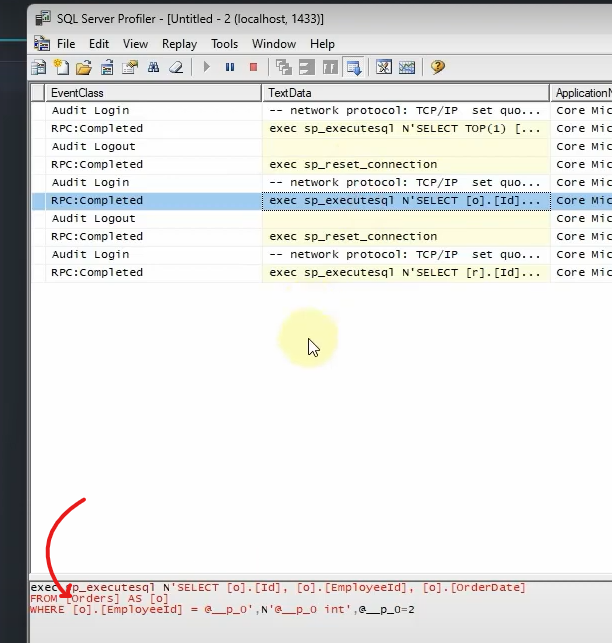
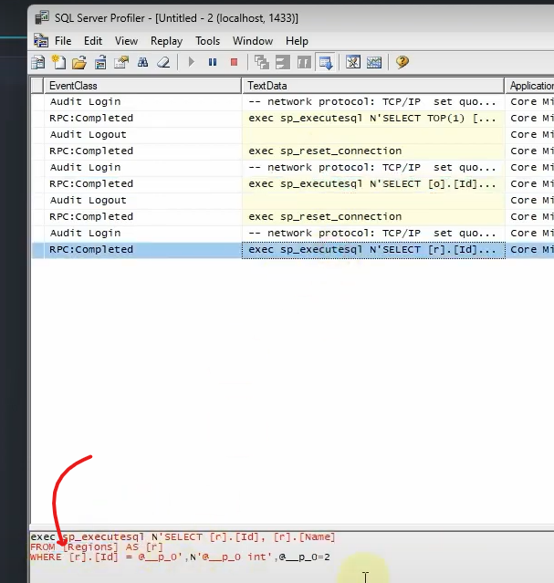
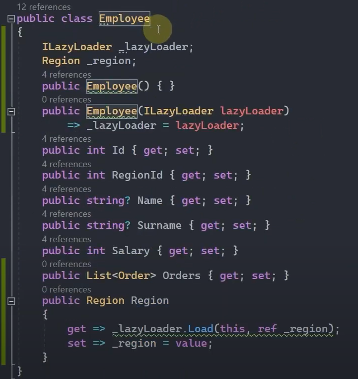
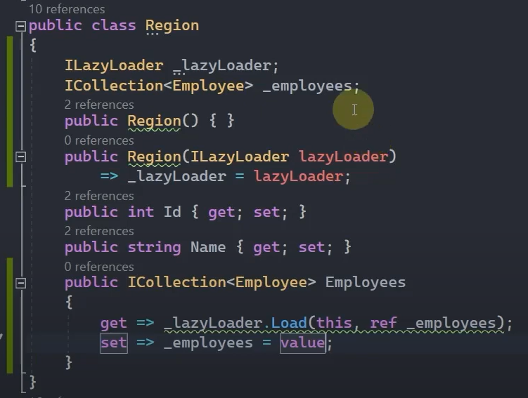
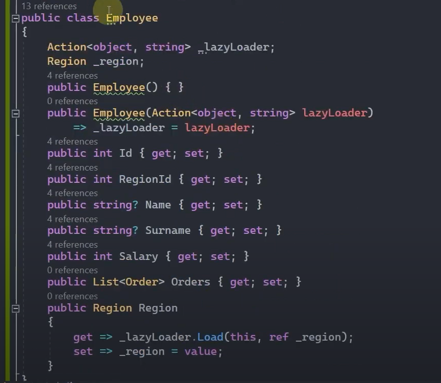

# Loading Related Data

 

## Lazy Loading Nedir?

Navigation property'ler üzerinde bir işlem yapılmaya çalışıldığı taktirde ilgili property'nin temsil ettiği tabloya özel bir sorgu oluşturup execute edilmesi ve verilerin yüklenmesini sağlayan bir yaklaşımdır.

 

Yukarıdaki çalışmada 2 id'sine sahip Employee verisini çağırırken ilişkili olduğu Region verisini sorguya eklemediğimiz için hâliye Region verisi null gelicek ve biz 'Name' değerine ulaşmak istersek hata alıcaz. 

Ama biz Region üzerinde Lazy Loading işlemini uygularsak eğer, ne zaman ki Employee'dan Region nesnesi çağrılırsa o zaman daha 'Name' verisini çağırmadan evvel gerekli sql sorgusu oluşturulup Region nesnesiyle birlikte Employee verisi getirilir ve en sonunda da 'Name' değerine hatasız bir şekilde ulaşılır.  

 

## Proxy'lerle Lazy Loading

Öncelikle proxy yapılanmasını kullanabilmek için "Microsoft.EntityFrameworkCore.Proxies" kütüphanesini kullanmamız gerekiyor.

Şimdi proxy üzerinden Lazy Loading yapacaksak eğer, OnConfiguring() metodu içerisinde aşağıdaki gibi her iki çalışmayı da yapabiliriz. 

 

Yukarıdaki çalışmalardan herhangi birini yaptığımız taktirde uygulamamızda Lazy Loading yaklaşımı enable hâle gelmiş olacaktır.

 

## Property'lerin Virtual Olması

Eğer ki proxy'ler üzerinden lazy loading yaklaşımını gerçekleştireceksek navigation property'lerin virtual ile işaretlenmiş olması gerekmektedir. Aksi taktirde patlama meydana gelecektir.  

 

 

### Önemli Nokta!

Eğer ki biz herhangi bir yaklaşımlar lazy loading kullanırsak debug süreçlerinde şöyle bir yanılma söz konusu olabilir.

 

Örneğin, yukarıdaki sorguyu çalıştırdığımızda debug modundayken employee değişkenine gelen verileri gözlemleyecek olursak eğer aşağıdaki gibi Orders ve Region verilerinin de geldiğini görmüş olucaz.

 

Böyle bir durumda şöyle düşünebiliriz: "Demek ki biz sorgulamayı yaptığımız da navigation property üzerinden Orders veya Region verilerine herhangi bir talepte bulunmasak dahi bu veriler yükleniyor." diye zannedebiliriz.

Ki bu, yanlış bir düşüncedir. Çünkü biz burada debug yaparken ilgili objenin içerisindeki property'lere bakarken aslında Orders ve Region property'lerini tetiklemiş oluyoruz. Hâliyle bunlar tetiklendiği için Orders ve Region ile ilgili sorgular arkaplanda oluşturulmuş oluyor. Ve bu durumun esas sebebi virtual ile ilgilidir. Buna run time'da karar verilip tetikleniyor.

<b>Bunu daha detaylı şöyle açıklayabiliriz:</b> 

Şimdi uygulamayı tekrar debug modda çalıştırdığımızda öncelikle Employee ile ilgili sorgulamanın yapıldığını aşağıdaki gibi görücez. 

 

Ama 'employee' değişkenine tıklayıp değerlerini açtığımız anda sql server profiler'da Orders ve Region verilerinin de sorgulandığını görmüş olucaz.

 

 

Yani aslında lazy loading'de tüm veriler top yekün belleğe yüklenmiyor. Biz navigation property'leri tetikledikçe, oradaki ihtiyacı belirttikçe veriler; belleğe yüklenmiş olacaktır.

 

## Proxy Olmaksızın Lazy Loading 

Proxy'ler tüm platformlarda desteklenmeyebilir. Böyle bir durumda manuel bir şekilde Lazy Loading'i kullanmak mecburiyetinde kalabiliriz.

 

## ILazyLoader Inteface'i İle Lazy Loading

Öncelikle ILazyLoader operasyonunu, interface'ini uygulayabilmek için Microsoft.EntityFrameworkCore.Abstractions kütüphanesini uygulamamıza yüklememiz gerekiyor. 

Daha sonrasında aşağıdaki gibi bir çalışmayla Employee nesnesinin ilişkili olduğu Region verileri için lazy loading işlemini manuel bir şekilde gerçekleştirmiş oluyoruz. Hem Employee class'ının içerisinde hem de Region class'ı içerisinde bu çalışmayı yapıyoruz.

 

Manuel yapılan lazy loading operasyonlarında Navigation Property'lerin 'virtual' keyword'ü ile işaretlenmesine gerek yoktur!

 

## Delegate İle Lazy Loading

 

Şimdi yukarıdaki Action nesnesi için _lazyLoader içinde tanımlanmış bir Load() metodu olmadığı için aşağıda olduğu gibi extension bir metot hazırlıyoruz.

 

## N+1 Problemi

Şimdi bizler lazy loading operasyonunu hangi yöntemle uygularsak uygulayalım bu N+1 problemi meydana çıkabiliyor.

Lazy loading kullanım açısından oldukça maliyetli ve performans düşürücü bir etkiye sahiptir. O yüzden kullanırken mümkün mertebe dikkatli olmalı ve özellikle navigation property'lerin döngüsel tetiklenme durumlarında lazy loading'i tercih etmemeliyiz. Aksi taktirde lazy loading, her bir tetiklemeye karşılık aynı sorguları üretip execute edecektir. Bu problemi de N+1 olarak nitelendirmekteyiz.

Özetle mümkün mertebe ilişkisel verileri eklerken Lazy Loading kullanmamaya özen göstermeliyiz. 

