# Complex Query Operators

 

## Inner Join

### Query Syntax
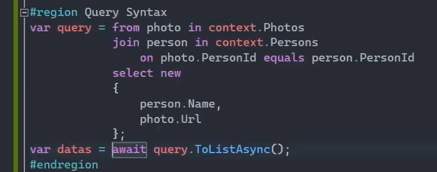

 

### Method Syntax
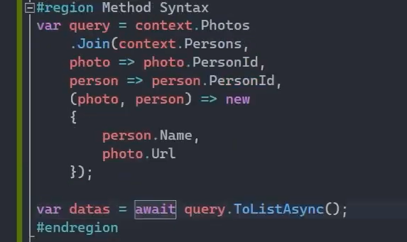

 

## Multiple Columns Join

iki veya daha fazla tabloyu birden fazla sütun üzerinden birleştirme işlemidir. Genellikle, tablolar arasında birden fazla sütun üzerinden ilişki kurulduğunda ya da karmaşık bir veri modeliniz olduğunda kullanılır.

### Query Syntax

Örneğin aşağıdaki çalışmada Photos tablosuyla Persons tablosu arasında PersonId ve Url sütunları üzerinden eşleşme sağlanmıştır. Tabi bizim Person tablomuzda 'Url' diye bir kolonumuz olmadığı için bu eşleşmeyi 'Name' kolonu üzerinden sağlıyoruz ama asıl, gerçek senaryolarda kolon isimlerinin birebir aynı olması gerekiyor!

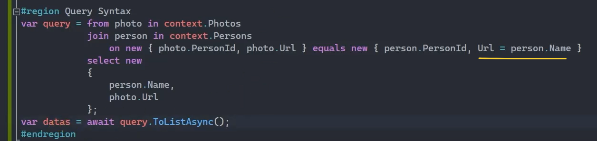

 

### Method Syntax

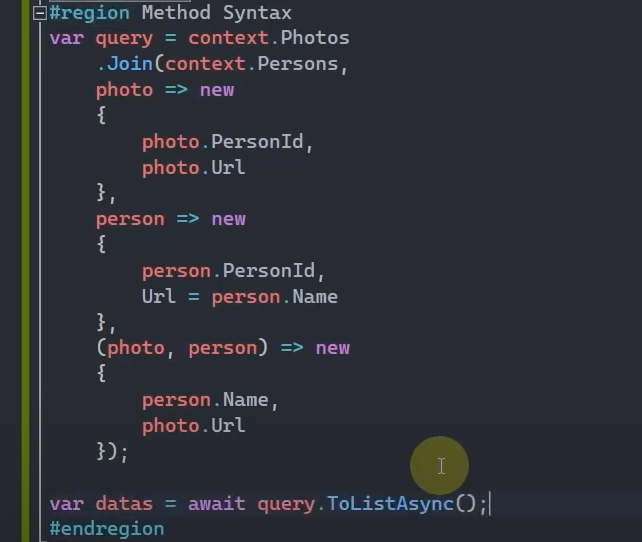

 

## 2'den Fazla Tabloyla Join

### Query Syntax

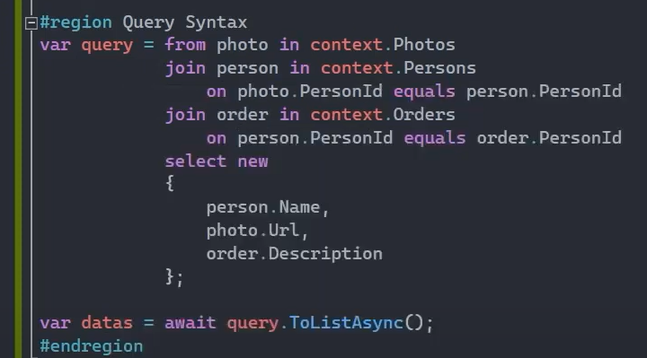

 

### Method Syntax

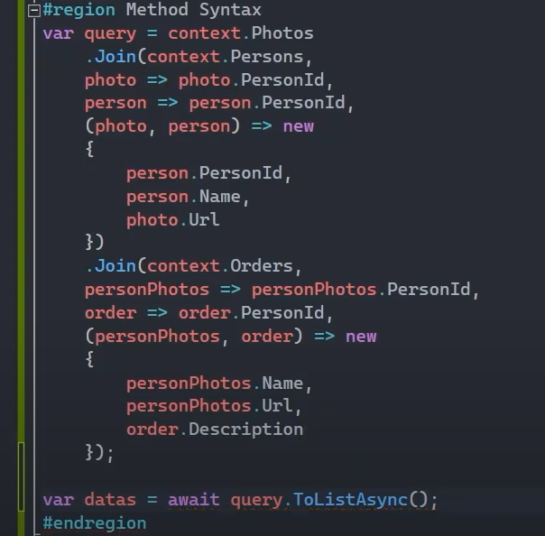

 

## Group Join - GroupBy Değil!

Group Join'den kastedilen GroupBy değildir.

### Query Syntax

Person'lara karşılık gelen Order'ları gruplamak istiyorsak aşağıdaki gibi bir çalışma yapabiliriz.

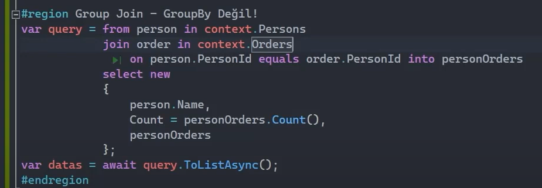

 

## Left Join

Entity framework core'da left ya da right join'i kullanabilmek için sadece query syntax yöntemini kullanabiliriz. Method syntax yöntemi kullanılamıyor.

### Query Syntax
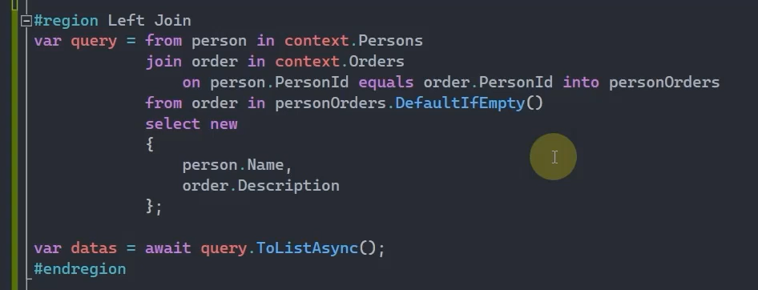

 

### DefaultIfEmpty() Metodu

Sorgulama sürecinde ilişkisel olarak karşılığı olmayan verilere default değerini yazdıran yani LEFT JOIN sorgusunu oluşturtan bir fonksiyondur. 

 

## Right Join

### Query Syntax
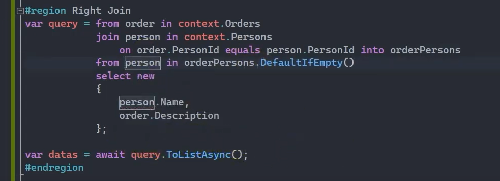

 

## Full Join

Ef Core'da full join yapmak da mümkün değil. Yani ne query syntax ile ne method syntax ile yazılamıyor. Ama yine de full join yapmak istiyorsak bir mantık uyguluyoruz. Öncelikle left join daha sonrasında right join yapıyoruz. Ardından da bu iki sorguyu birleştirip full join işlemini gerçekleştirmiş oluyoruz.

### Query Syntax
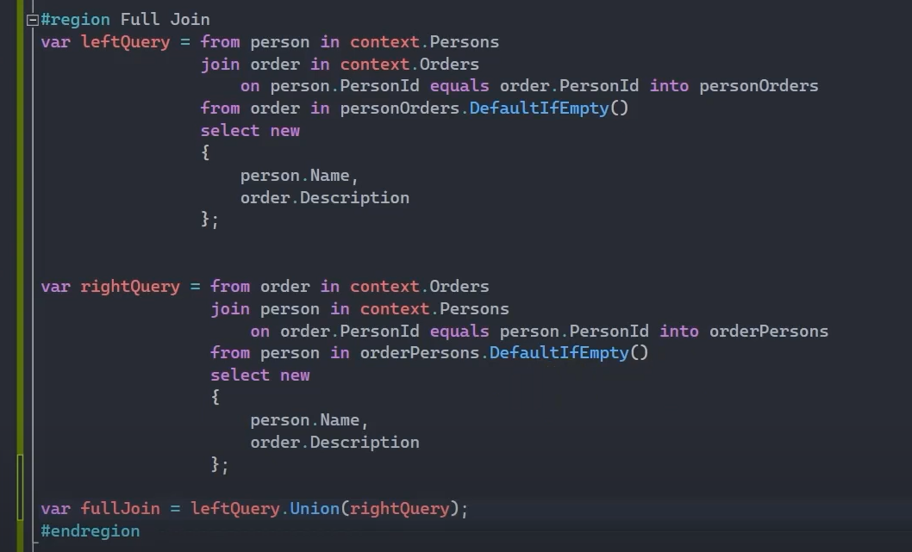

 

## Cross Join

### Query Syntax
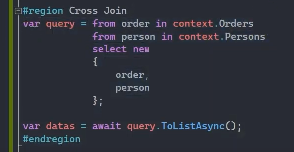

 

## Collection Selector'da Where Kullanma Durumu

Aşağıdaki işlemin sorgusunda aslında bir inner join yapılmış oluyor.

### Query Syntax
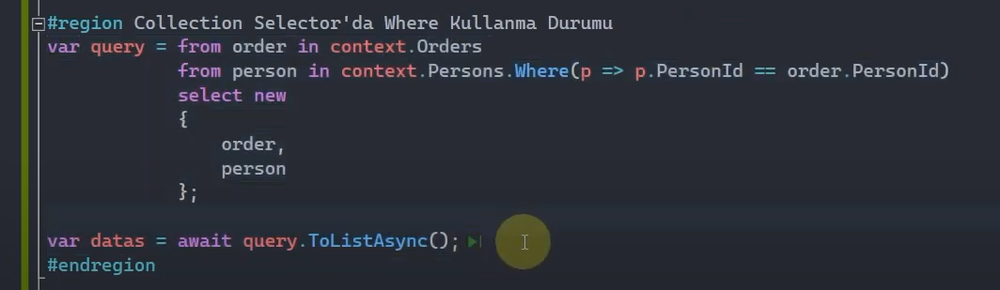

 

## Cross Apply

Inner Join'e benziyor.

### Query Syntax
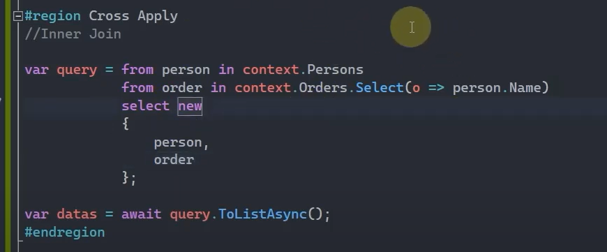

 

## Outer Apply

Left Join'e benziyor.

### Query Syntax
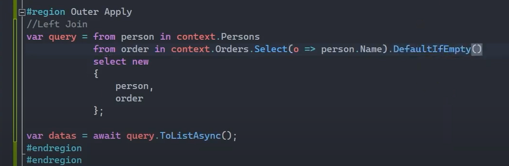

 

