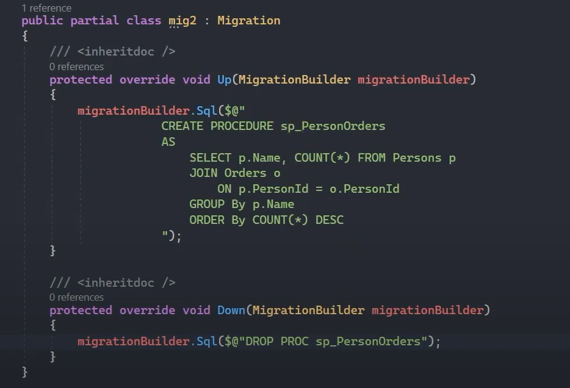
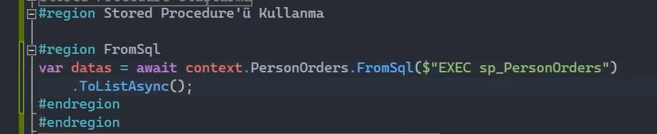
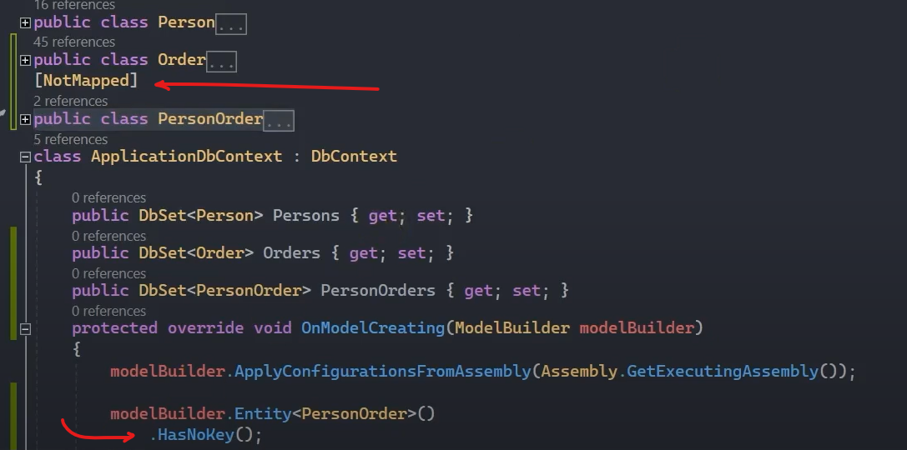
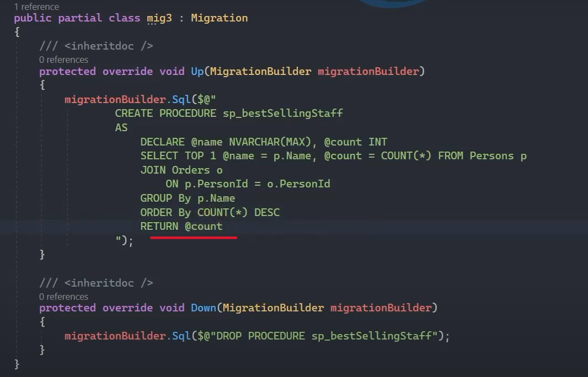
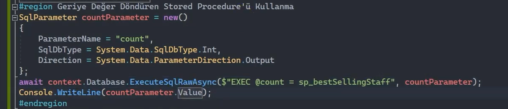
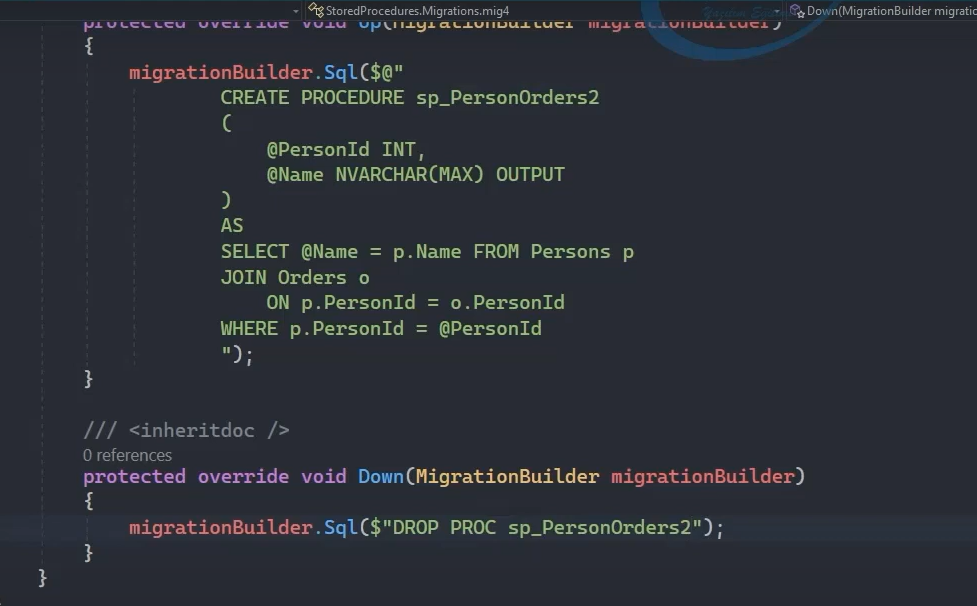
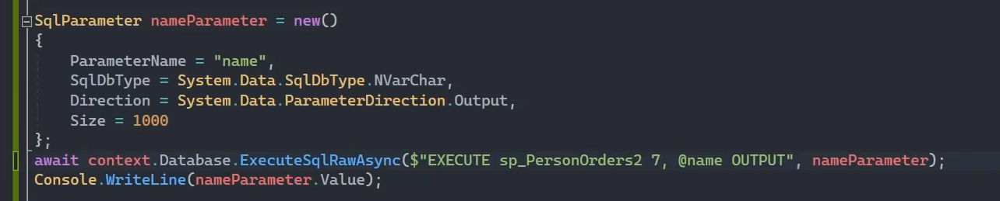

# Stored Procedure

View'ler gibi komplex sorgularımızı daha basit bir şekilde tekrar kullanılabilir bir hâle getirmemizi sayğlayan veri tabanı nesnesidir.

View'ler tablo misali bir davranış sergilerken stored procedure'ler ise fonksiyonel bir davranış sergiler. Ve bu anlatılanların dışında da artıları vardır. 

 

## Stored Procedure Oluşturma

<b>1. Adım : </b> Boş bir migration oluşturunuz.

<b>2. Adım : </b> Migration içesindeki Up fonksiyonuna stored procedure'ın create komutlarını yazınız. Down fonksiyonuna ise Drop komutlarını yazınız.

<b>3. Adım : </b> Migrate ediniz.

 

## Stored Procedure'ı Kullanma

Stored procedure'ı kullanabilmek için bir entity'e ihtiyacımız vardır. Bu entity'nin DbSet property'si olarak context nesnesine de eklenmesi gerekmektedir. Ardından bu DbSet property'si üzerinden FromSql() fonksiyonunu kullanarak 'Exec ....' komutu eşliğinde stored procedure yapılanmasını kullanabiliriz. 

 

Stored Procedure için oluşturduğumuz bu 'PersonOrder' entity'sinin veri tabanına yansıtılacak bir tablo olmadığını belirtebilmek için [NotMapped] attribute'unu kullanıp OnModelCreating() fonksiyonunda da bu entity'nin bir primary key kolonunun olmayacağını bildiriyoruz.

 

## Geriye Değer Döndüren Stored Procedure Kullanma 

 

 

## Parametreli Stored Procedure Kullanma 

### Input ve Output Parametreli Stored Procedure Kullanma 

 

