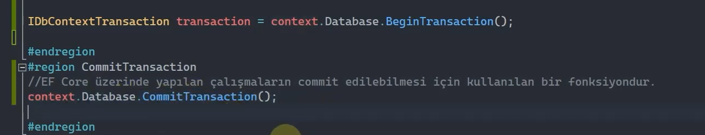
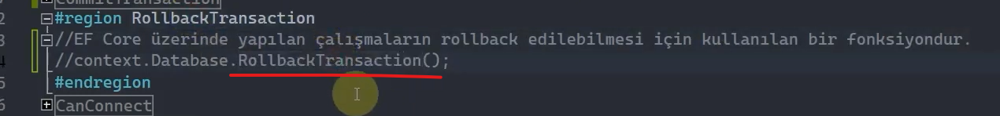
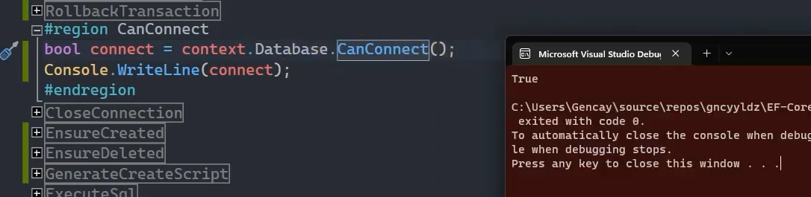
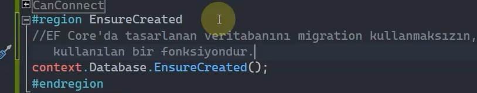
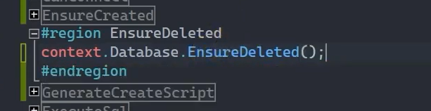
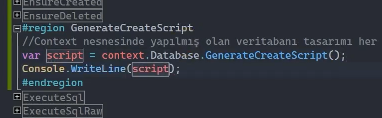
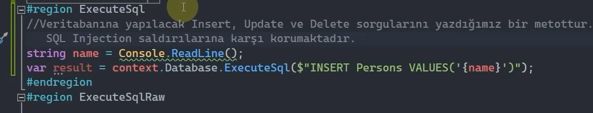
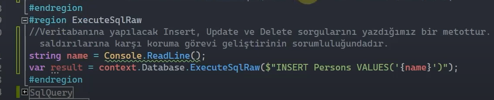
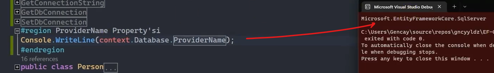

# EF Core İçin İşlevsel Fonksiyonlar

## Database Property'si

Database property'si veri tabanını temsil eden Ef Core'un bazı işlevlerinin detaylarına erişmemizi sağlar.

 

## BeginTransaction()

Ef core, transaction yönetimini otomatik bir şekilde kendisi gerçekleştirmektedir. Eğer ki transaction yönetimini anlık olarak ele almak istiyorsak BeginTransaction() fonksiyonunu kullanabiliriz.

 

 

 

## CommitTransaction()

Ef core üzerinde yapılan çalışmaların commit edilebilmesi için kullanılan bir fonksiyondur. 

 

## RollbackTransaction()

Ef core üzerinde yapılan çalışmaların rollback edilebilmesi için kullanılan bir fonksiyondur. 

 

## CanConnect()

Verilen connection string'e karşılık bağlantı kurulabilir bir veri tabanı var mı yok mu bunun bilgisini bool türde veren bir fonksiyondur.

 

## EnsureCreated()

Ef core'da tasarlanan veri tabanını migration kullanmadan run-time'da yani kod üzerinde veri tabanı sunucusuna inşa edebilmek için kullanılan bir fonksiyondur.

 

## EnsureDeleted()

İnşa edilmiş veri tabanını run-time'da silmemizi sağlayan bir fonksiyondur.

 

## GenerateCreateScript()

Context nesnesinde yapılmış olan veri tabanı tasarımı her neyse ona uygun bir Sql Script'ini string olarak veren bir metottur.

Yani veri tabanını entity framework core üzerinden tasarlayıp bir zamandan sonra entity framework core'u kullanmaman gerektiğini anlarsan ve başka bir araçla yola devam etmen gerekirse, bu veri tabanıyla ilgili yapmış olduğun çalışmaları script olarak elde etmek istiyorsan GenerateCreateScript() metodunu kullanabilirsin.

 

## ExecuteSql()

Veri tabanına insert, update veya delete sorgularını yazdığımız bir metottur. Bu metot işlevsel olarak alacağı parametreleri Sql Injection saldırılarına karşı korumaktadır. 

 

## ExecuteSqlRaw()

Veri tabanına insert, update veya delete sorgularını yazdığımız bir metottur. Bu metotta ise sorguyu Sql Injection saldırılarına karşı koruma görevi, geliştiricinin sorumluluğundadır. 

 

Bu fonksiyonda string interpolation'da kullanılabilir, string ifade de. Ama her iki durumda da dışardan gelen parametre doğrudan sorguya eklenirse, SQL Injection riskine açık hle gelir. Bu yüzden geliştirici, parametrelerin güvenliğini manuel olarak sağlamalıdır.

 

## SqlQuery()

SqlQuery() fonksiyonu her ne kadar erişilebilir olsa da artık desteklenmemektedir. Bunun yerine DbSet property'si üzerinden erişilebilen FromSql fonksiyonu gelmiştir / kullanılmaktadır.

 

## SqlQueryRaw()

SqlQuery() fonksiyonu her ne kadar erişilebilir olsa da artık desteklenmemektedir. Bunun yerine DbSet property'si üzerinden erişilebilen FromSqlRaw fonksiyonu gelmiştir / kullanılmaktadır.

 

## GetMigrations()

Uygulamada üretilmiş olan tüm migration'ları rum-time'da programatik olarak elde etmemizi sağlayan metottur. 

 

## GetAppliedMigrations()

Uygulamada migrate edilmiş olan, veri tabanında uygulanan tüm migration'ları rum-time'da programatik olarak elde etmemizi sağlayan metottur. 

 

## GetPendingMigrations()

Uygulamada migrate edilmemiş olan, veri tabanında uygulanmayan tüm migration'ları rum-time'da programatik olarak elde etmemizi sağlayan metottur. 

 

## Migrate()

Migration'ları programatik olarak run-time'da migrate edebilmek için kullanılan bir fonksiyondur.

 

### !!! Önemli

EnsureCreated fonksiyonu migration'ları kapsamamaktadır. Bu yüzden migration'lar içerisinde yapılan çalışmalar EnsureCreated fonksiyonunda geçerli olmayacaktır. 

 

## OpenConnection()

Veritabanı bağlantısını manuel açar.

 

## CloseConnection()

Veritabanı bağlantısını manuel kapatır.

 

## GetConnectionString()

İlgili context nesnesinin o anda kullandığı connection string değeri neyse onu elde etmemizi sağlar. 

 

## GetDbConnection()

Ef core'un kullanmış olduğu Ado.NET alt yapısının kullandığı DbConnection nesnesini elde etmemizi sağlayan fonksiyondur. Yani bizi Ado.NET kanadına götürür.

 

## SetDbConnection()

Özelleştirilmiş connection nesnelerini ef core mimarisine dahil etmemizi sağlayan fonksiyondur.

 

## ProviderName Property'si

Ef core'un kullanmış olduğu provider neyse onun bilgisini bize getiren property'dir.

