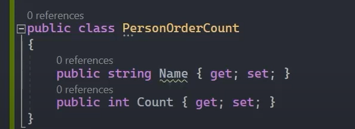
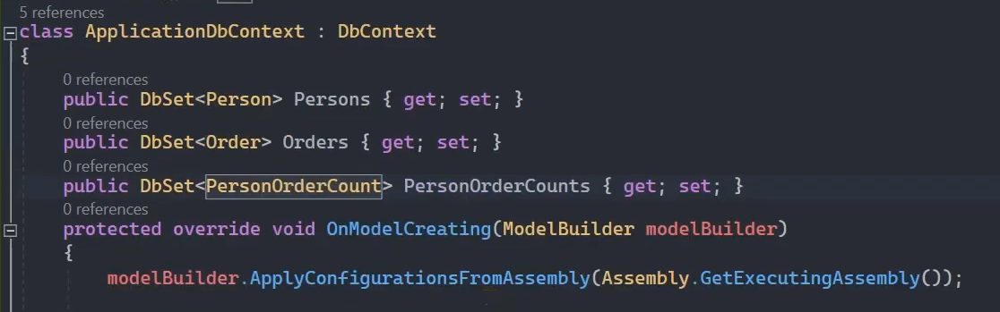
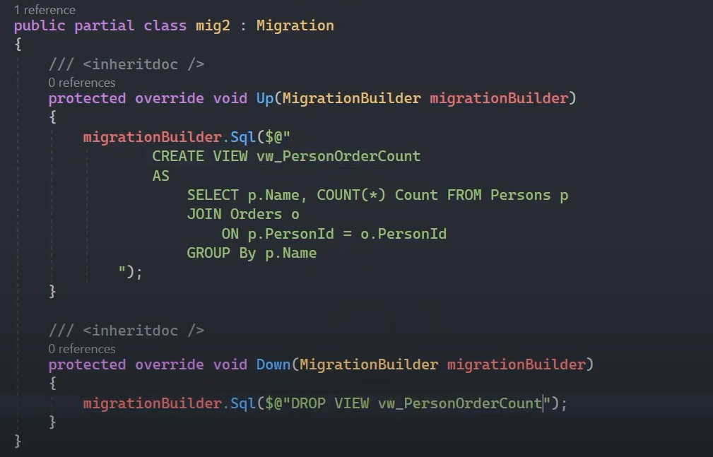
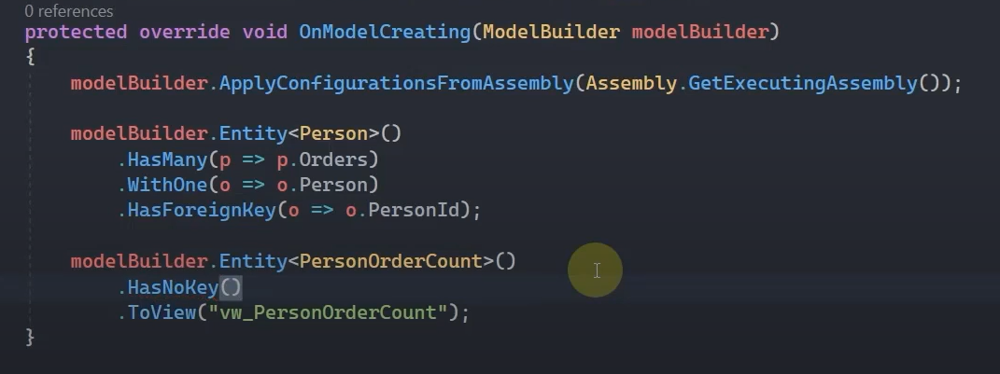
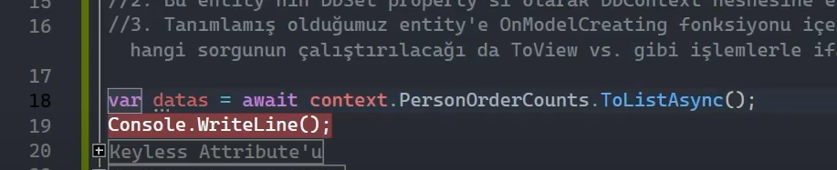
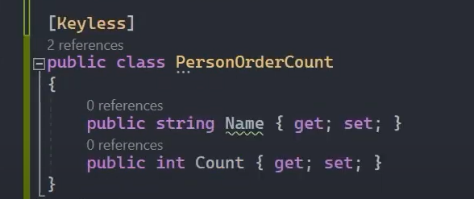

# Keyless Entity Types

Normal entity type'lara ek olarak primary key içermeyen query'lere karşı veri tabanı sorguları yürütmek için kullanılan özelliktir.

Genellikle aggregate operasyonlarının yapıldığı group by yahut pivot table gibi işlemler neticesinde elde edilen istatistiksel sonuçlar, primary key kolonu barındırmazlar. Bizler bu tarz sorguları, Keyless Entity Types özelliği ile sanki bir entity'e karşılık geliyormuş gibi çalıştırabiliriz.

 

## Keyless Entity Types Tanımlama

<b> 1. </b> Hangi sorgu olursa olsun, sorgunun; bir entity'e karşılık geliyormuş gibi işleme / execute'a / çalıştırmaya tabi tutulabilmesi için o sorgunun sonucunda bir entity'nin yine de tasarlanması gerekmektedir.  

 

<b> 2. </b> Bu entity'nin DbSet property'si olarak DbContext nesnesine eklenmesi gerekmektedir. 

 

<b> 3. </b> Tanımlamış olduğumuz entity'e OnModelCreating fonksiyonu içerisinde girip bunun bir primary key'i olmadığını bildirmeli ve hangi sorgunun çalıştırılacağı da ToView() vs. gibi işlemlerle ifade edilebilir. (ToView vs. dememizin sebebi de belki bu yapılanma stored procedure ya da inline function'dır, bunlara uygun bir davranışın sergilenmesi gerekecektir.)

 

 

 

## Keyless Attribute'u

Biz şimdi keyless entity types yapılanmasında oluşturmuş olduğumuz entity'nin (PersonOrderCount) primary key'i olmayacağını OnModelCreating() metodunda HasNoKey() metoduyla bildirdik. Ama istersek Keyless attribute'u ile de bunu yapabiliriz. İkisi de aynı işlevi görüyor. 

 

## Keyless Entity Types Özellikleri Nelerdir?

* 
 Primary key kolonu olmaz! 

* 
 Change Tracker mekanizması aktif olmayacaktır. 

* 
 Table per hierarchy olarak entity hiyerarşisinde kullanılabilir ancak diğer kalıtımsal ilişkilerde kullanılamaz. 

